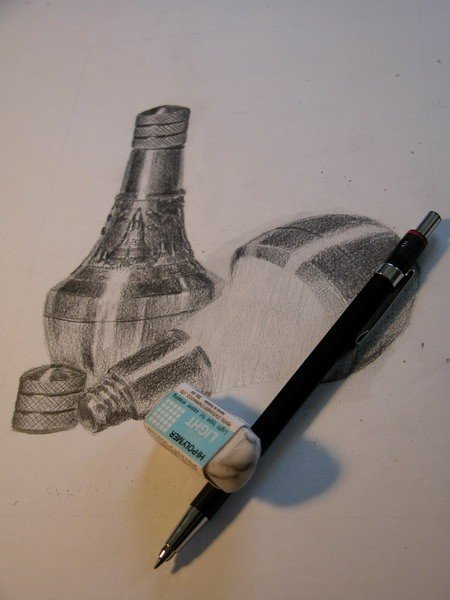

วันนี้สอบเป็นวันที่สอง จากที่มาเขียนไว้เมื่อวานซืน พอเขียนเสร็จก็กะว่าจะไปอาบน้ำแล้วกินข้าว (เพิ่งเล่นสควอชมาสองชั่วโมง) ก็พอดีมีเพื่อนเข้ามาถามฟิสิกส์ ตอนนั้นก็ประมาณหกโมงได้ บอกเค้าว่ายังไม่ได้กินข้าวเลย เค้าก็บอก แป๊ปเดียว ๆ... อืม แป๊ปเดียวคนเดียวก็ไม่เป็นไร สอน ๆ อยู่ซักพักก็มีเพื่อนอีกคนเข้ามาถามต่อ แหะ ๆ สรุปเลยไม่ได้ทำอะไรเลย คืนนั้นก็กินมาม่าเอา... เพื่อนเกาหลี (ที่มาถามฟิสิกส์) ก็ถามว่าเผ็ดป่าว แล้วก็พูด ๆ ว่าบะหมี่เกาหลีเผ็ดที่สุดแล้ว อะไรประมาณนี้ ก็เลยลองให้เค้ากินดู (มาม่าต้มยำ)... เหงื่อก็ไหลออกมามากพอดู แต่เราก็เชื่อนะว่าของเกาหลีก็น่าจะเผ็ดเหมือนกันอ่ะ ไว้วันหลังไปลองขอกินดู แหะ ๆ... สอนไป ๆ มา ๆ เวลาก็ผ่านไปถึงเที่ยงคืน ยังไม่ได้อ่านอะไรของตัวเองเลย เหอ ๆ ก็อ่านของตัวเองต่ออีกชั่วโมงนึงแล้วก็นอน

วันรุ่งขึ้นมาสอบฟิสิกส์กับเลข ก็ไม่รู้เหมือนกันว่าทำได้รึเปล่า เกือบผิดโง่ ๆ ไปหลายครั้ง แบบอินทิเกรตเค้าให้ลิมิตมาก็ไม่ได้คิด จะบวก c ลูกเดียวเลย แหะ ๆ... บ่ายวันนั้นก็ไปนั่งทำศิลปะต่อ ก็ไม่ได้อะไรเท่าไหร่ ทำตั้งแต่บ่ายสองถึงบ่ายสี่ แล้วก็กลับมาทำต่ออีกเกือบ ๆ สองชั่วโมง เพิ่งรู้ว่างานต้องส่งก่อนสองทุ่มวันศุกร์...

ไปกินข้าวเย็น แล้วก็กลับมานั่งอ่านศัพท์ที่จะต้องสอบ มีทั้งหมด 130 กว่าคำ เค้าจะเอามาออก 10 คำ แหะ ๆ นอกนั้นก็เป็นการเขียนเรียงความ ซึ่งก็เตรียมอะไรไม่ได้อยู่แล้ว ก็เลยนั่งอ่านศัพท์พร้อมกับดู DVD คอนเสิร์ต P.O.P ไปด้วย แหะ ๆ ก็นอนตีหนึ่งเช่นเคย

วันนี้ตื่นมาก็เดินไปสอบอังกฤษ ดีใจ อิอิ ศัพท์ได้ทุกคำเลย (ก็เล่นท่องซะทั้งคืน...) แต่เรียงความเค้าให้เขียนสองเรื่อง อันนึงคิดว่าทำพอได้ คือเค้าให้เอาเรื่องที่เคยอ่านสามเรื่องมาผูกกัน ส่วนอีกอันเป็นให้อ่านเรื่องแล้วเขียนเรียงความเลย อันนี้คิดว่าทำไม่ค่อยดีเท่าไหร่อ่ะ

สอบเสร็จแล้วก็กลับมานั่งทำศิลปะเลย เพราะว่าต้องส่งวันนี้แล้ว ก็ทำออกมาได้อย่างที่เห็น (ข้างล่าง) ก็วาดอยู่สองวันเลยได้เท่านี้ เป็นรูปอะไร ใครทายถูกมีรางวัล ฮ่า ๆ

คืนนี้คงพักหน่อย แล้วพรุ่งนี้ก็อ่านเศรษฐศาสตร์ทั้งวันเลยแหละ ไว้มาเขียนใหม่ละกันนะครับ

อาร์ต  
๑๘ พฤศจิกายน พ.ศ.๒๕๔๘ เวลา ๑๘:๕๕ น.