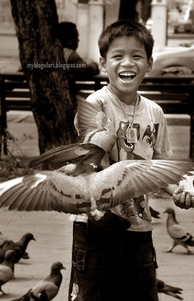

ตอนไปเรียนที่ Loomis ได้ลงคลาสถ่ายรูปอยู่ครั้งนึง จำได้ว่าสนุกสนานมากพอสมควร ใครชอบถ่ายรูปแต่ยังไม่เคยลง ลองลงดูนะครับ คลาสนั้นเป็นคลาสถ่ายรูป "เบื้องต้น" คือถ้าใครยังไม่เคยลงคลาสนี้ ก็จะลงคลาสถ่ายรูปตัวอื่น ๆ ไม่ได้ สอนถ่ายรูปด้วยกล้องฟิล์มครับ เป็นกล้อง Pentax เก่า ๆ ตัวนึง กับฟิล์มขาวดำ ไว้วันหลังจะมาเล่าถึงประสบการณ์การทำงานกับกล้องฟิล์มนะครับ

ที่นึกถึงคลาสนี้ ก็เพราะมีวันหนึ่ง ครูบอกว่า ให้หารูปเก่า ๆ มารูปนึงที่เราถ่ายไว้ แล้วเขียนบรรยายว่าเกิดอะไรขึ้นบ้างก่อนที่จะถ่ายรูปนั้น วันนี้ ไหน ๆ ก็ยังไม่รู้ว่าบล๊อกนี้จะเขียนเกี่ยวกับอะไรดี ก็เลยจะมาลองเขียนแบบนั้นดูก็แล้วกันนะครับ

(แบ่งช่องว่างเพื่อความสบายตา)

วันนั้นจำได้ว่าเพิ่งสอบเอ็นทรานซ์เสร็จ (มีนาคม ๒๕๔๘) แล้วก็กำลังจะกลับบ้านกับเจ๊ซิม พอดีวั้นนั้นนึกครึ้มอกครึ้มใจยังไงไม่รู้ พกกล้องไปสอบด้วย... สอบเสร็จปรากฎว่ายังไม่อยากกลับบ้านกันทั้งคู่ ก็เลยตกลงกันว่าจะไปวัดพระแก้ว ไปถ่ายรูปกัน

ลงรถเมล์ที่สนามหลวง ก็มีคุณป้าคนนึงมาขายถั่วให้ เราก็ไม่ได้อยากซื้อเท่าไหร่หรอก แต่ป้าแกตื้อเอามาก ๆ ก็เลยซื้อไปถุงนึง สิบบาท กินไปจนหมด เอ๊ยไม่ใช่... ถั่วเอาไว้ให้นกพิราบต่างหาก... โปรยไปโปรยมาจนหมด ก็กำลังจะเดินต่อ แต่แล้วก็มีเด็กคนนึงจะมาขายอีก ถามไปถามมาได้ความว่า เค้าเป็นลูกของป้าคนนั้นนั่นเอง ก็เลยบอกไปว่าพี่ซื้อจากแม่หนูไปแล้ว แต่ต้องนับถือในความพยายามจริง ๆ น้องเค้าเริ่มขายเราที่แถว ๆ หน้าพิพิธภัณฑสถานแห่งชาติ ขายไปขายมา เราก็เดินหนีไปเรื่อย ๆ จนถึงหน้าศิลปากร น้องเค้าก็ยังไม่หยุด ก็เลยต้องยอมแพ้ ตกลงให้เงินน้องเค้าห้าบาท แล้วให้น้องเค้าให้อาหารนกพิราบให้ ส่วนเราจะนั่งถ่ายรูปให้เค้าเป็นแบบ น้องเค้าก็ดีใจใหญ่ มาขอเป็นคนถ่ายมั่ง ขอไล่นกพิราบให้มันบินกันมั่ง สุดท้ายก็ได้รูปนี้แหละครับ 😊

บอกน้องเค้าไว้ว่าวันหลังจะเอารูปนี้มาให้ แต่ถึงวันนี้ก็สามปีแล้วสิ ยังไม่ได้เอาให้น้องเค้าเลย เค้าจะยังอยู่ที่นั่นมั้ยน้อ