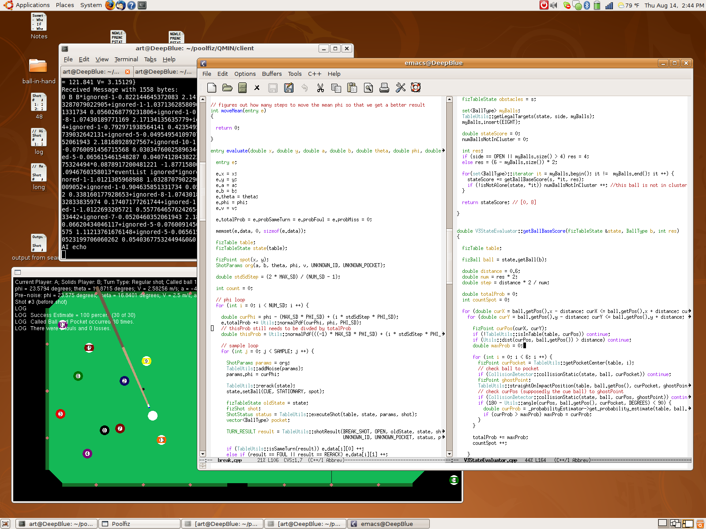

ช่วงปิดเทอมนี้หลายครั้งได้รับคำถามว่า ทำอะไรเนี่ยะ ทำไมไม่กลับบ้าน หลายครั้งก็อยากจะตอบแบบละเอียด ๆ แต่บางทีก็มีเวลาไม่พอที่จะตอบ ก็เลยตอบได้แค่ว่า **สอนคอมเล่นพูลครับ** แค่นั้น ฮ่า ๆ จริง ๆ ที่ไม่ได้เขียนอะไรมาหลายวันก็เพราะไม่ได้คิด ที่ไม่ได้คิดก็เพราะเอาเวลาไปคิดเรื่องนี้แหละ พอดีต้องนำเสนองานให้อาจารย์ดู ว่าที่ผ่านมานั่งรับเงินเนี่ยะ ทำอะไรไปบ้าง ก็เลยต้องเร่งขยันขึ้นมาหน่อยนึง

วันนี้ก็เลยว่า ไหน ๆ เราก็คิดเรื่องนี้มาตั้งเยอะ (โดยเฉพาะสัปดาห์ที่ผ่านมานี่... เพราะต้องนำเสนองาน) ทำไมไม่เอามาเขียนในนี้ดู คนทั่วไปจะได้ทราบกันบ้างว่า ปิดเทอมนี้เนี่ยะ ทำอะไรอยู่ ทำไมถึงได้มาทำอะไรยังงี้ ก็ขอเนิร์ดซักนิดนะครับ

ทำไมต้องสอนให้คอมพิวเตอร์เล่นพูลด้วย... ที่จะทำก็เพราะจะส่งโปรแกรมนี้ไปแข่งครับ แข่ง[คอมพิวเตอร์โอลิมปิกที่ประเทศจีน](https://www.game-ai-forum.org/icga-tournaments/event.php?id=37)เชียวนา (ฟังดูยิ่งใหญ่มั้ย ได้แข่งในโอลิมปิกด้วย) การแข่งขันจะมีขึ้นในช่วงต้น ๆ เดือนตุลาคมครับ

แล้วแข่งกันยังไงล่ะ... ไม่ยากเหมือนที่หลายคนคิดกันครับ ไม่ได้ให้ทำหุ่นยนต์ที่จะเล่นพูลจริง ๆ ไปแข่งกัน ที่แข่งกันเค้าเรียกว่า Simulated Pool ก็คือแข่งอยู่แค่ในคอมพิวเตอร์ครับ คร่าว ๆ ก็คือ จะมีเครื่องนึงที่ทำหน้าที่เป็น Server อยู่ จะบอกว่าตอนนี้โต๊ะเป็นยังไง ลูกต่าง ๆ อยู่ตรงไหน เป็นตาใคร (ถามหลานดูก็ได้) เวลาเหลือเท่าไหร่ อะไรพวกนี้ครับ จากนั้นก็จะมีอีกส่วนที่เรียกว่า Client ซึ่งเป็นคนเล่น ก็จะดูว่า อื้ม... โต๊ะเป็นยังงี้ ลูกขาวอยู่ตรงนั้น แล้วเรายิงลูกนี้ ลูกนั้น กับลูกนู้นได้... เอ่... ลูกนั้นเหมือนจะง่ายแฮะ แต่ลูกนั้นยากกว่าหน่อยนึงแต่พอยิงลงแล้วยิงลูกโน้นต่อได้เลย... ยิงลูกไหนดีนะ... ยิงลูกไหนดี... ฮื้มม... ยิงลูกนั้นหรือลูกนี้ดี... คิดไปคิดมายังงี้แล้ว ก็นั่งเด็ดกลีบดอกไม้เลือกเอา ลูกนั้น... ลูกนี้... ลูกนั้น... ลูกนี้...

ล้อเล่นครับ แต่เวลาคิดนี่คิดนานจริง ๆ (เป็นนาทีเลย) พอเลือกได้แล้ว (ไม่ว่าจะด้วยการคิดสี่ตลบ เด็ดกลีบดอกไม้ ถามสาวยาคู้ลท์ ทอยลูกเต๋า โยนเหรียญ หรืออะไรก็ตาม) ตัว Client ก็จะบอก Server ไปครับ ว่าอ่ะ เนี่ยะ เลือกจะยิงยังงี้แหละ โดยการเลือกที่จะยิง ก็ต้องบอกเลขให้ Server ไปห้าตัวด้วยกัน ก็คือ a, b (ตำแหน่งบนลูกขาว มองจากด้านหลัง), theta (มุมก้มของไม้ที่ทำกับโต๊ะ), phi (มุมของไม้ มองจากด้านบน) แล้วก็ v (ความเร็วของไม้) ครับ

เพื่อไม่ให้เป็นการง่ายเกินไป ตัว Server ก็จะทำการเพิ่ม noise เข้าไปในค่าพวกนี้แบบ Gaussian distribution ครับ เช่นเราบอกว่าเราต้องการให้ phi เป็น ๔๘ องศา ก็อาจจะได้ค่าที่ใช้ยิงจริง ๆ เป็น ๔๘.๒๑ องศา ทำนองนั้น

การแข่งคร่าว ๆ ก็เป็นไปตามที่ได้บรรยายไปครับ (ยาวไปมั้ยเนี่ยะ) หวังว่าท่านผู้อ่านจะได้ข้อมูลที่เป็นประโยชน์กันไปบ้างไม่มากก็น้อยนะครับ