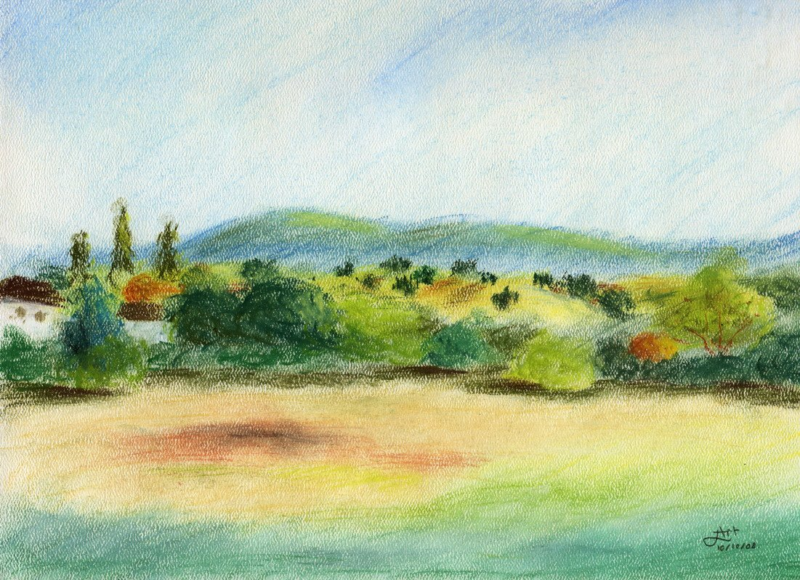
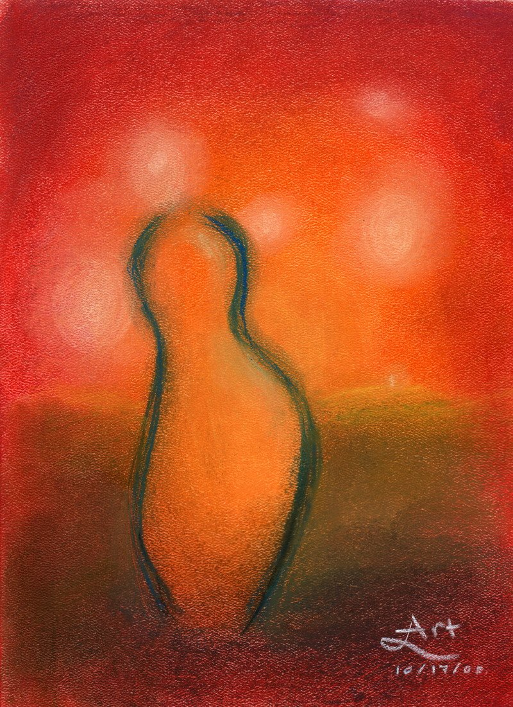

> จากกันไปเป็นเดือนเป็นปี มิได้พบกัน... คิดถึงคืนนึกถึงวันวานที่แล้วมา... 
> จากกันไปใจยังเหมือนเดิมซ้ำเพิ่มมากกว่า... เพิ่มแรงจิตจดจ่อนึกถึงจึงกลับมาใหม่...

ฮ่า ๆ หลังจากห่างหายไปนานกว่าสองเดือน ในที่สุดก็มีโอกาสที่จะมาเขียนอะไรเพิ่มซะที เรื่อง “การทดลอง ตอนที่ ๒” ก็ต้องขอผลัดไว้คราวต่อไป (ซึ่งก็ไม่รู้เมื่อไหร่เหมือนกัน) นะครับ เพราะตอนนี้มีอะไรตื่นเต้นกว่านิดนึงมานำเสนอ

หอที่อยู่ตอนนี้ชื่อว่า Kimball (ก็ที่เดียวกับปีที่แล้วนั่นแหละ) เค้าเรียกว่าเป็นหอ art-focused คือเป็นหอที่มุ่งเน้นด้านศิลปะเป็นสำคัญ เริ่มจากอาจารย์ประจำหอเลย ก็เป็นครูสอนดนตรีสองคน นอกจากนั้นหอก็ยังจัดกิจกรรมศิลปะต่าง ๆ เป็นกลุ่ม ๆ กันไป กลุ่มที่ว่านี้ก็จะมีคนอยู่ซัก ๑๐ คน ที่สนใจเรื่องคล้าย ๆ กัน แล้วก็มาเจอกันทุกสัปดาห์เพื่อทำกิจกรรมศิลปะร่วมกัน มีทั้งพวกที่ทำเกี่ยวกับดนตรี ลีลาศ การทำอาหาร วาดภาพระบายสี ทำหนัง ไปจนถึงศิลปะการป้องกันตัว

สำหรับกลุ่มที่อยู่ในเทอมนี้ก็เป็นกลุ่มที่ออกไปนั่งวาดรูป ใช้สีที่ฝรั่งเขาเรียกกันว่า pastel ซึ่งก็ไม่แน่ใจว่าภาษาไทยเรียกว่าอะไรเหมือนกัน อาจจะเป็นสีชอล์กมั้ง ลักษณะก็คือว่าพอฝนลงบนกระดาษแล้วจะเป็นผงฝุ่น ๆ ออกมา ซึ่งเราสามารถใช้นิ้วเกลี่ยให้ผสมกับสีอื่นได้ ทำให้ภาพที่ได้ออกมาดูนุ่มราวปุยนุ่น... อธิบายยังกับเรียนมายังงั้นเลย... ขอออกตัวก่อน (ไม่ได้วิ่งแข่งอยู่ ออกตัวก่อนเลยไม่เป็นไร ไม่ผิดกติกา) ว่าไม่ได้เรียนอะไรอย่างจริงจังเลย ที่พูดนี่ก็คือมั่วเอาทั้งนั้นนะครับ ใครที่รู้เรื่องก็ต้องขอความรู้ด้วย

ผ่านมาสองสัปดาห์ ก็ได้วาดไปสองรูป รูปแรกวาดเมื่อสัปดาห์ก่อน ที่ทะเลสาบ (แห้ง) ในสแตนฟอร์ดนี่เอง ชื่อว่า Lake Lagunita ใช้เวลาทั้งสิ้นเกือบ ๆ สองชั่วโมง ใช้ผงสีไปประมาณ ๑๗๓ กรัม (รู้ทำไมเนี่ยะ) ออกมาเป็นประมาณนี้ครับ

ส่วนรูปที่สอง เป็นรูปที่เพิ่งวาดเมื่อบ่ายวันศุกร์ที่ผ่านมา นั่งอยู่เบื่อ ๆ ก็เลยวาดดู ตั้งชื่อรูปไว้ว่า Distance ครับ รูปพวกนี้ (ที่ดูไม่ค่อยรู้เรื่องเท่าไหร่... วาดเพราะคนวาดไม่มีฝีมือวาดให้เหมือนของจริง) ภาษาศิลปะเค้าเรียกกันว่า แอ๊บแสตก (abstract) มั้งครับ ฮ่า ๆ

ส่วนความหมายหรืออะไรจะซ่อนอยู่ยังไง ก็ขอเชิญท่านผู้ชมวิเคราะห์กันเองนะครับ เค้าว่าศิลปะมันสนุกตรงนี้ ที่งานชิ้นนึงก็อาจจะมีความหมายต่างกันสำหรับคนดูแต่ละคน คิดว่ายังไงเขียนบอกไว้ก็คงจะดีไม่น้อย

คงไว้เท่านี้ก่อนก็แล้วกัน ต้องไปทำการบ้านก่อนแล้วครับ