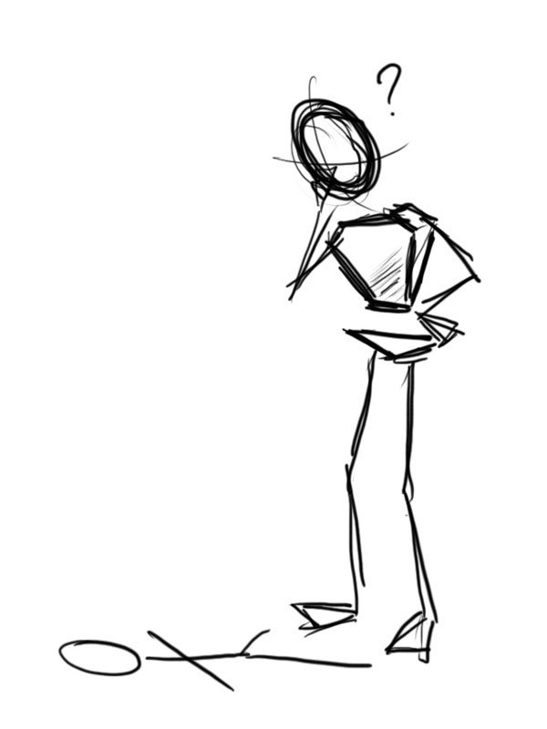

After a long disappearance (since October...) I finally have enough time to do something. I just got a Wacom Bamboo from Amazon (the store, not the rain forest) a few days ago and just had time to set it up just now. So I thought I’d try drawing something… and here it is. I hope I have more time to work on something fun with my tablet soon!

Many of you might note that this is my first post in English ever! Due to requests (particularly from Tu and Misha), I’ll try to make this a bilingual blog from now on, LOL. Until next post, take care 😉