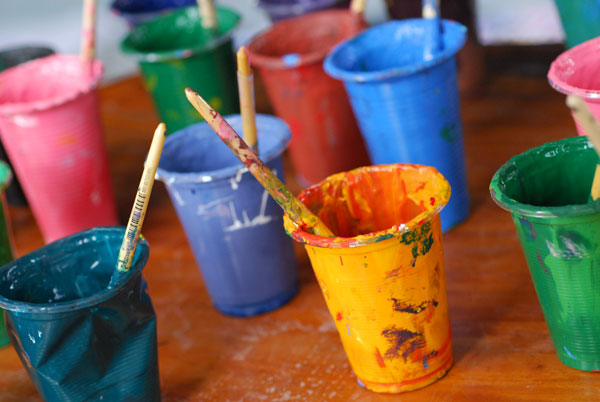
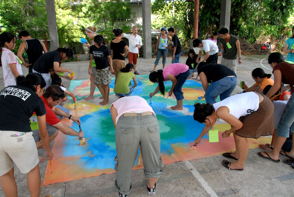
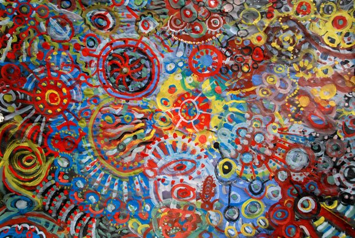
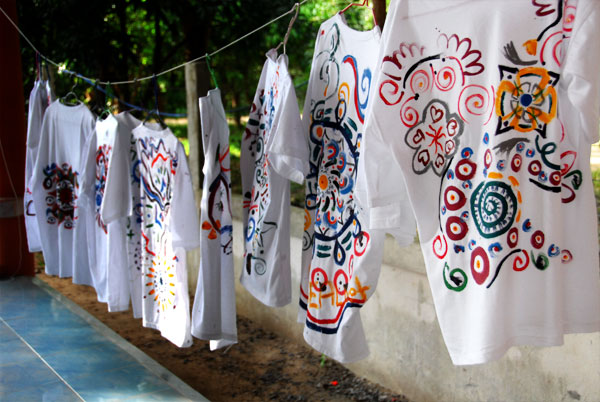

Yes, I have three midterms coming up in the next 2 days, and yet I’m still doing this. I just want to talk really quickly about something called Circle Painting.

So what is Circle Painting? It’s basically a process in which a group of people come together and create a painting. The process is very simple with basic instructions, but the result is quite amazing. Basically, you and your friends draw lines and shapes and build on each other’s. If you want to learn more, I really recommend you going to the [official website](https://www.circlepainting.org/).

I was introduced to this about 2 years ago on [SEALNet Project Philippines](https://sealnetonline.org/programs/summer-projects/past-projects/summer-projects-in-the-philippines/project-philippines-2007/). It was part of the attempt to show the connectedness of Southeast Asia. An artist Hiep Nguyen (who happened to be a twin brother of Hung Nguyen, whose partner is Leng Lim, one of the co-founders of SEALNet... wow!) went to 3 SEALNet projects that year and did 3 huge circle paintings with the SEALNet team and the locals in each country. The paintings are then shipped to Singapore for a display in the 40th ASEAN Celebration. Singapore’s prime minister also painted on the paintings.

After that, I did 2 more circle paintings. One is at the Bangkok School for the Blinds with blind students there. It all started when Hiep was traveling and happened to be in Bangkok. He asked me if there’s any place I could think of that he could do circle painting, and the school came up in my mind. Some of the Thai Scholars who were in Thailand at the moment were interested in helping out too. It was a challenging task, but it was really fun working with the children.

Another one was with the children at Baan Home Hug during [SEALNet Project Thailand 2008](https://sealnetonline.org/programs/summer-projects/past-projects/summer-projects-in-thailand/project-thailand-2008-aids/). We did one big one which was put on the wall of the exhibition site, and we also drew them on t-shirts, which would be sold to visitors as souvenirs.

Now Hiep came up with the idea to spread Circle Painting around even further. The next step is to schools, including Stanford. Imagine a circle painting in Old Union!