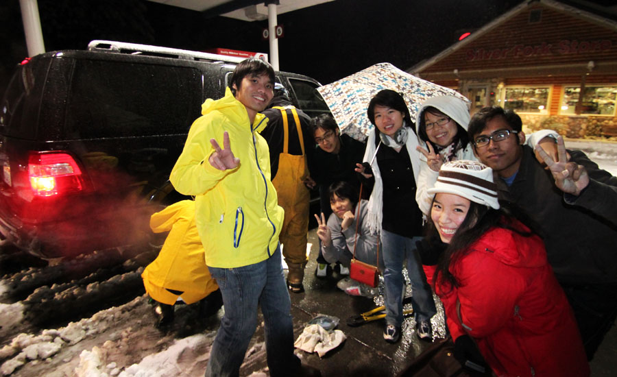
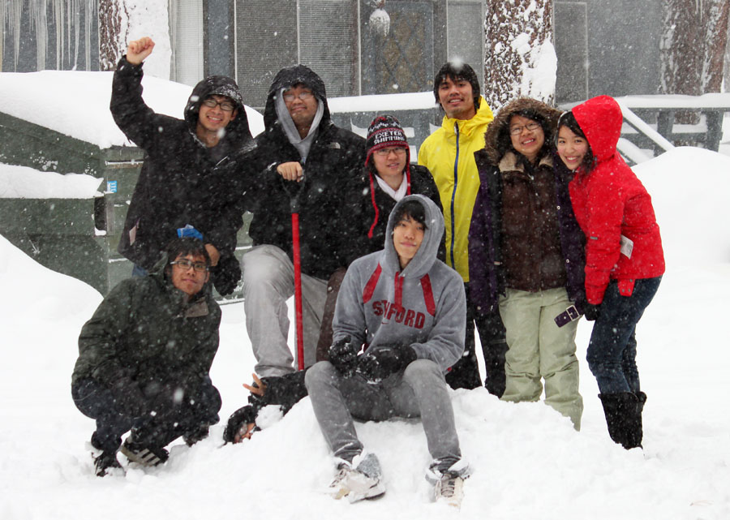

ได้เข้ามาเขียนกันซักที หลังจากที่โอ้เอ้อยู่นาน ไม่รู้ว่าจะมีคนอ่านกันหรือเปล่า หลังจากที่ย้ายที่ไป ๆ มา ๆ อยู่หลายครั้ง แต่ไม่เป็นไร ฮ่า ๆ เขียนไว้อ่านเองเป็นหลัก (ว่าเข้านั่น) แต่ถ้าใครผ่านเข้ามาเจอก็ขอต้อนรับ และหวังว่าจะสนุกไปกับการอ่านด้วยนะครับ

วันนี้จะเล่าให้ฟังถึง snow trip ที่ไปกันมาเมื่อเกือบ ๆ เดือนที่แล้ว เป็นทริปที่น่าจะจำได้ไปอีกนาน เพื่อไม่ให้เป็นการเสียเวลา เริ่มกันเลยดีกว่านะครับ

# ตอนที่หนึ่ง : ช่วงบ่ายกลางสายฝน

ทริปนี้เริ่มต้นขึ้นในวันเสาร์ที่ 20 พฤศจิกายน... มีผู้ร่วมประสบชะตากรรมทั้งหมด 10 ท่าน (นับดี ๆ จะได้ 12 หรือ 13 ท่าน) ได้แก่ (เรียงตามลำดับอาวุสโส) พี่ขวัญ ปิ๊ง จ๊อบ ชน น้องหอย แม็กซ์ น้องมิน แมน ไมค์ ดุสิด ไบรท์ แล้วก็ดัสติน (นอกจากนี้ยังมีตัวผู้เขียน ซึ่งยังไม่แน่ใจว่าจะใช้สรรพนามแทนว่าอะไรดี... สังเกตว่าจะหลีกเลี่ยงมาตลอด จนตอนนี้... เรียกว่า เรา ก็แล้วกัน)

นัดแนะกันว่าจะออกประมาณเที่ยง แล้วยังไงก็ไม่รู้ กว่าจะได้ออกจริง ๆ ประมาณบ่ายสองได้ ก็ไม่ได้สนใจเท่าไหร่ เพราะดู [Big Game](https://www.espn.com/college-football/game?gameId=303240025) อยู่พอดี ปีนี้ Stanford Football เทพมาก ชนะ 11 แพ้ 1 เท่านั้น นับเป็นปีที่เริ่มดูอเมริกันฟุตบอลได้ถูกต้องจริง ๆ ฮ่า ๆ

พี่ขวัญขับรถมารับ ในรถนั้นก็มีแม็กซ์ ไมค์ แล้วก็ดุสิต (ดัสตินกับไบรท์ด้วย) หลังจากไปรับของคนนู้นคนนี้เรียบร้อยแล้วก็ขับออกจากมหาลัย มุ่งหน้าไปทางตะวันออก ข้ามสะพานไป ไปเจอกับรถอีกคันนึงที่ In-N-Out (เพื่อความสะดวกได้แนบแผนที่มา ณ ที่นี้ด้วย)

<iframe src="https://www.google.com/maps/d/embed?mid=1_rNaEevtUGhPnpUwjzvUIHKYT0c&hl=en" width="100%" height="500px" frameBorder="0" />

กินอะไรกันเสร็จเรียบร้อยก็เดินทางต่อจุดหมายต่อไปเป็นที่งาน Ski Dazzle 2010 (อ่านแบบมีสำเนียงนิดนึงว่า "สะกีแด๊ซเซิ่ล ทูท้าวซั่นแอ่นด์เทน") ในเมือง Sacramento ระหว่างทางก็มีฝนตกหนักถึงหนักมาก คลื่นทะเลความสูงสองเมตร ชาวประมงที่จะออกใช้เรือให้ใช้ความระมัดระวัง (หน้าตาคงจะคล้าย ๆ เรือ เพราะใช้แทนกันได้) รถก็ติดนิดหน่อย แต่ก็ยังพอจะเคลื่อนตัวได้ ที่จะไปก็เพราะว่างานนี้เนี่ยะ มีคูปอง lift ticket แบบซื้อสองแถมหนึ่งครับ

อืม... lift ticket คืออะไร หลายคนอาจจะสงสัย... ก็คือว่า สกีหรือ snowboard เนี่ยะ เป็นกีฬาที่ดูแล้วไม่ค่อยมี point เท่าไหร่ ขึ้นเขาไป แล้วก็ไหล ๆ กลับลงมาที่เดิม ฮ่า ๆ ตอนจะขึ้นเขา ถ้าจะเดินขึ้นไปก็คงจะเหนื่อยขนาดเป็นกีฬาไปได้ในตัว เค้าก็เลยสร้างลิฟต์ขึ้นมาจากข้างล่างขึ้นไปข้างบน ราคาปกติก็ประมาณ \$70 ต่อวัน คูปองนี้ราคา \$10 แต่ซื้อได้สองใบ ก็คือลดราคาลงมาเหลือ \$40 ต่อวัน (เท่านั้น)

ที่งานนั้นนอกจากจะมีคูปองที่ว่านี้แล้ว ก็ยังมีชุดกันหนาว กางเกงสกี ถุงมือ และอื่น ๆ อีกมากมายในราคาเป็นกันเอง ก็เลยได้ซื้อเสื้อมาหนึ่งตัว (\$70) กับถุงมือหนึ่งคู่ (\$10) ส่วนคนอื่น ๆ ก็ซื้อของตามอัตภาพกันไป น้องมินก็ได้เสื้อสีแดงคุณภาพดีมากมาหนึ่งตัว 😛

ออกมาจากที่นั่นก็เริ่มหิวกัน ประกอบกับความที่ไม่อยากกิน fast food กันอีกแล้ว ก็เลยหาร้านมั่ว ๆ ดู ก็เจอร้านนึงห่างออกไปไม่มาก ชื่อร้าน [C F Cheng](http://www.yelp.com/biz/cf-cheng-sacramento) (มีลิงค์ให้ซะด้วย น่าจะได้ค่าโฆษณานะเนี่ยะ) อร่อยมาก ๆ เจ้าของร้าน (เค้าให้เรียกเค้าว่า Uncle Mike) ก็เป็นกันเอง แถมยังรู้อีกว่ากินแบบ Thai style เนี่ยะ ใช้ช้อนกับส้อม อาหารอร่อยหลายอย่าง แต่จำได้อยู่อย่างเดียวตอนนี้คือผัดผักเต้าเหมี่ยว (เขียนงี้ป่าว) เสร็จแล้วก็เดินไปร้านที่อยู่ถัดไปประมาณ 5 ร้าน จะกินโบบ้า (คือชานมไข่มุก) แต่ไปถึงร้านก็พบว่ามันปิดซะแล้ว ใครนึกภาพช่วงนี้ไม่ค่อยออกก็จะมีคนไทยอยู่กลุ่มนึง เดินตากฝนหนาว ๆ ไปตามถนนมืด ๆ ในเสื้อกันหนาวที่บางคนเพิ่งซื้อมาแบบยังไม่ได้แกะป้ายราคาออก เดินคอตกกลับมาที่รถ แต่แววตาก็ยังมีประกายเพราะรู้บ้านพักอันแสนอบอุ่นนั้นอยู่อีกไม่ไกล

(คั่นรายการ ระหว่างนี้ดุสิตไปทำอะไรซักอย่างที่ร้านพิซซ่า พอขึ้นมาคนในรถก็เล่นมุกกัน เอ๊ะ แล้วดัสตินล่ะ ไม่รอมันเหรอ... อ่า มันคนเดียวกัน... อ้าว แล้วไบรท์ล่ะ... ขำกันสนุกสนาน)

# ตอนที่สอง : ผจญภัยในขุนเขา

ขับออกไปจาก Sacramento ก็ไปขึ้น [Route 50](https://en.wikipedia.org/wiki/CA_50) ขับไปได้ซักพัก หิมะก็เริ่มเปลี่ยนสภาพกลายเป็นเกล็ด ๆ แล้วจากนั้นก็เปลี่ยนมาเป็นหิมะอย่างเต็มตัว ทุกคนดีใจสนุกสนานกันใหญ่ อารมณ์ว่าได้เห็นหิมะแล้ว พอถึงประมาณไมล์ที่ 50 ได้มั้ง ก็มีด่านตรวจโซ่อยู่ เรียกเป็นภาษาอังกฤษว่า chain control นะครับ ด่านพวกนี้ก็มีหน้าที่บังคับให้รถที่จะผ่านด่านใส่โซ่ที่ล้อ (หน้าตาเป็น[แบบนี้](https://www.google.com/search?q=tire+chain&tbm=isch)) เนื่องจากสภาพถนนข้างหน้ามีหิมะตกหนักและอยู่ในพื้นที่ภูเขา ถ้าล้อลื่นไปอาจเกิดอันตรายได้ ตัวโซ่ที่ใส่ไว้นี่ก็จะทำให้ล้อเกาะถนนได้ดีขึ้น ไม่ติดอยู่ในหิมะ มีข้อยกเว้นอยู่นิดหน่อยคือรถขับเคลื่อนสี่ล้อสามารถผ่านไปได้โดยไม่ต้องใส่โซ่

คันที่นั่งมานี่เป็นแบบขับเคลื่อนสี่ล้อ ก็เลยผ่านไปได้ด้วยดี ขับไปซักพักก็ว่าอีกคันเริ่มห่างไปเรื่อย ๆ เลยคิดว่าจอดรอก่อนดีกว่า ก็เลยไปจอดอยู่ข้างทาง... ด้วยความที่ไม่รู้จะทำอะไร ก็เลยปั้นตุ๊กตาหิมะ ถ่ายรูป ปาหิมะ ฯลฯ กันอย่างสนุกสนาน... ส่วนอีกคันนึงเป็นแบบขับเคลื่อนสองล้อ แต่รูปร่างมันดูเหมือนขับเคลื่อนสี่ล้อ ตอนแรกคิดกันว่าคงพอขับได้อยู่ ก็เลยบอกตำรวจไปว่าเป็นแบบขับเคลื่อนสี่ล้อ ตำรวจก็ปล่อยผ่านมา ซักพักหิมะเริ่มตกหนักขึ้นเลยว่างั้นซื้อโซ่ดีกว่า เปิดหาดูปั๊มน้ำมันที่ใกล้ที่สุดก็อยู่ที่ Pollock Pines ก็เลยว่าจะไปลองดูที่นั่น แต่ปรากฏว่าปิดซะแล้ว ก็เลยขับต่อไปเรื่อย ๆ

ถึงตอนนี้หิมะเริ่มตกแบบเป็นการเป็นงาน นึกภาพทางมืด ๆ แล้วก็มีหิมะขาว ๆ ตกลงมาเรื่อย ๆ แต่จะเห็นก็เฉพาะตอนที่ลงมาใกล้พอที่ไฟหน้ารถจะส่องได้เท่านั้น ถ้าลองเปิดไฟสูงก็เห็นเม็ด ๆ สีขาวเต็มจอเลย ขับตาม ๆ กันมาตาม CA-50 โดยรถคันที่พี่ขวัญขับนั้นขับนำอยู่ อีกคันก็ขับตาม ๆ มา พอดีมีโค้งนึง เป็นโค้งขึ้นเขานิดหน่อย ก็คิดอยู่ว่าอีกคันจะขึ้นมาได้มั้ย หันกลับไปดู ก็เริ่มเห็นแสงไฟหน้าของรถคันหลังค่อย ๆ หรี่ไป... หรี่ไป... และมืดลงไปในที่สุด

พี่ขวัญจอดรถรออยู่พักใหญ่ ๆ ก็ไม่มีทีท่าว่าจะมา คนที่นั่งมาด้วยในรถก็เลยว่าเดี๋ยวเดินกลับไปดูดีกว่า เดินไปกันสามคน ซักพักก็เจอรถอีกคันอยู่ ติดหิมะ ขับขึ้นต่อไม่ได้ ก็เลยให้คนอื่น ๆ ลงมากันก่อน พอดีมีรถโกยหิมะผ่านไปพอดี ก็เลยมีหิมะหนา ๆ ที่ต้องลุยไปอีกไม่มากเท่าไหร่ สุดท้ายก็เลยว่าเปลี่ยนรถกันดีกว่า มีเรา แม็กซ์ แมน ดุสิต ดัสติน ไบรท์ นั่งคันสีดำที่ขับเคลื่อนสองล้อนี่ ส่วนคนอื่น ๆ ได้แก่ชน จ๊อบ ปิ๊ง น้องมิน น้องหอย ไปนั่งคันสีขาวที่พี่ขวัญขับ เผื่อมีปัญหาอะไรน่าจะโอเคกว่า

ตอนนี้หิมะตกลงมาซักหกนิ้วได้แล้วมั้ง รถโกยหิมะก็วิ่งอยู่เรื่อย ๆ คงจะต้องวิ่งอย่างนั้นทั้งคืน วิ่งผ่านไปยังไม่ทันไร ถนนก็ขาวโพลนอีกแล้ว ขับมาได้ซักพัก (ตามกันมาเรื่อย ๆ ตลอด) ก็มาถึง chain control อีกอันนึง คันสีขาวอยู่ข้างหน้า มี 4WD ก็สบาย ตำรวจโบกผ่านโลด พอคันขาวผ่านไป ตำรวจก็โบกให้คันพวกเราเลื่อนไปมั่ง ไม่รู้เค้าตั้งใจรึเปล่า ตรงที่จอดรอนั่นมีกองหิมะใหญ่มากเลย พอขับไปล้อก็ส่ายเป็นหางปลากันเลยทีเดียว จอดตรงหน้าเค้าก็ได้แต่ทำหน้ายิ้มแหย ๆ เพราะเค้ารู้แน่ว่าไม่มี 4WD เค้าก็เลยบอกให้ไปจอดข้าง ๆ ก่อน ส่วนคันพี่ขวัญนี่ขับนำหน้าไปเป็นที่เรียบร้อยแล้ว

ตอนนั้นก็งง ๆ นิดนึง ตำรวจบอกว่าร้านขายโซ่ที่ใกล้ที่สุดก็ต้องขับกลับไป 16 ไมล์ (ซึ่งขับในสภาพอากาศแบบนั้นไปกลับก็ประมาณชั่วโมงนึงได้) แต่ตำรวจบอกว่าจะลองโทรไปถามรถโกยหิมะดู ว่าซื้อมาให้ได้รึเปล่า... ที่แย่คือตรงนั้นไม่มีสัญญาณมือถือเลย ตำรวจก็เลยโทรไม่ได้ แล้วเราก็เลยโทรไปหาอีกคันไม่ได้ ว่าเอายังไง รอไปประมาณครึ่งชั่วโมงก็ไม่มีอะไรเกิดขึ้น (ตอนนั้นเที่ยงคืนกว่าแล้วมั้ง) ก็เลยว่าคงต้องขับกลับไปซื้อโซ่ แต่ก็ต้องบอกอีกคันก่อน ไม่งั้นจะไม่รู้เร่ืองกัน ก็เลยว่าลองเดินไปดูว่ารถสีขาวจอดอยู่รึเปล่า ก็เดินไปตามถนนมืด ๆ (อีกแล้ว) กะว่าถ้าพ้นโค้งไปแล้วไม่เจอก็เดินกลับแล้ว กำลังจะหันหลังกลับ พี่ขวัญก็ขับมาพอดี แล้วก็บอกว่ามีร้านโซ่อยู่ข้างหน้าอีกนิดเดียว... มารู้ทีหลังว่าที่จริงตำรวจพยายามโทรหาร้านนี้ แต่คงคิดว่าปิดไปแล้ว... ยังไงก็ขับมา เจ้าของร้านเป็นคนเกาหลี จ่ายค่าโซ่ไป \$150 (พร้อมให้เค้าใส่ให้)

พอติดโซ่ปุ๊บ คนละเรื่องเลย เกาะถนนดีมาก รู้งี้ซื้อมานานแล้ว ฮ่า ๆ เหลือทางอีกประมาณ 40 กว่าไมล์จะถึง Tahoe แต่ทรรศนวิสัยแย่ลงตามลำดับ เพราะหิมะตกหนักขึ้นเรื่อย ๆ ถึงจุดนี้แล้วมองอะไรไม่เห็น ต้องตามทางล้อที่คันหน้าทำไว้อย่างเดียวเลย ที่ปัดน้ำฝนก็แย่มาก ปัดได้ทุกที่ ยกเว้นตรงหน้าคนขับ 😓 ก็เลยต้องจอดลงไปแกะน้ำแข็งที่เกาะอยู่กับยางที่ปัดน้ำฝนบ่อย ๆ ในที่สุดใช้เวลาเกือบ ๆ สองชั่วโมงก็ถึงตัวเมือง South Lake Tahoe ใช้เวลารวมครึ่งวัน

# ตอนที่สาม : ความสนุกไม่มีวันหมด

มาถึงตัวเมืองแล้วก็เฮฮากันใหญ่ มีโซ่ มี 4WD อ๊ะ สบาย ไปไหนก็ได้แล้ว อารมณ์แบบว่ารอดจากการผจญภัยในภูเขามาได้จนถึงเมืองนี่แล้ว ประสบความสำเร็จเป็นอันมาก ก็เลยคุยกันว่าคันขาวจะไปเอากุญแจบ้านมาจาก office ก่อน แล้วคันดำก็จะไปซื้อของพวกขนมนมเนย (เป็นกลุ่มคำที่อ่านยากดี) มาจาก Safeway แล้วก็ไปเจอกันที่บ้าน อีกไม่เกินชั่วโมงคงได้นอน

คันเราไป Safeway ก็สนุกสนาน ซื้อนู่นซื้อนี่เสร็จ ก็ขับออกมาด้วยความสบายใจและมั่นใจว่า ถนนไหน ๆ ในโลกนี้ก็ไม่กลัวแล้ว มีโซ่ซะอย่าง 🥳 ขับออกมาถึงถนนก็เลี้ยวซ้ายเลยจ้า ปรากฏว่ามันเป็นถนนแบบมีเกาะกลาง แล้วก็กำลังขับผิดทางอยู่ 🫢 แต่ตอนนั้นดึกแล้ว ไม่ค่อยมีรถ ก็เลย อ่ะ ด้วยความโปร ขับข้ามเกาะกลาง (ซึ่งเป็นแค่กองหิมะ) ไปเลยละกัน ขับไปก็ติดอยู่นิดนึง แต่เร่ง ๆ หน่อยก็มีเสียง กึ๊ก แล้วก็ขับไปได้อย่างสบาย

กำลังจะเลี้ยวเข้าถนนก่อนเข้าบ้าน ก็ได้ข่าวจากอีกคันนึงว่ารถเค้าติดหิมะอยู่ แต่ก็คิดว่าคงไม่เป็นไรมาก เดี๋ยวไปรออยู่ที่บ้านก่อนละกัน ขับเข้าไปถึงก็หาเลขที่บ้าน (ใน GPS ไม่ได้ละเอียดขนาดนั้น) ก็ลองขับ จอด แล้วก็มีน้องดุสิตกับแมนวิ่งลงไปดู (หิมะขึ้นมาประมาณหัวเข่าแล้วตอนนี้) แล้วก็บอกว่า ม่าย ๆ ต้องไปต่อ ทำยังงี้อยู่หลายรอบเหมือนกัน มีที่ต้องเลี้ยวเข้าไปแล้วต้องกลับรถออกมาด้วย คิดในใจว่า หืมม นี่ถ้าไม่มีโซ่นี่แย่เลยนะเนี่ยะ ว่าแล้วก็ถอยหลังกลับรถอย่างสบาย ที่วิ่ง ๆ หานี่มีอยู่บ้านนึงเปิดไฟทิ้งไว้ ก็คิดว่ามีคนอยู่แล้ว ก็เลยไม่ได้ดู ปรากฏว่าเค้าเปิดไฟทิ้งไว้ให้พวกเรานั่นแหละ ฮ่า ๆ ก็เลยจะไปถอยรถมาจอดหน้าบ้าน

เหยียบคันเร่ง... รถไม่ขยับ... เหยียบแรงอีกหน่อย... ไม่ขยับ... มีกลิ่นไหม้แทน

เอาล่ะวา... วิ่งลงไปดู ปรากฏว่าล้อข้างนึง โซ่หายไปตั้งแต่เมื่อไหร่ไม่รู้ (มูลค่า \$75) ก็วิ่งออกตามหาแถว ๆ นั้นกันอยู่นาน ในที่สุดก็ได้ข้อสรุปว่าคงจะหลุดอยู่ตรงหน้า Safeway นั่นแหละ 😣 ด้วยความงก ก็เลยอยากจะไปเอากลับมา แต่รถอีกคันก็ยังติดอยู่ (ถึงตอนนี้ต้องโทรเรียกรถยกมาแล้ว) ก็เลยจะออกไปกันเอง ก็ไป "ยืม" พลั่วของบ้านข้าง ๆ มาโกยหิมะออกไปเยอะมาก จนรถถอยได้ แล้วก็ขับกลับไปที่ Safeway

ประมาณตีสี่ ถ้าใครผ่านหน้า Safeway ไปก็จะเห็นเด็กสี่คนยืนเล่นหิมะกันอย่างสนุกสนานอยู่ตรงเกาะกลางถนน หารู้ไม่ว่ากำลังหาโซ่กันอยู่ หนาวมาก ๆ (ปลายกางเกงยีนส์แข็งไปเลย) ขุดกันไปได้สักพักก็มีตำรวจมาถามว่าทำอะไรกันอยู่ ก็บอกเค้าไป เค้าก็บอกว่าอ่อ งั้นโชคดีแล้วกัน ระวัง ๆ ด้วยล่ะ แต่ขุดไปได้อีกแป๊ปนึงก็ต้องยอมแพ้ เพราะหนาวจริง ๆ ก็เลยขับกลับบ้านด้วยโซ่ข้างเดียว กลับไปรออยู่ที่หน้าบ้าน...

ชะตากรรมรถอีกคันนึง มารู้ทีหลังว่าเลี้ยวเข้าไปตรงที่เป็นกองหิมะ รถติดอยู่นาน กุญแจก็เอาไม่ได้ จนต้องโทรเรียก vice president ของบริษัทมาจัดการ (ตอนเกือบ ๆ ตีห้า) ในที่สุดก็มาพบกันที่บ้านตอนตีห้ากว่า ๆ ทุกคนเข้าบ้าน อาบน้ำ แล้วก็ได้นอนกันตอนหกโมง 😪 นับเวลาได้ประมาณ 15–16 ชั่วโมงหลังจากออกมาจาก Stanford

เขียนมาถึงตรงนี้ก็เหนื่อยพอ ๆ กับที่ไปมาเลย ฮ่า ๆ เพราะเขียนยาวมาก คาดว่าคนอ่านก็คงเหนื่อยพอ ๆ กัน :P ถือว่าประสบความสำเร็จในการเล่าเรื่องเป็นอย่างมาก ฮ่า ๆ

จริง ๆ แล้วมีอยู่อีกหลายอย่างเหมือนกันหลังจากนี้ก่อนจะกลับมาอีกสี่วันให้หลัง แต่กลัวว่าถ้าเขียนทั้งหมด เรื่องนี้จะกลายเป็นหนังสือไปซะ เล่าคร่าว ๆ ก็แล้วกัน ประมาณว่า ต้องซื้อโซ่อีกรอบนึง ไม่ได้สกีเท่าไหร่ เพราะลมแรงมาก ได้สกีอยู่ครึ่งวัน แต่กว่าจะไปสกีอันนั้นได้ก็ต้องขับอ้อมทะเลสาบไป 40 ไมล์... แม็กซ์ แมน ดุสิต กลายเป็นทีมเชี่ยวชาญเรื่องโซ่ไปเลย... หิมะตกเยอะมาก ขากลับก็เจอพายุหิมะอีกรอบ... ถ้าใครเคยดู Dante’s Peak ตอนที่เถ้าภูเขาไฟคลุมเมืองล่ะก็ประมาณนั้นเลย เห็นว่าตกมาประมาณ 5–6 ฟุตได้... นอกจากนั้นก็ไปเล่น blackjack มานิดหน่อย ลงเงินไปคนละ \$20 ได้กลับมาประมาณ \$30 ถือว่าพอใช้ได้ (แต่ยังไงก็เอามาลบค่ารถลาก ค่าโซ่ ฯลฯ ไม่หมด ฮ่า ๆ)

ก็เป็นทริปที่สนุก แล้วก็ได้เรียนรู้หลาย ๆ อย่างดี รู้สึกดีที่ทุกคนทำให้อุปสรรคต่าง ๆ กลายเป็นเรื่องผจญภัย เป็นประสบการณ์ที่สนุกและมีคุณค่าได้ แล้วก็รู้สึกว่าถ้าเจออะไรอย่างงี้ในอนาคตก็รู้มากขึ้นในระดับนึงว่าต้องทำอะไรยังไงบ้าง

ไป snow trip คราวหน้า หวังว่าจะได้เล่าเรื่องสกี (หรือ snowboard) มากหน่อย แล้วก็เรื่องการเดินทางน้อยหน่อย ฮ่า ๆ ครั้งหนึ่งในชีวิตก็สนุกแล้วล่ะ 😊

ปล. ขอบคุณรูปสวย ๆ จากน้องชนนะครับ