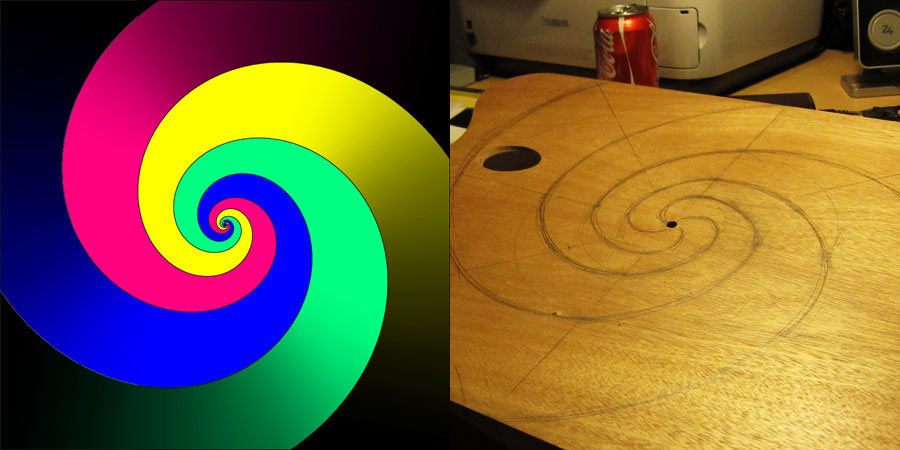
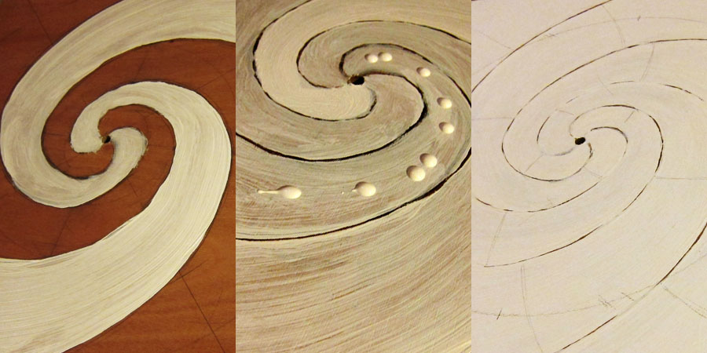
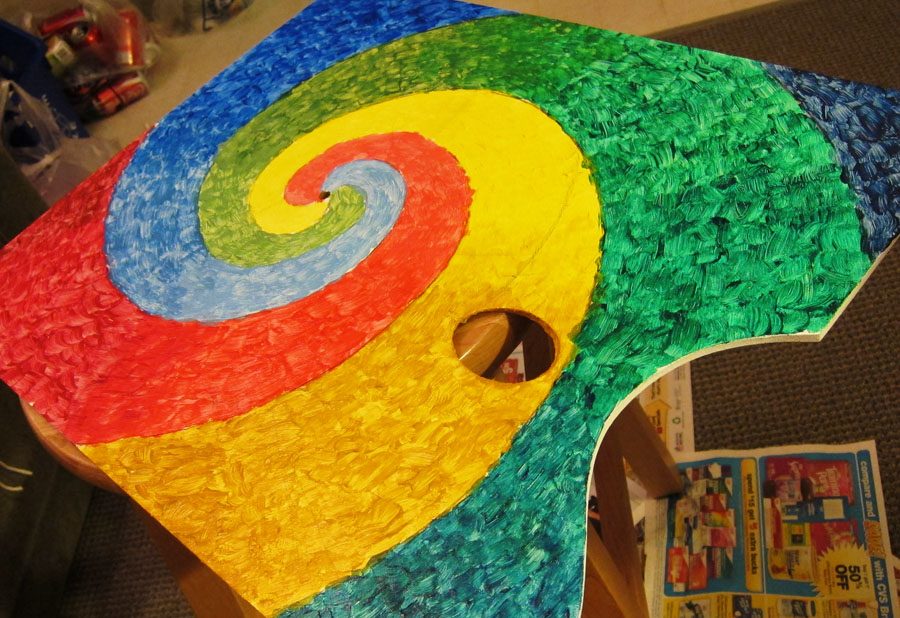
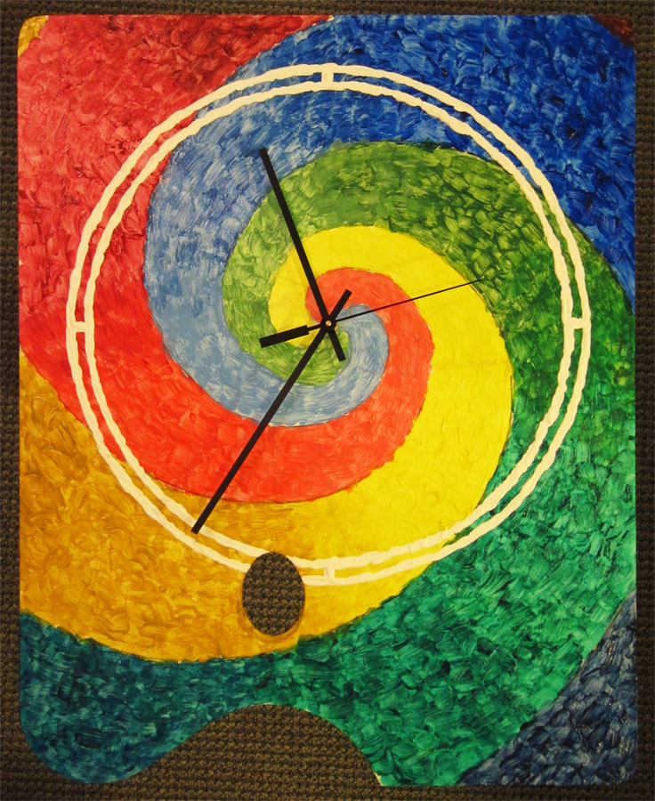

Spring break is here! This means I have more time to study, and hence more likely to get bored of studying. So I decided to turn to something I planned to do for quite a while… a clock.
I thought about this since September. Roughly, I want to use a palette as the background of the clock. I bought the palette and acrylic paint from an art store in Palo Alto. I got the clock movement from eBay.

As for the background, I was thinking of a spiral—A [log spiral](https://en.wikipedia.org/wiki/Log_spiral) to be precise. I decided to make it go one round with 20cm radius. Setting $a$ equals to 2 yields $b = 0.366468$.

First thing I did was to prime the palette with gesso. I did that three times. Then I make marks for gradient...

After priming, I stopped getting bored of studying so I went back to studying 😅 Two days later I got bored again so I came back to painting. This is how it looks after a few hours.

After finished painting, I thought for a while what’s still missing. I decided to later add two white circles with tick marks. After that, all that’s left is putting the clock in, and wallah… the DIY clock!

