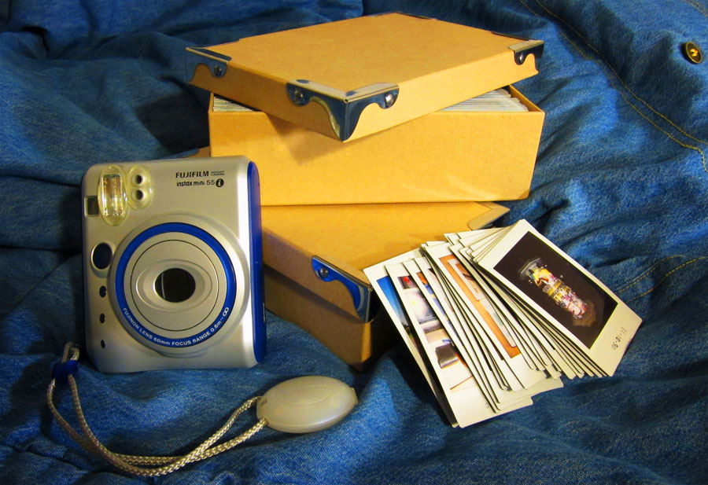
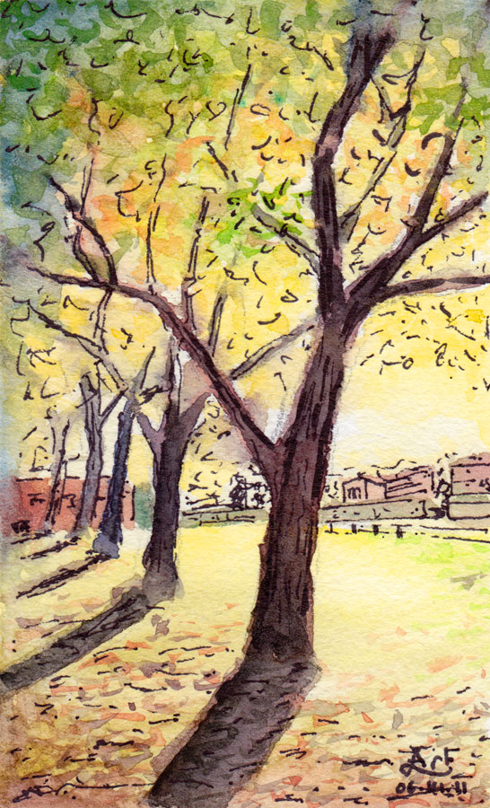

สวัสดีกันอีกครั้งนะครับ หลังจากหายไปนาน ก็สอบเสร็จไปประมาณสองอาทิตย์แล้ว ตอนนี้ก็อยู่ในช่วงที่ยังปรับตัวกับความว่างไม่ค่อยได้เท่าไหร่ ก็เลยเหมือนอยู่ไปวัน ๆ (แย่จัง) ทำนู่นทำนี่ หลัง ๆ มานี่ค่อยได้ทำอะไรที่ดูมีประโยชน์หน่อย วาดรูปบ้าง อัดเพลงบ้าง (อะไรบ้าง) ตอนนี้มีเวลาอยู่ซักชั่วโมงนึงก่อนนอน ก็เลยว่ามาเขียน blog ก็แล้วกัน

เรื่องที่จะเขียนนี่ที่จริงก็จะเขียนมาซักพักนึงแล้ว (เมื่อประมาณครึ่งปีก่อน) แต่ก็ยุ่งมากจนไม่ได้เขียนซักที กระนั้นแล้ว อย่าเสียเวลาอยู่เลย เริ่มกันเลยดีกว่านะครับ

เมื่อประมาณต้นปีก่อน ไปเจอ[เว็บนึง](http://photooftheday.hughcrawford.com/)น่าสนใจดี เป็นเว็บรวมรูปภาพที่คน ๆ นึงถ่ายไว้วันละภาพ ตั้งแต่ปี 1979–1997 รูปสุดท้ายลงวันที่ 25 ตุลาคม 1997 เป็นวันที่เค้าเสียชีวิตไป รวมทั้งสิ้น 18 ปี 6 เดือน กับอีก 25 วัน เป็นจำนวน 6,778 ภาพ (ตาม [WolframAlpha](https://www.wolframalpha.com/input/?i=3%2F31%2F79+to+10%2F25%2F97))

ก็มาคิดดูว่า น่าทำดีเหมือนกัน เพราะว่าตั้งใจจะเขียนบันทึกคล้าย ๆ กับไดอารี่ อะไรพวกนี้มาตั้งนานแล้ว แต่ก็ไม่มีเวลาและไม่ขยันพอซักที (เขียนนานสุด 7 วัน) ใช้วิธีถ่ายรูปเอาก็น่าจะใช้เวลาน้อยดี เห็นน้องแป้ง (STEP XII) เอามาถ่าย ๆ ก็ดูโอเคดี ก็เลยสั่งซื้อกล้อง [Fuji Instax mini 55i](http://camera-wiki.org/wiki/Fujifilm_Instax_Mini_50) มาเกือบจะทันทีจาก eBay... วันที่ 29 มกราคม เมื่อปีที่แล้ว กล้องก็มาถึงที่ Kimball แล้วก็เอามาประเดิมรูปของวันแรกไป

จุดประสงค์หลัก ๆ ที่คิดไว้ตอนแรกก็คืออยากจะบันทึกอะไรในชีวิตลงไป ไม่รู้คนอื่นเป็นเหมือนกันรึเปล่า แต่เวลาได้ย้อนไปดูอะไรเก่า ๆ แล้วก็รู้สึกดีเหมือนกัน ไม่ว่าความทรงจำช่วงนั้นจะดีหรือจะไม่ดีแค่ไหน ประมาณว่าวันนั้นเจออะไรก็ถ่ายมาล่ะครับ ช่วงไหนอยู่ห้องสมุดติดกันเป็นอาทิตย์เพื่อปั่นเปเปอร์ก็จะรู้ได้ทันที

ถามว่า ถ่ายทุกวันเลยเหรอ ก็ไม่ใช่นะครับ บางวัน (แต่เป็นส่วนน้อย) ก็แอบโกงบ้าง ถ่ายย้อนหลัง บางทีอะไรที่เก็บได้แต่ไม่มีเวลาถ่ายจริง ๆ เช่นตอนกำลังจะไป snow trip นี่ ก็เก็บหนังสือพิมพ์ที่ Stanford กำลังจะแข่ง Big Game กับ Berkeley เอาไว้ กลับมาถ่ายทีหลัง เป็นต้น

นับมาถึงตอนนี้ก็ 510 วันแล้ว หลังจากที่เริ่มถ่ายรูป "โพลารอยด์" มา (อันที่จริงโพลารอยด์เป็นชื่อบริษัทแรกที่ผลิตฟิล์มแบบเห็นภาพทันที คนก็เลยมักเรียกกล้องพวกนี้ว่ากล้องโพลารอยด์กัน เหมือนที่เรียกผงซักฟอกว่าแฟ้บนั่นแหละครับ) ก็ได้รูปมาทั้งหมด 509 รูป (ของวันนี้ยังไม่ได้ถ่าย) เก็บใส่กล่องที่ซื้อมาจาก Daiso ซึ่งขนาดพอดีมาก เก็บได้กล่องละแปดเดือน ตอนนี้ก็ได้สองกล่องกว่า ๆ แล้ว ก็ได้อะไรจากโปรเจคนี้มากกว่าการบันทึกสิ่งต่าง ๆ ในชีวิตเยอะเหมือนกัน อย่างเช่นว่าเป็น conversation starter ที่ดีมาก เวลาไปไหน ก็จะมีหัวข้อคุยกับคนที่ยังไม่รู้ว่าเราทำโปรเจคนี้อยู่เพิ่มอีกหนึ่งเรื่อง หลายคนก็สนใจจนซื้อกล้องกันไปเลยทีเดียว (พี่หวัง เป็นต้น) นอกจากนั้น การที่ต้องพกกล้องนี้ไปไหนต่อไหน ก็ทำให้เวลาเดิน ๆ ได้ดูนู่นดูนี่ไปเรื่อย เผื่อจะเห็นอะไรสวย ๆ ที่น่าถ่ายรูปบ้าง หรือเวลานั่งทำงานเบื่อ ๆ ก็มีการออกไปเดินถ่ายรูปเป็น study break ไปในตัว (แต่ส่วนใหญ่แล้วถ้างานรัดตัวจริง ๆ จะออกแนวถ่าย ๆ ให้เสร็จมากกว่า)

ก็นั่นแหละครับ ที่มา และความเป็นไปของโปรเจคนี้ ยังไม่รู้เหมือนกันว่าจะทำไปอีกถึงเมื่อไหร่ เพราะรูปนึงก็ตก \$0.70 กว่า ๆ ก็แพงอยู่เหมือนกัน แต่ถ้ายังอยากทำอยู่ก็คงทำไปเรื่อย ๆ แหละครับ 😊

สุดท้ายนี้ฝากรูปที่วาดมาจากรูปถ่ายของวันที่ 15 ธันวาคม 2553 ไว้ก็แล้วกันครับ

