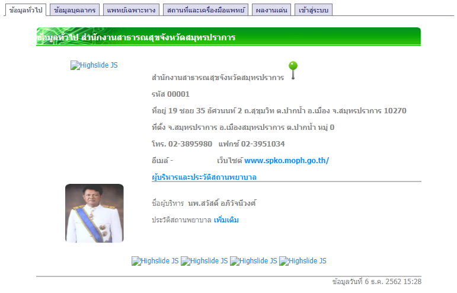
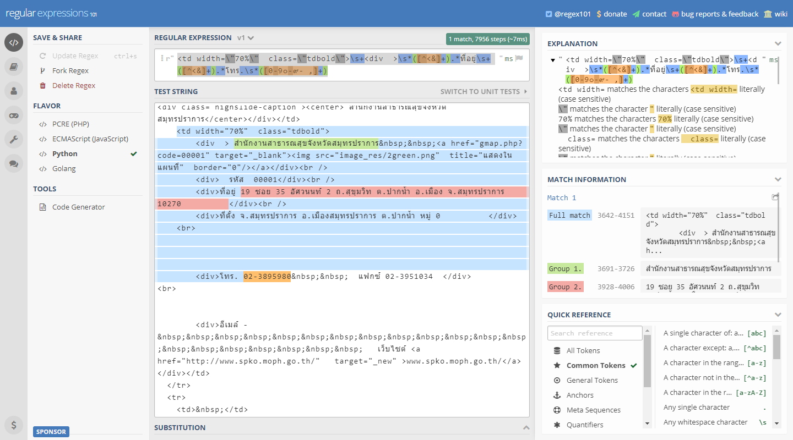

ปกติเวลาเราจะดึงข้อมูลจากเว็บมาใช้งาน ถ้าคนทำข้อมูลนึกถึงหัวอกคนใช้งาน ก็จะทำให้ข้อมูลอยู่ในรูปแบบที่เรียกว่า "machine-readable" ซึ่งก็แปลว่า ทำให้ช้อมูลอยู่ในรูปแบบที่คอมพิวเตอร์เข้าใจง่าย ๆ โดยระบบการรับส่งข้อมูลที่เป็นมาตรฐานที่สุด คือการใช้ API (application programming interface) และในโลกแห่งทุ่งลาเวนเดอร์ ทุกหน่วยงานก็จะมี API ให้เรายิงไปดูดข้อมูลมาด้วยความง่ายดาย

แต่อนิจจา เราไม่ได้อยู่ในทุ่งลาเวนเดอร์ มีหน่วยงานมากมายที่ยังจัดเก็บข้อมูลโดยใช้กระดาษเป็นแผ่น ๆ อยู่ ซึ่งอันนั้นจะขอยกไว้เป็นกลุ่มผู้ป่วยที่อาจจะเยียวยาได้ยากนิดนึง (วิธีส่วนใหญ่ ก็จะเป็นการ scan เอกสารเหล่านี้ แล้วใช้ OCR แปลงให้เป็น text file)

อีกกลุ่มนึง อาจจะดีขึ้นมาหน่อยและเห็นได้ค่อนข้างเยอะ คือข้อมูลที่อยู่ในเว็บต่าง ๆ แต่เจ้าของเว็บไม่ได้ทำ API ไว้ให้ จะด้วยความที่ไม่มีกำลังมาทำ หรือไม่อยากยกข้อมูลให้คนอื่นใช้ง่าย ๆ ก็ตาม (หน่วยงานไทย เข้าใจว่าจะเป็นทั้งสองอย่างปน ๆ กัน) ยกตัวอย่างเช่น [ระบบสารสนเทศภูมิศาสตร์ทรัพยากรสุขภาพ](http://gishealth.moph.go.th/healthmap/gmap.php) ซึ่งมีข้อมูลสถานพยาบาลต่าง ๆ ทั่วประเทศอยู่ค่อนข้างละเอียด ไม่ว่าจะเป็นที่ตั้ง ข้อมูลบุคลากร เครื่องมือแพทย์ที่มี ฯลฯ

ในตัวอย่างนี้ เราจะลองมาดึงข้อมูลของสถานพยาบาลทุกแห่งในประเทศไทยกัน!

:::note
บทความนี้ปรับปรุงจากเนื้อหาการสอนน้อง ๆ พนักงานใหม่ในสายนโยบายการเงินของแบงก์ชาติ เมื่อปี 2018
:::


# ข้อมูลที่มี

ก่อนที่เราจะ scrape อะไร ก็ต้องมาดูกันก่อนว่าลักษณะของที่เราจะไปเอามานั้นเป็นยังไง
ลองกดไปดู[หน้านี้](http://gishealth.moph.go.th/healthmap/info.php?maincode=00001) จะเห็นข้อมูลต่าง ๆ กดดูตาม tab ต่าง ๆ ข้างบนได้



นอกจากนี้ ถ้าเราลองเปลี่ยนรหัส 5 ตัวหลังสุด ก็จะพบว่ามันคือรหัสสถานพยาบาลต่าง ๆ นั่นเอง ซึ่งก็แปลว่าถ้าเราอยากดึงข้อมูลของสถานพยาบาลทุกแห่งในประเทศ เราก็สามารถ loop รหัสนี้ ตั้งแต่ `00001` ไปจนถึง `99999` ได้เลย แน่นอนว่าสถานพยาบาลในประเทศไทยคงมีไม่ถึงเกือบแสนแห่ง แต่อันไหนที่ไม่มีเราก็แค่ข้ามไปเท่านั้นเอง

# ขั้นตอนการ scrape โดยทั่วไป

อันนี้ไม่ได้เป็นสูตรตายตัวหรืออะไร แต่ขั้นตอนทั่ว ๆ ไปก็จะเป็นประมาณนี้

1. หาข้อมูลว่าอยู่ตรงไหน เค้าจัดเก็บข้อมูลยังไง
2. ดึงข้อมูลจากหน้าเพจมา
3. แยกข้อมูลที่เราต้องการออกมาเก็บไว้
4. ทำซ้ำข้อ 2–3 ไปเรื่อย ๆ จนกว่าจะพอใจ

ซึ่งข้อ 1 เราได้ทำไปประมาณนึงละ ต่อมาเรามาลองดูขั้นตอนต่อไปกัน


# เริ่มจากการทำ HTTP request ก่อน

ลองสร้าง file ใหม่ (จะเป็นใน Jupyter Notebook หรือ text editor อะไรก็ได้ แล้วแต่สะดวก) แล้วใส่ code นี้ไปดู

```python
import requests

url = 'http://gishealth.moph.go.th/healthmap/info.php?maincode=00001'
r = requests.get(url, timeout=1)
```

`requests` นี่เป็น package ที่มี feature ค่อนข้างเยอะ แต่อันนี้ความหมายง่าย ๆ ก็คือ ให้ส่ง get request ไปขอข้อมูลที่ URL ข้างต้น โดยตั้งค่า `timeout` ไว้ที่ 1 วินาที คือ ถ้าไม่ได้ response ใด ๆ กลับมาใน 1 วินาที ก็ให้เลิกซะ
จากนั้นถ้าเราลองพิมพ์ผลลัพธ์ที่ได้ออกมา ด้วยคำสั่ง `print(r)` ก็จะได้ `<Response [200]>` ออกมา

เราก็จะเห็นว่า `r` นี่จริง ๆ เป็น `response` object ([กดตรงนี้ไปดู doc ได้](https://www.w3schools.com/python/ref_requests_response.asp)) ซึ่งก็จะมี properties เยอะมาก ลองเล่นดูได้

อันนึงที่เราอาจจะสนใจ คือ `status_code` เป็นยังไง ก็สามารถพิมพ์ `r.status_code` ดูได้เลย อันนี้จะเป็น [HTTP status code](https://en.wikipedia.org/wiki/List_of_HTTP_status_codes) ซึ่งถ้าโอเค ไม่มีปัญหาอะไร ก็จะได้เลข `200` กลับมา หรือถ้าหาไม่เจอ ก็จะได้ `404` เป็นต้น (อันนี้ขึ้นกับคนเขียนเว็บ อย่างของอันนี้ ถ้าไม่เจอ เราจะได้หน้าเปล่า ๆ แต่ status code ยังเป็น `200` อยู่)

แล้วเราจะเอาข้อมูลมาจากไหนล่ะ? ข้อมูลที่ไปปรากฏในหน้า browser ก็สามารถเรียกได้จาก `print(r.text)` นั่นเอง ซึ่งก็จะเหมือนกับ source code ของ HTML page เด๊ะ ๆ เลย ถ้าลองหาดู ใน source code ก็จะมีข้อมูลที่เราสนใจอยู่ ไม่ว่าจะเป็นที่อยู่ เบอร์โทร เว็บไซต์ ฯลฯ


# แยกข้อมูลที่เราสนใจมาเก็บไว้ด้วย  RegEx

ตอนนี้เราได้ text response ที่มีข้อมูลเยอะแยะมาละ ทีนี้ถึงขั้นตอนที่เราจะต้องแยกเอาข้อมูลที่เราสนใจเก็บไว้

หลาย ๆ คนอาจจะรู้จัก wildcard search หรือการหาแบบไม่ระบุตัวอักษรทั้งหมด เช่น ถ้าเราอยากหาคำที่ขึ้นต้นด้วยอะไรก็ได้ แต่ลงท้ายด้วย `ing` เราก็จะหาว่า `*ing` หรืออยากได้คำที่ขึ้นต้นด้วย `s` ตามดัวยตัวอักษร 1 ตัว แล้วลงท้ายด้วย `t` ก็จะหาว่า `s?t` เป็นต้น

Regular expression เป็นประมาณนั้น แต่ทำได้มากกว่าประมาณ 230,000 เท่า ถ้าใครสนใจ ขอแนะนำให้ลองไปอ่านบทความ ["RegEx เมพ"]() (ซึ่งยังไม่ได้เขียน... ตึ๊ง) หรือ [Wikipedia](https://en.wikipedia.org/wiki/Regular_expression) ก่อน

สมมติเราต้องการตัวแปรเหล่านี้จากหน้า `info.php`

* ชื่อสถานพยาบาล
* ที่อยู่
* เบอร์โทร

ถึงจะไม่ค่อยคุ้นชินกับ regex ก็สามาถไปลองผิดลองถูกได้ เพราะ มีเว็บช่วยดูเพียบ เนื่องจาก regex เป็นเครื่องมือที่คนใช้กันแพร่หลายมากนั่นเอง โดยเว็บนึงที่อยากจะแนะนำคือ [regex101.com](https://regex101.com/) เพราะสามารถ export code มาเป็นภาษาต่าง ๆ ได้เลย แถมมี quick reference ให้อีกด้วย (ดูเฉลยได้[ที่นี่](https://regex101.com/r/ADp5rM/1))



จากนั้นเราก็เอา regex pattern ที่เราได้ มาใส่ใน code ของเราได้เลย

```python
import requests
import re # [!code ++]

url = 'http://gishealth.moph.go.th/healthmap/info.php?maincode=00001'
r = requests.get(url, timeout=1)

regex = r"<td width=\"70%\"  class=\"tdbold\">\s+<div  >" \ # [!code ++]
    + r"\s*([^<&]+).*ที่อยู่\s+([^<&]+).*โทร.\s*([0-9๐-๙- ,]+)" # [!code ++]
```

โดย function ที่จะใช้ มี 2 อัน

* `re.search()` จะ return ค่า match อันแรก เป็น `re.Match` object ซึ่งเราสามารถดูผลลัพธ์ได้โดยการเรียก `.group` ขึ้นมา
* `re.findall()` จะ return ค่า match ทุกอัน

ในกรณีนี้ เนื่องจากเรารู้อยู่แล้วว่าในหน้านึง จะมี match แค่อันเดียว ก็ใช้ `re.search()` จะมีประสิทธิภาพมากกว่า

```py
import requests
import re

url = 'http://gishealth.moph.go.th/healthmap/info.php?maincode=00001'
r = requests.get(url, timeout=1)

regex = r"<td width=\"70%\"  class=\"tdbold\">\s+<div  >" \
    + r"\s*([^<&]+).*ที่อยู่\s+([^<&]+).*โทร.\s*([0-9๐-๙- ,]+)"
m = re.search(regex, r.text, re.MULTILINE | re.DOTALL) # [!code ++]
```

เมื่อเราสั่ง `print([m.group(1), m.group(2), m.group(3)])` ก็จะได้ข้อมูลออกมา

```py
['สำนักงานสาธารณสุขจังหวัดสมุทรปราการ',
 '19 ซอย 35 อัศวนนท์ 2 ถ.สุขุมวิท ต.ปากน้ำ อ.เมือง จ.สมุทรปราการ 10270          ',
 '02-3895980']
```


# ทำวนไปสิ

อ่าห์ ตอนนี้ถ้าเราใส่ URL เข้าไป ก็จะได้ชื่อสถานพยาบาล ที่อยู่ แล้วก็เบอร์โทรมาแล้ว แต่! งานของเรายังไม่จบแค่นี้ เพราะถ้าจะเอาข้อมูลของสถานพยาบาลเดียว กดเข้าไปก๊อปมาแปะ ก็คงจะเร็วกว่านั่งเขียนโปรแกรมเป็นแน่แท้

สิ่งที่คอมจะชนะคน ก็คือความถึกกับความเร็วนี่แหละ

## ลองสร้าง loop

เราจะมาเริ่มสร้าง loop เล็ก ๆ ดูก่อน ให้มั่นใจว่า script เราใช้ได้ ไม่พัง 😊

ทีนี้ จะ loop ตามที่เกริ่นไว้ข้างต้น ก็ต้องไล่เลข `00001`, `00002`, ... ไปเรื่อย ๆ ซึ่งเรารู้วิธี loop จาก 1 ถึง 99,999 อยู่แล้วแหละ แต่ว่าต้องใส่เลข 0 ข้างหน้านี่ทำยังไงน้อ

จะเขียน function เองขึ้นมาก็คงได้ แต่ต้องคิดไว้ก่อนว่า มันต้องมีคนพยายามทำแบบนี้มาแล้วสิน่า แล้วก็ search โลด... Keyword ที่ใช้ คือ python fill zero left ก็จะพบว่า python มี function ชื่อ `zfill` อยู่แล้ว โดยวิธีใช้ก็ง่าย ๆ คือสมมติเราบอก `str(89).zfill(5)` ก็จะได้ string `"00089"` ออกมา โอ้ว ชีวิตอะไรจะง่ายเท่านี้

ว่าแล้วเราก็จัดการ loop โลด

```python
import requests
import re

url = 'http://gishealth.moph.go.th/healthmap/info.php?maincode='
regex = r"<td width=\"70%\"  class=\"tdbold\">\s+<div  >" \
    + r"\s*([^<&]+).*ที่อยู่\s+([^<&]+).*โทร.\s*([0-9๐-๙- ,]+)"

for i in range(1, 6):
  r = requests.get(url + str(i).zfill(5), timeout=1)
  m = re.search(regex, r.text, re.MULTILINE | re.DOTALL)
  print(i, [m.group(1).strip(), m.group(2).strip(), m.group(3).strip()])
```


ไม่แน่ใจว่าตอนนี้จะเป็นยังไง แต่ตอนเขียนอยู่นี่ เหมือนมีปัญหากับที่ `00003` อยู่ ทำให้ค้างนานมาก ได้ response มาประมาณนี้

```
1 ['สำนักงานสาธารณสุขจังหวัดสมุทรปราการ', '19 ซอย 35 อัศวนนท์ 2 ถ.สุขุมวิท ต.ปากน้ำ อ.เมือง จ.สมุทรปราการ 10270', '02-3895980']
2 ['สำนักงานสาธารณสุขจังหวัดนนทบุรี', 'ศูนย์ราชการจังหวัดนนทบุรี ม.8 ถ.รัตนาธิเบศร์ ต.บางกระสอ อ.เมือง จ.นนทบุรี  11000', '02 9503071-6']
---------------------------------------------------------------------------
timeout                                   Traceback (most recent call last)
...
```

คือได้ผลของสองอันแรกมา แต่อันที่สามเจ๊ง แล้วก็เลยจบเลย ซึ่งถ้าเราอยากดึงข้อมูลสถานพยาบาลมาเป็นพัน ๆ หมื่น ๆ แห่ง ปล่อยให้เจ๊งกลางคันอย่างนี้คงไม่ดีแน่

## จัดการกับ `timeout`

วิธีจัดการกับ error ต่าง ๆ คือใช้ [Try Except](https://www.w3schools.com/python/python_try_except.asp) ซึ่งถ้าเกิด error ขึ้น ก็จะไปเข้าที่ except แต่โปรแกรมก็ยัง run ต่อไปได้ ลองแบบนี้ดู

```python
import requests
import re

url = 'http://gishealth.moph.go.th/healthmap/info.php?maincode='
regex = r"<td width=\"70%\"  class=\"tdbold\">\s+<div  >" \
    + r"\s*([^<&]+).*ที่อยู่\s+([^<&]+).*โทร.\s*([0-9๐-๙- ,]+)"

for i in range(1, 6):
  try: # [!code ++]
    r = requests.get(url + str(i).zfill(5), timeout=1)
    m = re.search(regex, r.text, re.MULTILINE | re.DOTALL)
    print(i, [m.group(1).strip(), m.group(2).strip(), m.group(3).strip()])
  except: # [!code ++]
    print('*** Error at i = ' + str(i)) # [!code ++]
```


ก็จะได้ response แบบนี้

```
1 ['สำนักงานสาธารณสุขจังหวัดสมุทรปราการ', '19 ซอย 35 อัศวนนท์ 2 ถ.สุขุมวิท ต.ปากน้ำ อ.เมือง จ.สมุทรปราการ 10270', '02-3895980']
2 ['สำนักงานสาธารณสุขจังหวัดนนทบุรี', 'ศูนย์ราชการจังหวัดนนทบุรี ม.8 ถ.รัตนาธิเบศร์ ต.บางกระสอ อ.เมือง จ.นนทบุรี  11000', '02 9503071-6']
*** Error at i = 3
4 ['สำนักงานสาธารณสุขจังหวัดพระนครศรีอยุธยา', 'ค 130 ถนนอู่ทอง ต.หอรัตนไชย', '035-241520']
5 ['สำนักงานสาธารณสุขจังหวัดอ่างทอง', '122 ม.4 ถ.โพธิ์พระยา-ท่าเรือ  ต.บ้านอิฐ อ.เมือง จ.อ่างทอง', '035-611222']
```

เห็นได้ว่าจะเขียนว่า อันที่ 3 นั้นเจ๊ง แต่ก็ยังไปดึงข้อมูลของอันต่อ ๆ ไปมาได้ไม่มีปัญหา


# เก็บเข้าไฟล์

เอาล่ะ เริ่ม loop ได้แล้ว ขั้นสุดท้ายก็คือเก็บข้อมูลที่ได้ลงไฟล์ เพื่อเอามาวิเคราะห์ต่อไป โดยในตัวอย่างนี้จะลองเก็บเป็นไฟล์ `.csv` ก่อน
ขั้นตอนนี้ไม่ยากแล้ว เพราะค่อนข้าง standard คือเปิดไฟล์ขึ้นมา แล้วก็เรียก `csvwriter.writerow()` เป็นอันเสร็จสิ้น

```python
import requests
import re
import csv # [!code ++]

url = 'http://gishealth.moph.go.th/healthmap/info.php?maincode='
regex = r"<td width=\"70%\"  class=\"tdbold\">\s+<div  >" \
    + r"\s*([^<&]+).*ที่อยู่\s+([^<&]+).*โทร.\s*([0-9๐-๙- ,]+)"

with open('hospital.csv', 'w', newline='', encoding='utf-8-sig') as csvfile: # [!code ++]
  csvwriter = csv.writer(csvfile, quoting=csv.QUOTE_ALL) # [!code ++]
  for i in range(1, 6):
    try:
      r = requests.get(url + str(i).zfill(5), timeout=1)
      m = re.search(regex, r.text, re.MULTILINE | re.DOTALL)
      csvwriter.writerow([str(i).zfill(5), m.group(1).strip(), # [!code ++]
                m.group(2).strip(), m.group(3).strip()]) # [!code ++]
    except:
      print('*** Error at i = ' + str(i))
      csvwriter.writerow([str(i).zfill(5), "Error"]) # [!code ++]
```

ลองเช็คไฟล์ `hospital.csv` ดู ก็จะเห็นว่ามีข้อมูล 4 สถานพยาบาล ส่วนเบอร์ `00003` นั้นก็จะมี log ออกมาว่า "Error" เรียบร้อย

```
"00001","สำนักงานสาธารณสุขจังหวัดสมุทรปราการ","19 ซอย 35 อัศวนนท์ 2 ถ.สุขุมวิท ต.ปากน้ำ อ.เมือง จ.สมุทรปราการ 10270","02-3895980"
"00002","สำนักงานสาธารณสุขจังหวัดนนทบุรี","ศูนย์ราชการจังหวัดนนทบุรี ม.8 ถ.รัตนาธิเบศร์ ต.บางกระสอ อ.เมือง จ.นนทบุรี  11000","02 9503071-6"
"00003","Error"
"00004","สำนักงานสาธารณสุขจังหวัดพระนครศรีอยุธยา","ค 130 ถนนอู่ทอง ต.หอรัตนไชย","035-241520"
"00005","สำนักงานสาธารณสุขจังหวัดอ่างทอง","122 ม.4 ถ.โพธิ์พระยา-ท่าเรือ  ต.บ้านอิฐ อ.เมือง จ.อ่างทอง","035-611222"
```


# ยังช้าไปนะ

ถึงตอนนี้ เราก็แค่ให้ loop ตั้งแต่ 1 ถึง 99,999 ก็เสร็จแล้ว! แต่ก็ยังมีอีกหลายอย่างให้ปรับปรุงเหมือนกัน เช่น จะ loop ตั้งแต่ 1 ถึง 99,999 นั้น กว่าจะได้ก็อาจจะแก่ตายก่อน โดยเฉพาะถ้า server ไม่เร็ว หรือมี traffic มาก คอขวดหลักที่ทำให้ช้าคือตอน `requests.get()` ต้องรอ response จาก server ค่อนข้างนาน

จะดีมั้ย ถ้าระหว่างที่รอ เราก็ขอ request อื่นไปด้วยได้... คำตอบก็คือ ดีสิ!

ทำแบบนี้เรียก multithreading เปรียบเทียบก็เหมือนแทนที่จะนั่งพิมพ์ข้อมูลยู่คนเดียว ก็ขอให้เพื่อนมาช่วยทำหลาย ๆ คน ซึ่งจริง ๆ python สามารถทำได้ แต่ในขั้นนี้จะขอแนะนำแบบง่าย ๆ ก่อน เป็น fake multithreading ก่อนละกัน คือ เขียน script ขึ้นมา โดยเราสามารถบอกได้ว่าให้ดูดข้อมูลตั้งแต่รหัสเท่าไหร่ถึงเท่าไหร่ แล้วเราก็ run sript นี้ไปพร้อม ๆ กันซัก 10 อัน

ก่อนอื่นก็ทำให้ code เรารับ argument จาก command line ได้ก่อน ตามด้านล่างเลยจ้า

```python
import requests
import re
import csv
import sys # [!code ++]

url = 'http://gishealth.moph.go.th/healthmap/info.php?maincode='
regex = r"<td width=\"70%\"  class=\"tdbold\">\s+<div  >" \
    + r"\s*([^<&]+).*ที่อยู่\s+([^<&]+).*โทร.\s*([0-9๐-๙- ,]+)"

with open(sys.argv[3], 'w', newline='', encoding='utf-8-sig') as csvfile: # [!code ++]
  csvwriter = csv.writer(csvfile, quoting=csv.QUOTE_ALL)
  for i in range(int(sys.argv[1]), int(sys.argv[2]) + 1): # [!code ++]
    try:
      r = requests.get(url + str(i).zfill(5), timeout=1)
      m = re.search(regex, r.text, re.MULTILINE | re.DOTALL)
      csvwriter.writerow([str(i).zfill(5), m.group(1).strip(),
                m.group(2).strip(), m.group(3).strip()])
    except:
      print('*** Error at i = ' + str(i))
      csvwriter.writerow([str(i).zfill(5), "Error"])
```

จากนั้นถ้าเราต้องการให้ script ดูดข้อมูลของรหัส 1–100 ไปไว้ที่ `out_1.csv` ก็พิมพ์ไปว่า

```bash
python hospital_scrape.py 1 100 out_1.csv
```

ได้เลย

# บทสรุป

จะเห็นได้ว่าการ scrape ข้อมูลนี้ไม่ได้ยากเลย โดยเฉพาะถ้าเป็นข้อมูลที่เราสามารถเห็นได้ชัด ๆ จากการดู source code ขั้นต่อไปก็อาจจะมีการใช้เครื่องมืออย่างอื่นที่ advance ขึ้น เช่น ดึงข้อมูลจาก class ต่าง ๆ นอกจากนี้ ก็ยังมีบางจุดที่เราสามารถปรับปรุง code นี้ได้ เช่น การทำให้เป็น true multithreading หรือการจัดการกับ error เพราะตอนนี้พอเราเจอ error เราก็แค่บอกว่าเป็น error แต่อาจจะดีถ้าเราจะบอกประเภท error ได้ เช่น เป็น timed out หรือ not found ได้ เวลาเราจะจัดการ clean up ข้อมูลจะได้ง่ายขึ้นหน่อย

ยังไงก็หวังว่าจะได้รับประโยชน์ไปจากบทความนี้นะครับ