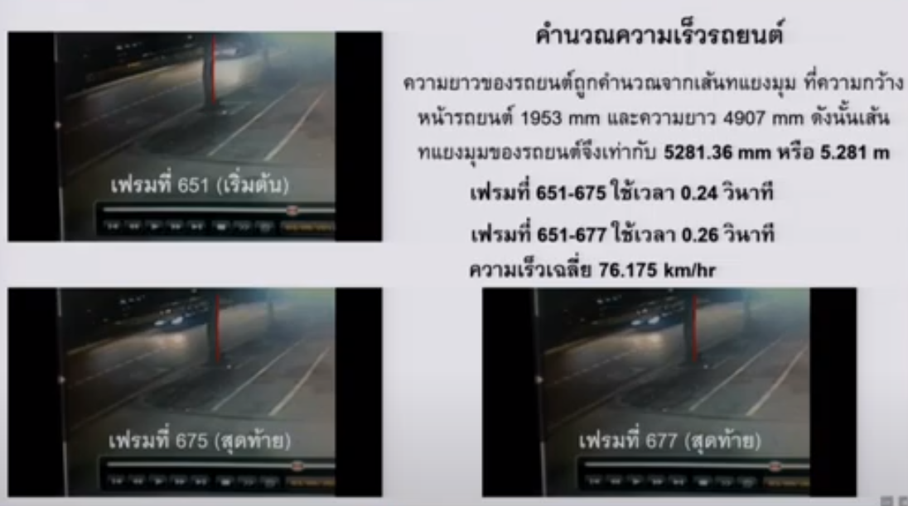
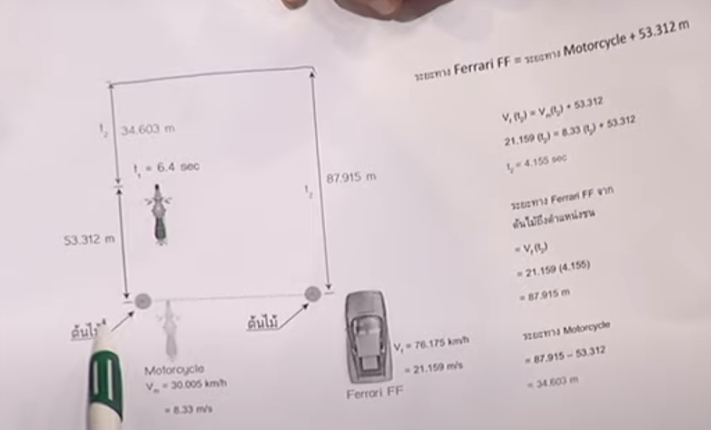

import { speedPlot } from './plot'
import Diagram from "./Diagram.jsx"

ข่าวที่เป็นที่สนใจกันมากในตอนนี้ คือข่าวที่[อัยการมีคำสั่งไม่ฟ้อง บอส อยู่วิทยา](https://edition.cnn.com/2020/07/23/asia/red-bull-vorayud-yoovidhya-charges-dropped-intl/index.html) กรณีเกิดอุบัติเหตุเมื่อปี 2555 ส่งผลให้ดาบวิเชียร กลั่นประเสริฐ เสียชีวิต

หนึ่งใน "หลักฐาน" สำคัญที่อัยการใช้เป็นเหตุผลในการสั่งไม่ฟ้อง คือการที่มีผู้เชี่ยวชาญ [อาจารย์สายประสิทธิ์ เกิดนิยม](https://www2.mtec.or.th/search_researcher/detail.asp?p=frcvbzwhpbzwiadf&k=szty) มาให้ความเห็นว่ารถของบอสมีความเร็วเฉลี่ยเพียง **76.175 กม./ชม.** เท่านั้น จากเดิมที่สำนักงานพิสูจน์หลักฐานกลางให้ไว้ที่ 177±17 กม./ชม. ซึ่งลดลงกว่าครึ่งนึงเลยทีเดียว ทำให้เกิดความฉงนงงงวยว่าคำนวณมาได้อย่างไร

วันนี้เราจะมาลองดูกัน

# การคำนวณความเร็วของเดิม

[วิธีเดิม](https://www.thairath.co.th/news/society/1898739)ที่กองพิสูจน์หลักฐานใช้ในการคำนวณความเร็วรถ คือใช้ระยะทางถนนที่กล้องวงจรปิดจับได้ ซึ่งคือประมาณ 31±2 เมตร) หารด้วยเวลาที่รถใช้ในการเดินทางผ่านระยะทางนั้น ซึ่งคิดจากจำนวนเฟรมที่ใช้ ได้ประมาณ 0.6 วินาที ทำให้สามารถคำนวณความเร็วโดยประมาณได้ว่าเป็น 177 กม./ชม.

# การคำนวณความเร็ววิธีใหม่

วันนี้ รายการตอบโจทย์ เชิญอาจารย์สายประสิทธิ์ เกิดนิยม ผู้เชี่ยวชาญด้านความปลอดภัยยานยนต์ สถาบันเทคโนโลยีพระจอมเกล้าพระนครเหนือ และเป็นผู้เชี่ยวชาญที่ให้ความเห็นที่ทำให้อัยการมีคำสั่งไม่ฟ้องมาออกอากาศ อาจารย์ได้อธิบายวิธีคำนวณดังคลิปด้านล่าง

<YouTube id="c88Oz2XM3P0" params="start=520" />

ภาพที่อาจารย์ใช้อธิบาย ก็ตามด้านล่างนี่เลย (ต้องขออภัยด้วยที่ไม่ชัด เพราะแคปมาจาก YouTube ที่แคปมาจาก slide ของอาจารย์ ที่มีรูปที่ถ่ายมาจากจอที่เล่นวีดีโอกล้องวงจรปิดอีกที)

อธิบายง่าย ๆ ก็คือว่า เรามีจุดอ้างอิงอันนึง ในที่นี้คือขอบขวาของต้นไม้ ในเฟรมที่ 651 มุมขวาหน้าของรถผ่านจุดนั้น... หลังจากนั้นถัดไปอีก 24–26 เฟรม (เฟรมที่ 675–677) มุมซ้ายหลังของรถก็ผ่านจุดเดียวกัน ดังนั้น ก็สามารถคำนวณความเร็วได้ จากระยะห่างระหว่างมุมซ้ายหน้ากับมุมขวาหลัง ซึ่งก็คือความยาวเส้นทแยงมุมของรถ หารด้วยเวลาที่ใช้ ออกมาได้ 76.175 กม./ชม. นั่นเอง

ฟังดูไม่ซับซ้อนเลยใช่มั้ยครับ

## ลองเปลี่ยนมุมมอง

หลายครั้งเราสามารถ "เช็ค" ความคิดของเราได้ด้วยการวาดรูปครับ

<Diagram step={1} />

จากรูป ถ้า "ผู้สังเกตการณ์" (ในที่นี้คือกล้องวงจรปิด) มองตามเส้นประ ผ่านจุดอ้างอิง (ต้นไม้) ระยะที่รถเคลื่อนไปจากขณะที่มุมขวาหน้าของรถเคลื่อนผ่านเส้นประ ไปจนถึงขณะที่มุมซ้ายหลังของรถเคลื่อนผ่านเส้นประ ปรากฎตามภาพด้านบน

แต่ถ้าใช้วิธีที่อาจารย์สายประสิทธิ์คำนวณ ซึ่งคิดว่าในช่วงเวลาดังกล่าว รถเคลื่อนที่ไปได้ตามระยะของเส้นทแยงมุมของรถ (ระยะสีส้ม) เท่านั้น ซึ่งเป็นระยะที่น้อยกว่าระยะที่เกิดขึ้นจริง (ระยะสีเขียว)

:::note
ระยะจริงจะเป็นเท่าไหร่นั้น ขึ้นอยู่กับตำแหน่งของผู้สังเกตการณ์ จุดอ้างอิง และระยะห่างของรถจากจุดอ้างอิง
:::

## แล้ววิธีของอาจารย์นี่จะถูกได้เมื่อไหร่

ถ้ามาคิดดี ๆ แล้ว วิธีเดียวที่เราจะเห็น

1. รถเคลื่อนไปด้วยระยะทางเท่ากับเส้นทแยงมุมของรถ
2. จุดเริ่ม อยู่ที่มุมขวาหน้าของรถ
3. จุดจบ อยู่ที่มุมซ้ายหลังของรถ

ก็จะต้องเป็นตามรูปด้านล่างเท่านั้น เรียกได้ว่าต้องดริฟท์มาเลยทีเดียว (หมายถึงรถนะ ไม่ใช่คำอธิบาย)

<Diagram step={2} />

จะเห็นได้ว่า วิธีคำนวณของอาจารย์สายประสิทธิ์ ซึ่งเป็นสิ่งที่อัยการใช้เป็นหนึ่งในเหตุผลหลักที่มีคำสั่งไม่ฟ้องนั้น มีจุดอ่อนที่ค่อนข้างใหญ่มากอยู่

# จุดที่ชน

สิ่งนึงที่อาจารย์บอกว่าอาจารย์ใช้ในการ cross-check ผลการคำนวณ คือการที่ความเร็วรถทั้งสองคันที่อาจารย์คำนวณมา (รถมอเตอร์ไซค์ 30 กม./ชม. รถยนต์ 76.175 กม./ชม.) สามารถคาดการณ์จุดที่เกิดอุบัติเหตุได้อย่างถูกต้อง (ตามรูปด้านล่าง)

แต่อาจารย์อาจจะลืมไป ว่าไม่ได้มีความเร็วเพียงคู่เดียวที่ทำให้เกิดจุดชนนี้ได้

สมมติว่ารถมอเตอร์ไซค์วิ่งมาด้วยความเร็ว $v_1$ ผ่านจุดอ้างอิง (คือต้นไม้) หลังจากเวลาผ่านไป $t_1$ รถยนต์ที่มาด้วยความเร็ว $v_2$ ก็ผ่านจุดอ้างอิงเดียวกัน ในเวลานั้น จากนั้นทั้งสองคันก็วิ่งไปจนเวลาผ่านไปอีก $t_2$ จึงชนกัน

ตั้งสมการ (ไม่ได้ใช้คำนี้มานานมาก) ได้สองสมการ สมการแรกเป็นของรถยนต์ คือระยะเท่ากับความเร็วคูณเวลา

$$
x = v_2 t_2 \quad\Rightarrow\quad t_2 = \frac{x}{v_2}
$$

อีกสมการเป็นของรถมอเตอร์ไซค์ ซึ่งใช้เวลา $t_1 + t_2$ ในการวิ่งระยะ $x$ ด้วยความเร็ว $v_1$

$$
x = v_1(t_1 + t_2)
$$

แทนค่า $t_2$ ที่ได้จากสมการแรก จะได้ว่า

$$
x = v_1\left(t_1 + \frac{x}{v_2}\right) \quad\Rightarrow\quad v_1 = \frac{x}{t + \frac{x}{v_2}}
$$

สิ่งที่เรารู้คือ $t_1$ (ดูจากกล้องวงจรปิด) และ $x$ (ระยะระหว่างจุดอ้างอิงกับจุดเกิดเหตุ) และมีตัวแปรที่ไม่ทราบค่าอยู่สองตัว คือ $v_1$ กับ $v_2$ นั่นก็แปลว่า สำหรับค่า $v_2$ ใด ๆ ก็จะมีค่า $v_1$ ที่ทำให้จุดเกิดเหตุอยู่ห่างจากจุดอ้างอิงไป $x$ เหมือนกัน

<Plotter options={speedPlot} />

ลองแทนค่า $t_1 = 6.4$ และ $x = 87.915$ ตามภาพของอาจารย์สายประสิทธิ์ข้างต้น สมมติว่ารถเฟอร์รารี่วิ่งมาด้วยความเร็ว 177 กม./ชม. (49.17 m/s) ก็จะได้ว่ารถมอเตอร์ไซค์จะต้องวิ่งด้วยความเร็ว 10.74 m/s หรือ 38.66 กม./ชม. ซึ่งใกล้เคียงกับที่อาจารย์ได้คำนวณไว้ (เนื่องจากความกว้างของมอเตอร์ไซค์ค่อนข้างน้อย ใช้วิธีของอาจารย์จึงไม่คลาดเคลื่อนมากนัก)

# ข้อมูลที่มีอยู่อย่างจำกัด

คุณวราวิทย์ ผู้ดำเนินรายการ ได้ถามอาจารย์ในช่วงหนึ่งว่า ทำไมอาจารย์ไม่ใช้วิธีคำนวณเดียวกับที่กองพิสูจน์หลักฐานใช้ คือดูระยะยาว ๆ ทั้งความกว้างของมุมกล้อง

อาจารย์ตอบว่า ไม่สามารถไปจำลองเหตุการณ์ที่จุดเกิดเหตุจริงได้ เพราะอาจารย์ได้รับคำขอให้มาคำนวณความเร็วหลังจากเหตุการณ์ผ่านไปแล้วหลายปี ซึ่งมุมกล้องก็อาจจะเปลี่ยนไปจากเดิมเมื่อปี 2555

อันนี้นับว่าเป็นข้อกังวลที่ถูกต้อง และก็อาจจะช่วยชี้ให้เห็นได้ว่า ข้อมูลที่อาจารย์มี (ซึ่งก็คือภาพจากกล้องวงจรปิด) นั้น น้อยกว่าข้อมูลที่ทีมพิสูจน์หลักฐานมีเป็นอย่างมาก เพราะในปี 2555 ทีมพิสูจน์หลักฐานสามารถไปดูมุมกล้อง วัดระยะทางต่าง ๆ ในที่เกิดเหตุจริงได้

# บทสรุป

สุดท้ายแล้ว บทสรุปเรื่องนี้จะออกมาเป็นอย่างไร ก็คงต้องให้ทางเจ้าหน้าที่เค้าสืบเสาะไป ที่มาเขียนนี่แค่ทนไม่ได้กับการวิเคราะห์ที่ถ้าลองวาดรูปดูก็เห็นแล้วว่าไม่ใช่... แล้วข้อผิดผลาดนี้ผ่านตาอาจารย์ที่เป็นผู้เชี่ยวชาญทางด้านความปลอดภัยยานยนต์มาได้อย่างไร ผ่านตาทีมตรวจสอบของอัยการมาได้อย่างไร อันนี้ก็ไม่ทราบเหมือนกันครับ
