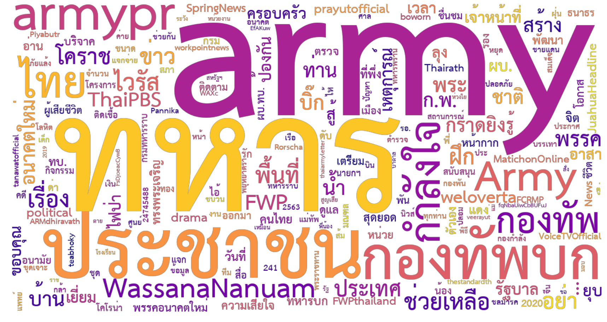
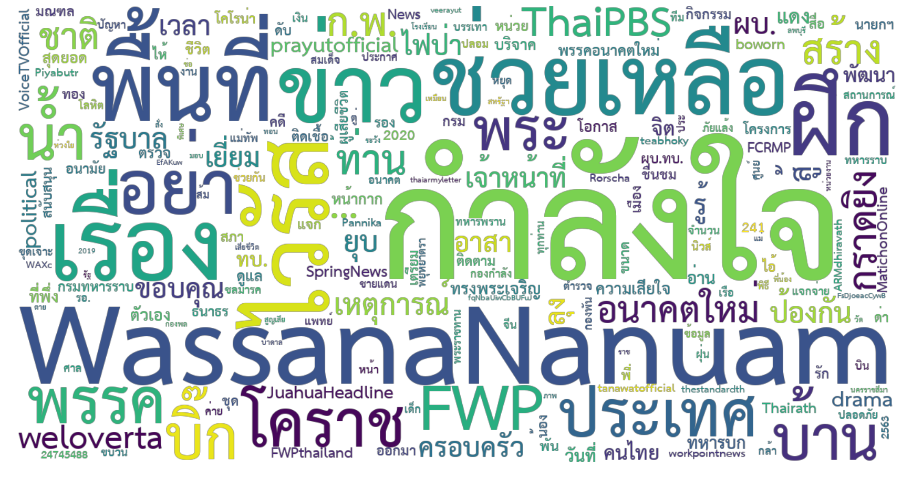
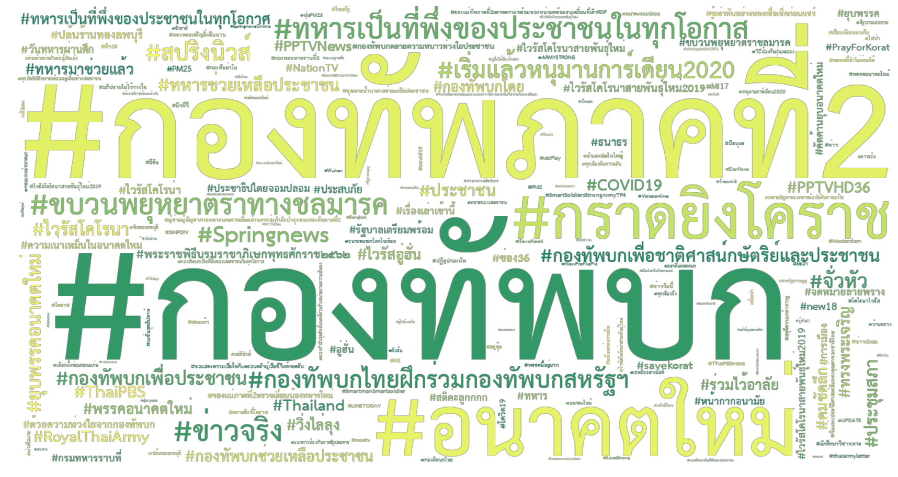
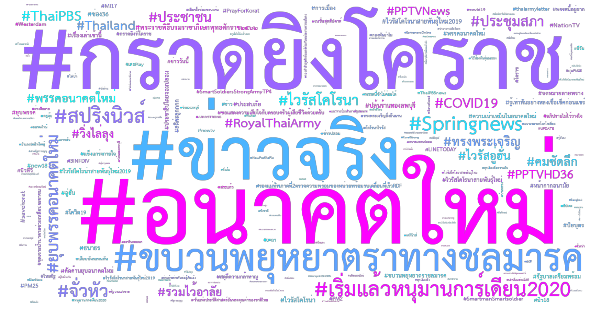

import {intl} from './intl'
import {time} from './time'

ข่าวใหญ่วันนี้คือเรื่องที่ Twitter ออกมาแถลงว่า[มีการปิดบัญชีไป 1,594 บัญชี](
  https://blog.twitter.com/en_us/topics/company/2020/disclosing-removed-networks-to-our-archive-of-state-linked-information.html)
เนื่องจากตรวจสอบพบว่าเป็นบัญชีที่เกี่ยวข้องกับปฏิบัติการข้อมูลข่าวสารของรัฐบาล
  ("state-linked information operations")

ที่ทำให้เป็นข่าวใหญ่ในประเทศไทยก็คือ พบว่ามีถึง 926 บัญชีที่เกี่ยวโยงกับกองทัพบก
Twitter ยังกล่าวด้วยว่าบัญชีที่ถูกปิดไปนี้มีการกระทำที่สนับสนุนกองทัพบกและรัฐบาล
  รวมถึงโจมตีผู้มีบทบาททางการเมืองฝ่ายตรงข้ามด้วย

ข่าวนี้อ่าน ๆ ดูตอนแรกก็เฉย ๆ เพราะมีข่าวทำนองนี้ออกมาตั้งแต่การ[อภิปรายไม่ไว้วางใจ](https://mgronline.com/onlinesection/detail/9630000019216)ครั้งก่อน
  ที่ทำให้ข่าวนี้น่าสนใจมาก คือเพิ่งมารู้ว่า Twitter [เปิดเผยข้อมูล](
  https://transparency.twitter.com/en/reports/information-operations.html)เกี่ยวกับบัญชีเหล่านี้ด้วย
  ไม่ว่าจะเป็นเวลาที่สร้างบัญชี ข้อความที่ส่ง เวลา จำนวนคนกด like หรือ retweet ฯลฯ

วันนี้เราเลยจะมาลองดูว่าข้อมูลชุดนี้บอกอะไรเราได้บ้าง

# ไทยไม่ได้มีบัญชี IO เยอะสุด

วันนี้ข่าวพาดหัวหลายอันเขียนประมาณว่า Twitter บิดบัญชี IO 1,594 บัญชี โดยมีบัญชีของไทยถึง 1/3 ครองแชมป์เลยทีเดียว!
อีกนัยหนึ่งคือ ไทยมีบัญชี IO ที่ถูก Twitter จับเยอะที่สุดในโลกแล้ว
แต่มันเป็นยังงั้นจริง ๆ เหรอ

<Plotter options={intl} />

ถ้าเข้าไปดูหน้า [archive](https://transparency.twitter.com/en/reports/information-operations.html)
  จะเห็นได้ว่า Twitter เปิดเผยข้อมูลต่าง ๆ มาตั้งแต่ตุลาคม 2561 แล้ว
แล้วก็มีการปิดบัญชี IO ลักษณะนี้ของประเทศต่าง ๆ มาโดยตลอด
ครั้งยิ่งใหญ่ที่สุดน่าจะเป็นเดือนพฤษภาคม 2563 ที่ปิดบัญชีของจีนไปถึง 23,750 บัญชี
ส่วนไทยนั้น เป็นแค่ติ่งเล็ก ๆ ตรงปลายสุดเท่านั้นเอง

ดังนั้น ข่าวที่ออกมาอาจจะทำให้สับสนนิดนึง **เพราะครั้งนี้เป็นครั้งแรกที่บัญชี IO ของไทยโดนจับได้ ก็เลยโดนเยอะหน่อย**
(ประเทศที่โดนจับในรอบเดียวกันคือคิวบา ซึ่งโดนเป็นครั้งแรกเหมือนกัน มี 526 บัญชี ส่วนรัสเซีย อิหร่าน และซาอุดิอาระเบีย
  ครั้งนี้โดนไปรวมกัน 142 บัญชี แต่โดนมาก่อนหน้านี้แล้วรวมกัน 19,217 บัญชี)

# ทวิตเวลาทำงานบ่อยสุด

จากข้อมูลการทวิตทั้งหมดสองหมื่นกว่าครั้ง พบว่ากิจกรรมการทวิตส่วนใหญ่ของบัญชีพวกนี้จะเป็นในเวลางาน
  คือเริ่มประมาณ 8:30 พอตอนเที่ยงก็จะมีพักทานข้าวหน่อยนึง กลับมามีแรงตอนบ่ายครึ่ง
  พอถึงบ่ายสามครึ่งก็จะซา ๆ ลง
การทวิตช่วงเย็น ๆ ค่ำ ๆ แม้จะมีอยู่บ้างแต่ก็น้อยกว่าช่วงเวลาทำงานอย่างเห็นได้ค่อนข้างชัด
(อาจจะกลับกันกับกลุ่มเด็ก ๆ ที่[เดาว่า]มาทวิตตอนเย็น ๆ ค่ำ ๆ เป็นหลัก)

<Plotter options={time} />

ส่วนวันเสาร์อาทิตย์นั้นมีรูปแบบต่างกันค่อนข้างชัด คือจะเริ่มตอนสาย ๆ และช่วงเที่ยงเป็นช่วงที่มีการทวิตเยอะที่สุด

# ทวิตเรื่องทหารมากสุด

อันนี้อาจจะไม่เป็นที่น่าแปลกใจเท่าไหร่ (เพราะเป็น IO ทหาร)
คำที่ใช้มากที่สุดก็จะเป็นคำที่เกี่ยวเนื่องกัน เช่น army ทหาร กองทัพบก ประชาชน ฯลฯ

ถ้าเราลองเอาคำพวกนี้ออกไปก็จะเห็นคำที่หลากหลายมากขึ้นนิดนึง
ที่เห็นชัด ๆ หน่อยคือเรื่องเกี่ยวกับ[เหตุการณ์กราดยิงที่โคราช](
  https://th.wikipedia.org/wiki/เหตุกราดยิงที่จังหวัดนครราชสีมา_พ.ศ._2563)
ชื่อคุณ[วาสนา นาน่วม](https://twitter.com/WassanaNanuam)
และเรื่องเกี่ยวกับการยุบพรรคอนาคตใหม่

## ดูจาก #hashtag

ทีนี้แทนที่จะดูคำทั้งหมด เราดูแต่ hashtag กันบ้าง
  เพื่อตัดปัญหาเรื่องการตัดคำภาษาไทย ฯลฯ ออกไป
  ก็จะเห็นรูปแบบเดิม คือเป็นการทวิตเรื่องทหาร
โดย [#กองทัพบก](https://twitter.com/search?q=%23กองทัพบก) และ
  [#กองทัพภาคที่2](https://twitter.com/search?q=%23กองทัพภาคที่2) เป็น hashtags ที่ได้รับความนิยมสูงสุด
รวมทวิตที่มีการใช้ hashtag ที่มีคำว่า "กองทัพ" หรือ "ทหาร" รวมกันกว่า 1,200 ครั้ง
  หรือกว่า 30% ของทวิตทั้งหมดที่มีการใช้ hashtag

ถ้าเราตัด hashtag ที่มีคำว่า "กองทัพ" หรือ "ทหาร" ออก 
  ก็จะเห็นว่า [#อนาคตใหม่](https://twitter.com/search?q=%23อนาคตใหม่) เป็น hashtag
  ที่ถูกใช้บ่อยเป็นอันดับสาม ตามมาด้วย [#กราดยิงโคราช](https://twitter.com/search?q=%23กราดยิงโคราช) และ
  [#ข่าวจริง](https://twitter.com/search?q=%23ข่าวจริง) ตามลำดับ

# บทสรุป

นอกจากบทความนี้แล้ว
  ยังมีอีกบทความของ [Stanford Internet Observatory (StanfordIO)](https://twitter.com/stanfordio)
  ที่เป็น partner และได้รับข้อมูลจาก Twitter ก่อนจะเปิดเผยข้อมูลนี้ออกมา
  ได้[วิเคราะห์](https://fsi.stanford.edu/news/twitter-takedown-october-2020)เวลาที่บัญชีเหล่านี้ถูกสร้างขึ้นว่าเป็นช่วงต้นปี 2563
  แล้วพอเกิดเหตุการณ์กราดยิงที่โคราช account เหล่านี้ก็ active ขึ้นมาพอสมควร

นอกจากนี้ [อาจารย์อรรถพล](http://www.arts.chula.ac.th/ling/people/faculty/attapol8/)ยังได้ทำการ[วิเคราะห์ข้อความ](https://www.facebook.com/teattapol/posts/3337686199651109)แบบละเอียด
เกี่ยวกับกลุ่มเนื้อหาที่ทวิตอีกด้วย น่าสนใจมากทีเดียว

ที่สำคัญคือ บัญชี IO ไม่น่าจะมีอยู่เท่านี้
  ดังนั้นการที่จะไปสรุปอะไรด้วยข้อมูลจากเพียง 924 บัญชีที่ถูกเปิดเผยในครั้งนี้อาจจะทำให้ได้ภาพที่ผิดเพี้ยนไปได้
อย่างไรก็ดี เราพอจะเห็น pattern ที่เหล่า IO (หรือผู้ที่ถูกกล่าวหาว่าเป็น IO) ใช้แล้ว
  ซึ่งเราน่าจะสามารถเอา pattern เหล่านี้มาตรวจจับบัญชีที่ยังไม่ถูกลบออกไปได้เหมือนกัน

ท้ายที่สุด ขอชื่นชมในความ open data ของ Twitter ทำให้พวกเราได้ข้อมูลมาเล่นกันสนุกสนาน

ไว้รอดูกันว่าจะมีบัญชีและข้อมูลเพิ่มจากนี้อีกมั้ย ;)
