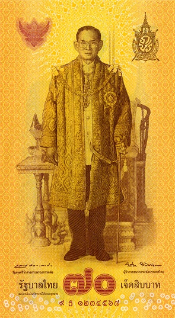

import { circulation } from './circulation'

import note20 from './K9-20.png'
import note50 from './K9-50.png'
import note100 from './K9-100.png'
import note500 from './K9-500.png'
import note1000 from './K9-1000.png'

คิดกลับไปกลับมาอยู่นานว่าจะเขียนดีมั้ย เพราะรอบที่จะเขียนก่อนหน้านี้ก็รู้สึกว่าคนจะไม่ค่อยสนใจแล้ว
แต่เว้นไปซักวันสองวัน เรื่องนี้ก็ได้รับความสนใจขึ้นมาอีก จนรู้สึกว่า เขียนก็ได้(วะ)
ยังไงถ้าอันไหนตอบไม่เคลียร์ comment ไว้ด้านล่างได้นะครับ แล้วจะค่อย ๆ เพิ่มเข้ามา

# การออกธนบัตร

## ธนบัตรที่ระลึกคืออะไร

เวลาแบงก์ชาติจะออกธนบัตรรูปแบบใหม่มา จะมีอยู่สองแบบ
แบบแรกคือการเปลี่ยนรูปแบบธนบัตรหมุนเวียน คือเลิกการผลิตแบบเดิม แล้วเปลี่ยนไปผลิตแบบใหม่
จนถึงปัจจุบัน แบงก์ชาติพิมพ์ธนบัตรออกมาแล้ว [17 แบบด้วยกัน](https://www.bot.or.th/th/our-roles/banknotes/History-and-Series-of-Banknote-And-Commemorative/banknotes-series.html)

อีกแบบคือการพิมพ์ธนบัตรแบบใหม่ขึ้นมาเพิ่ม โดยที่ยังคงพิมพ์ธนบัตรแบบเดิมต่อไปด้วย
ธนบัตรที่ถูกพิมพ์ออกมาแบบนี้จะเรียกว่า**ธนบัตรที่ระลึก** ซึ่งก็จะออกมามากน้อยตามโอกาสและความเหมาะสม
ตั้งแต่หลักร้อยฉบับไปจนถึงหลักหลายล้านฉบับ

ธนบัตรที่ระลึกที่ผลิตออกมาจำนวนมากและหลายคนน่าจะเคยเห็น (ดูจากแบงก์ในกระเป๋าสตางค์ตอนนี้ 5 ใบ เป็นรุ่นนี้อยู่ 4 ใบ)
คือ [ธนบัตรที่ระลึก ด้วยสำนึกในพระมหากรุณาธิคุณอันหาที่สุดมิได้แห่ง พระบาทสมเด็จพระมหาภูมิพลอดุลยเดชมหาราช บรมนาถบพิตร](https://www.bot.or.th/th/our-roles/banknotes/History-and-Series-of-Banknote-And-Commemorative/banknotes-commerorative/comm_KingRama9.html) หรือที่เรียกว่าธนบัตรรุ่น 16.5 นั่นเอง
หลายคนอาจจะไม่ทราบด้วยซ้ำว่านี่เป็นธนบัตรที่ระลึก เนื่องจากออกมาเป็นจำนวนมาก
ขณะเดียวกันก็ยังผลิตธนบัตรแบบ 16 ควบคู่กันไปด้วย

<Album images={[note20, note50, note100, note500, note1000]} />

ทั้งหมดที่พูดมานี่ เพื่อจะชี้ว่า **ธนบัตรที่ระลึก สามารถใช้ได้ทั่วไป แลกเงินได้ ซื้อของได้ จะเอาไปใส่ในตู้ ATM ให้คนกดออกมาก็ได้ และเคยมีการออกธนบัตรที่ระลึกในปริมาณมาก ๆ มาแล้ว**

## กระบวนการออกธนบัตรเป็นยังไง

ตาม [พ.ร.บ. เงินตรา](https://www.bot.or.th/content/dam/bot/documents/th/laws-and-rules/laws-and-regulations/legal-department/2-currency-act/2-1-currency-act/2-1-1-Law-TH-CurrencyUpdated-2545.pdf) มาตรา 16 กำหนดให้เวลาพิมพ์แบงก์ แบงก์ชาติจะต้องทำลายแบงก์เก่าที่มีมูลค่าเท่ากัน หรือนำสินทรัพย์มาอยู่ในบัญชีทุนสำรองเงินตรา หรือเรียกว่าการ "หนุน" ค่าของเงิน ด้วยปริมาณที่เท่ากัน

ถ้าเราดูปริมาณธนบัตรออกใช้ใน[รายงานสินทรัพย์และหนี้สินของธนาคารแห่งประเทศไทย](https://app.bot.or.th/BTWS_STAT/statistics/BOTWEBSTAT.aspx?reportID=11&language=TH)
จะเห็นว่าปริมาณธนบัตรที่หมุนเวียนในระบบเศรษฐกิจ (ซึ่งรวมถึงธนบัตรที่ระลึกด้วย) นั้นขึ้นลงตามช่วงเวลา
โดยช่วงเทศกาลที่มีการจับจ่ายใช้สอยมาก ความต้องการธนบัตรก็จะสูงขึ้น ธนบัตรหมุนเวียนก็จะสูงขึ้นตามด้วย
นั่นแปลว่ามีการ "พิมพ์เงิน" และ "ทำลายเงิน" และการเปลี่ยนแปลงของบัญชีทุนสำรองเงินตราอยู่อย่างต่อเนื่อง

<Plotter options={circulation} />

## ธนบัตรที่ระลึกที่ออกมารอบนี้มากแค่ไหน

ธนบัตรที่ระลึกที่ออกมา มีมูลค่ารวม 1.2 หมื่นล้านบาท
ในขณะที่ธนบัตรที่หมุนเวียนในระบบเศรษฐกิจมีปริมาณ 1.9 ล้านล้านบาท
(บรรทัดที่ 4 ของ[ตารางนี้](https://app.bot.or.th/BTWS_STAT/statistics/BOTWEBSTAT.aspx?reportID=7&language=TH))
คิดเป็นเพียง 0.6% ของมูลค่าธนบัตรทั้งหมด
หรือถ้าคิดจากปริมาณเงินในระบบการเงินทั้งหมด 22 ล้านล้านบาท
(บรรทัดที่ 1 ของตารางเดียวกัน)
ก็คิดเป็นเพียง 0.05% ของปริมาณเงินในระบบเท่านั้น

# การออกแบบธนบัตร

## EURion constellation คืออะไร กันการปลอมแปลงได้จริงมั้ย

EURion constellation เป็นรูปแบบป้องกันการปลอมแปลงแบบหนึ่ง
โดยหากเครื่องถ่ายเอกสารหรือเครื่องสแกนพบสัญลักษณ์นี้ จะไม่อนุญาตให้ทำการถ่ายเอกสารหรือสแกนได้

แต่แม้แต่ธนบัตรที่มี EURion constellation ก็ยังถูกปลอมแปลงขึ้นมาได้อยู่ (ตามข่าวที่เห็นมาเรื่อย ๆ)
เพียงแค่อาจจะต้องอาศัยขั้นตอนมากขึ้นนิดหน่อย
(อ่านความเห็นจากผู้เชี่ยวชาญเพิ่มเติมได้จาก [AFP Fact Check](https://factcheck.afp.com/misleading-claim-circulates-online-about-security-concerns-new-thai-banknotes))

:::danger[ระวัง]
การปลอมแปลงธนบัตรมีโทษอาญา ที่เขียนไม่ได้แนะนำให้ทำ แต่จะสื่อว่าถ้าคนจะเอาเข้า Photoshop ยังไงก็เอาเข้าได้
:::

ความเห็นส่วนตัวคืออาจจะป้องกันไม่ให้เด็กไปถ่ายเอกสารสีแล้วเอาไปใช้ในโรงอาหารโรงเรียนได้
เพราะเด็กก็จะเจอข้อความ error แล้วก็งงว่า อ่าว ทำไม่ได้แฮะ แล้วก็เลิกล้มความตั้งใจไป (แต่หลังจากเรื่องนี้ออกไปก็ไม่แน่ ฮ่า ๆ)
แต่ถ้าเป็นขบวนการค้ายาเสพติดหรือแก๊งมิจฉาชีพ มีเครื่องพิมพ์ของตัวเอง การใส่หรือไม่ใส่ EURion constellation
ไม่ได้สร้างความแตกต่างเท่าไหร่เลย

## แล้วจะรู้ได้ยังไงว่าเป็นธนบัตรจริง

ถ้าตอบเหมือนที่เรียนในโรงเรียน ก็คือการส่องดูลายน้ำ จะเห็นเป็นรูปหรือสัญลักษณ์ชัดเจน

แต่จากการไปดูงานที่โรงพิมพ์ธนบัตรของแบงก์ชาติมา (เค้ามีช่วงที่นำธนบัตรปลอมที่จับได้มาให้ลองดูว่าจะแยกออกมั้ย)
ส่วนตัวคิดว่าสัมผัสของกระดาษและหมึกพิมพ์ เป็นสิ่งที่บอกได้ง่ายและเร็วที่สุด
กระดาษจะไม่นิ่มเหมือนกระดาษที่เราใช้ทั่วไป และหมึกพิมพ์จะนูนขึ้นมา

นอกจาก "ยกส่อง" และ "สัมผัส" แล้ว ก็มีการ "พลิกเอียง" ที่จะเห็นลวดลายต่าง ๆ ที่ออกแบบมาไว้ด้วย

:::tip
โรงพิมพ์ธนบัตรของแบงก์ชาติ[เปิดให้บุคคลที่สนใจเข้าชม](https://www.bot.or.th/th/our-roles/banknotes/bmg-knowledge-service/banknote-exhibition-service.html)โดยไม่คิดค่าใช้จ่ายนะจ๊ะ
:::

## ถึงกันได้นิดหน่อยก็ยังดี ทำไมไม่ใส่มา

อันนี้ไม่ทราบจริง ๆ ครับ 😅

## สีคล้ายกับแบงก์พันไปมั้ย

ส่วนตัวคิดว่าไม่ครับ แต่ไม่เคยมีประสบการณ์ไปขายของตอนเช้ามืด ลูกค้าเยอะ ๆ
เลยคิดว่าสิ่งที่พ่อค้าแม่ค้าให้ feedback มา**น่าจะเป็นเรื่องที่แบงก์ชาติน่าจะนำไปทบทวนเมื่อออกธนบัตรที่ระลึกครั้งต่อไป**

# การใช้งานธนบัตรที่ระลึก

## ทำไมถึงใส่มาในเครื่อง ATM

ตามที่ได้บอกไปข้างต้น ว่าธนบัตรที่ระลึกบางแบบก็ออกมาหลายล้านฉบับ โดยผู้รับจะนำไปจับจ่ายใช้สอยก็ได้ หรือจะเก็บไว้เป็นที่ระลึกก็ได้
เข้าใจว่าแบงก์ชาติต้องการให้คนที่ต้องการไม่ต้องไปเสียเวลาแลกที่ธนาคาร จึงให้ธนาคารนำไปใส่ในตู้ ATM ได้
ถ้าถามว่าเหมาะสมมั้ย ก็คิดว่าถ้าออกแบบมาให้เป็นสีเดิม
การที่ธนบัตรที่ระลึกจะไปอยู่ในตู้ ATM ก็ไม่เป็นเรื่องผิดปกติหรือเสียหายอะไร (เช่นธนบัตรแบบ 16.5)
แต่ประเด็นน่าจะเป็นการผลิตออกมาจำนวนมาก และสีที่ต่างไปจากปกติ จึงทำให้ถูกวิพากษ์วิจารณ์เยอะ

## ทำไมเครื่องรับฝากเงินอัตโนมัติถึงไม่รับ

ตามที่สอบถามมา ทราบมาว่าเครื่องจำนวนหนึ่งรับธนบัตรที่ระลึกแบบใหม่ชนิดราคา 100 บาท
แต่มีอีกจำนวนหนึ่งที่ยังไม่ได้รับการ update (ง่าย ๆ คือ เครื่องยังไม่รู้ว่ามีธนบัตรแบบนี้ออกมา)
ตรงนี้สงสัยเหมือนกันว่าเวลาแบงก์ชาติออกธนบัตรแบบใหม่ ๆ มาในครั้งก่อน ๆ มีปัญหานี้มั้ย
แต่**คิดว่าน่าจะมีการแก้ไขให้ทุกตู้รับได้ในเร็ว ๆ นี้**

## ใช้แลกเป็นเงินตราต่างประเทศได้มั้ย

ถ้าเป็นการแลกภายในประเทศ ก็เหมือนการซื้อของทั่วไป ธนบัตรทุกฉบับ ไม่ว่าจะเป็นที่ระลึกหรือไม่
สามารถใช้ชำระหนี้ได้ตามกฎหมาย (มีเขียนอยู่บนธนบัตรทุกฉบับ)
ก่อนหน้านี้ที่ธนบัตรเพิ่งออกใช้ใหม่ ๆ มีข่าวอยู่บ้างว่า Superrich ไม่รับธนบัตรแบบใหม่
ซึ่งต่อมาก็มีคนมาแก้ข่าวแล้วว่าเกิดจากความเข้าใจผิดของพนักงาน เนื่องจากไม่ทราบว่ามีธนบัตรแบบใหม่ออกใช้แล้ว

:::note[Update]
เมื่อช่วงเย็น Superrich มี[แถลงการณ์](https://www.facebook.com/SuperRich1965/posts/3515790945125361)ออกมายืนยันว่ารับแลกธนบัตรที่ระลึกแบบใหม่แล้ว
:::

สำหรับการแลกเงินในต่างประเทศนั้น ต้องบอกว่า
ธนบัตร เมื่อออกนอกประเทศไปแล้ว ก็มีสภาพเหมือนสินค้าชนิดหนึ่ง ที่ใครจะให้ราคาเท่าไหร่ก็แล้วแต่ผู้ซื้อกับผู้ขายจะพอใจตกลงราคากัน
ถ้าเราคำนึงถึงว่าการจัดการธนบัตรของผู้รับแลกเปลี่ยนเงินในต่างประเทศจะต้องนำธนบัตรที่มีมูลค่าเท่ากันมามัดรวมกัน
จากนั้นก็นำไปให้ผู้ที่ต้องการมาแลกเงินบาทมาซื้อต่อไป
การนำธนบัตรที่มีขนาดหรือชนิดราคาต่างจากธนบัตรปกติ (เช่น ธนบัตรที่ระลึกชนิดราคา 60 บาท ที่มีลักษณะเป็นสี่เหลี่ยมจตุรัส)
ธนบัตรที่ไม่เป็นที่รู้จักดี (เช่น แบงก์ 10 บาท) หรือธนบัตรที่มูลค่าต่ำไปแลก
ผู้รับแลกอาจไม่ต้องการเก็บธนบัตรเหล่านั้นไว้ เนื่องจากมีต้นทุนในการจัดการสูง หรือคิดว่าอาจเกิดปัญหาในการขายต่อได้
(นี่เป็นเหตุผลที่ตู้แลกเงิน[ให้ราคาแบงก์ใหญ่สูงกว่าราคาแบงก์เล็ก](https://money.stackexchange.com/questions/108331/why-do-money-exchangers-give-different-rates-to-different-bills))

สำหรับกรณีของแบงก์ที่ระลึก 100 บาท ส่วนตัวคิดว่าเนื่องจากรูปลักษณ์ไม่ต่างจากแบงก์ 100 บาทที่มีอยู่แล้ว
และผลิตออกมาปริมาณมาก ผู้รับแลกเงินน่าจะเริ่มมีความคุ้นเคยในไม่ช้านี้

ไม่รู้ใครไปอ่านมาจากไหน ว่า UN หรือ World Bank กำหนดว่าธนบัตรจะต้องมี EURion constellation ถึงจะ "ได้มาตรฐาน"
และแลกเปลี่ยนกับเงินตราประเทศอื่นได้ อันนี้ตอบสั้น ๆ ได้ว่ามั่วมาก โดย
1. มีหลายประเทศ (เช่น เม็กซิโก)
ที่ธนบัตรที่ไม่มี EURion constellation แต่ก็ยังแลกเปลี่ยนเงินได้ตามปกติ และ
2. [ธนบัตรที่ระลึกชนิดราคา 70 บาท](https://www.bot.or.th/Thai/Banknotes/HistoryAndSeriesOfBanknotes/Pages/commemorative_K_70.aspx) มี EURion constellation อยู่ แต่คิดว่าผู้รับแลกในต่างประเทศส่วนใหญ่ไม่น่ารับ แต่เนื่องจากมีอยู่ฉบับเดียว จึงไม่กล้าเอาไปลองแลกดูครับ 😊

