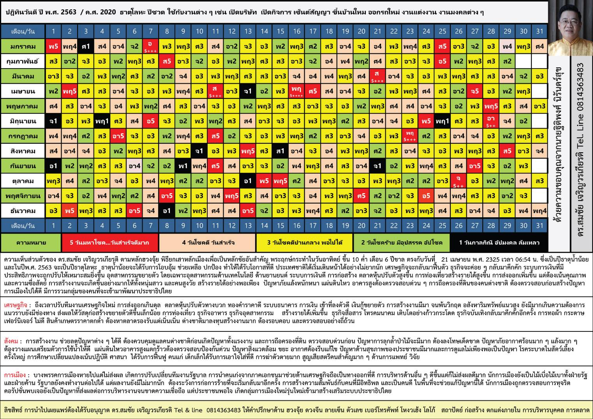

import {regCount, dateCount} from './gooddays'
import YearFilter from './YearFilter.jsx'

เพิ่งย้ายมาอยู่ [PIER](https://www.pier.or.th/)
ได้ไม่นานก็ได้รับมอบหมายให้ทำ [PIER Statistics](https://www.pier.or.th/blog/pier-statistics/)
สำหรับเดือนธันวาคม โดยมีโจทย์คือ เอาข้อมูลอะไรก็ได้ที่เป็นข้อมูลเปิดเผยในสาธารณะที่น่าสนใจมาให้คนได้เห็นกัน

พอดีตอนที่จะย้ายมาก็มีน้องช่วยดูฤกษ์ให้ว่าย้ายวันไหนดี
แล้วก็รู้ว่ากรมพัฒนาธุรกิจการค้า (DBD) มีข้อมูลการจดทะเบียนนิติบุคคลอยู่
เลยเกิดข้อสงสัยขึ้นมาว่า แล้วที่คนเค้าจดทะเบียนนิติบุคคลกันนี่ เค้าดูฤกษ์กันมั้ยนะ เป็นที่มาของ project เล็ก ๆ นี้

# ข้อมูล

## วันที่จดทะเบียนนิติบุคคล

เราจะใช้ข้อมูลวันที่จดทะเบียนจากสองแหล่ง
* [ศูนย์กลางข้อมูลเปิดภาครัฐ (Open Government Data of Thailand)](
  https://data.go.th/tr/dataset/item_f628f08d-b45e-4f56-906d-ca52131c31ed)
  มีข้อมูลรายชื่อนิติบุคคลที่จดทะเบียนตั้งแต่เดือน ม.ค. ถึง มิ.ย. ของปี 2558 และ ม.ค. ถึง ก.ค. ของปี 2559
* [รายชื่อนิติบุคคลจัดตั้งใหม่ปีล่าสุด](https://www.dbd.go.th/news_view.php?nid=469412361)
  จาก DBD เป็นข้อมูลตั้งแต่ ม.ค. ถึง (ณ ปัจจุบัน) พ.ย. 2563

<Plotter options={regCount} />

เอ๊ะ ทำไมข้อมูลมันแหว่ง ๆ

จริง ๆ DBD [เปิดเผยข้อมูลค่อนข้างเยอะ](https://datawarehouse.dbd.go.th/)อยู่แล้ว
แล้วก็เป็นที่แรก ๆ ที่ทำเลยมั้ง ด้วยความเป็น open data ก็กะว่าอย่างน้อย ๆ ก็ควรมีข้อมูลที่ครบ
แต่พอดูแล้วข้อมูลรายชื่อบริษัทจดทะเบียนใหม่ที่มีให้พร้อมใช้งานได้เลยก็มีเท่าที่เห็นด้านบนนี่แหละ

:::danger[ขอบ่นหน่อย]
เคยถามไปทีนึง เจ้าหน้าที่เค้าบอกว่า DBD เผยแพร่แค่ข้อมูลของปีล่าสุด (ซึ่งครึ่งนึงเป็น PDF อีกครึ่งเป็น XLS)
ถ้าอยากได้ข้อมูลของเดือนอื่น ๆ ปีอื่น ๆ ต้อง "เข้าไปขอข้อมูลกับทางกรมโดยตรง" 😱
:::

:::note
ข้อมูลที่ไม่มี สามารถไป scrape มาได้ แต่อาจจะไม่ตอบโจทย์ของ PIER Statistics เท่าไหร่
:::

จากข้อมูลเท่าที่มีอยู่ (รวมการจดทะเบียนของนิติบุคคล 128,321 ราย)
สิ่งนึงที่สังเกตได้คือมี 2–3 ช่วงที่จำนวนการจดทะเบียนลดลงชัดเจน
คือช่วงสงกรานต์ของแต่ละปี และช่วงไตรมาส 2 ของปี 2563 ซึ่งเป็นช่วงที่มีมาตรการป้องกันโควิด 19 นั่นเอง

## วันฤกษ์ดี

อันนี้ต้องยอมรับว่าหาค่อนข้างยาก เพราะมีหลายตำรา หลายสำนัก
อย่างแรกที่ตัดออกได้คือตำราดูฤกษ์ที่อิงกับวันเดือนปีเกิดของเจ้าของกิจการ
ในตำราที่เหลือ บางส่วนก็จะหาเจอบางปีเท่านั้น
ข้อมูลฤกษ์ดีอันแรกที่หาได้ทุกปีคือของเว็บ [TerraBKK](https://www.terrabkk.com/articles/197030/ปฎิทิน-วันดี-2563)
ที่ทำ format ค่อนข้างคงที่

ข้อมูลของเว็บ TerraBKK จะแบ่งวันเป็นห้าประเภท ตั้งแต่วันกาลกิณีไปถึงวันมหาโชคตามที่ห็นด้านบน

:::note
อีกที่นึงที่น่าสนใจคือข้อมูลจากเว็บ [TrueID](https://horoscope.trueid.net/luckyday/2020)
ที่น่าสนใจเพราะ[เรียกจาก API](https://reqbin.com/9zhnoasq) ได้เลยทีเดียว เสียแต่ว่าข้อมูลย้อนหลังไปถึงปี 2562 เท่านั้น
:::

วันที่เราจะสนใจ คือวันที่มีคนจดทะเบียนนิติบุคคลอย่างน้อยหนึ่งราย (เพื่อตัดวันหยุดราชการ วันหยุดพิเศษ ฯลฯ ออก)
ซึ่งมีทั้งหมด 477 วัน ตามภาพด้านล่าง ในจำนวนนี้ มีวันมหาโชคอยู่ 39 วัน

<Plotter options={dateCount} />

# ผลที่ได้

## ดูจากรูปก่อน

ถ้าเราลองนับจำนวนนิติบุคคลที่จดทะเบียนในแต่ละวันแล้วจัดกลุ่มวันตาม "ความดี" ของฤกษ์ ก็จะได้รูปข้างล่าง

<YearFilter client:only="react" />

สิ่งที่สังเกตได้ค่อนข้างชัดคือวันต่าง ๆ ตั้งแต่วันกาลกิณีมาถึงวัน "โชคดี" นั้น จำนวนนิติบุคคลที่จดทะเบียนเฉลี่ยไม่ต่างกันเท่าไหร่
ขณะที่วัน "มหาโชค" ดูจะได้รับความนิยมค่อนข้างมาก
โดยค่า median ของกลุ่มนี้อยู่ที่ประมาณ 290 ราย ขณะที่ของกลุ่มอื่น ๆ อยู่ที่ประมาณ 260–270 ราย
(ถ้าเอาข้อมูลปี 2563 ที่อาจจะได้รับผลของโควิดออกไปจะเห็นผลต่างมากขึ้นไปอีก)

:::warning[ข้อสังเกต]
วันที่ 9 กันยายน 2563 ซึ่งเป็นวันกาลกิณี
มีจำนวนนิติบุคคลจดทะเบียนใหม่ที่ค่อนข้างสูงแปลกไปจากวันอื่น ๆ
น่าไปดูต่อว่าเป็นเพราะอะไร
:::

## เรื่องบังเอิญ?

แล้วการที่มีนิติบุคคลจดทะเบียนมากกว่าวันอื่น ๆ นี่ คนตั้งใจจดทะเบียนวันนั้นจริง ๆ หรือเป็นแค่เรื่องบังเอิญนะ

ถ้าเราคิดว่าคนไม่เลือกวันในการจดทะเบียนนิติบุคคล จำนวนนิติบุคคลที่จดทะเบียนในวันมหาโชค
ควรจะมีสัดส่วนพอ ๆ กับจำนวนวันที่เป็นวันมหาโชค (คือประมาณ 8%)
แต่เราพบว่ามีจำนวนนิติบุคคลที่จดทะเบียนในวันมหาโชครวมแล้ว 11,528 ราย หรือประมาณ 9% ของนิติบุคคลจดทะเบียนทั้งหมดในข้อมูล
ซึ่งมากกว่า แต่ดูเท่านี้ก็อาจจะยังบอกไม่ได้อยู่ดีว่าความต่างนั้นเกิดจากความบังเอิญมั้ย
เราเลยจะมาทำการทดสอบทางสถิติกันดู

เราจะลองคิดว่านิติบุคคลรายนึงเวลาจะจดทะเบียนนิติบุคคลก็จะสุ่มวันขึ้นมาวันนึงโดยไม่ได้ดูฤกษ์
ดังนั้นจะมีโอกาสจดทะเบียนในวันมหาโชคด้วยความน่าจะเป็น $p = 0.08$
ถ้าเรากำหนดให้ $X$ เป็น random variable ที่แสดงจำนวนนิติบุคคลที่จดทะเบียนในวันมหาโชค
$X$ ก็จะมี distribution เป็นแบบ binomial

$$
X \sim B(128321, 0.08)
$$

สิ่งที่เราต้องทดสอบคือ ถ้า $p = 0.08$ จริง ๆ แล้ว
จะมีโอกาสเท่าไหร่ที่เราจะเห็น outcome ของ $X$ ออกมาเป็น $x^* = 11,528$ หรือมากกว่า
ซึ่งก็คือสิ่งที่เรียกว่า [binomial test](https://en.wikipedia.org/wiki/Binomial_test) นั่นเอง

โดยถ้าเราสมมติให้ $f(k)$ เป็นความน่าจะเป็นที่ $X = k$ (หรือที่เรียกว่า probability mass function)
โอกาสที่เราจะเห็น $X \geq x^*$ ก็จะเท่ากับ

$$
\begin{aligned}
\sum_{k = x^*}^n f(k) &= \sum_{k = x^*}^n {n \choose k} p^k (1-p)^{n-k}\\
  &= 1.20 \times 10^{-25}
\end{aligned}
$$

ซึ่งน้อยมาก ๆ และพอจะบอกได้ว่าเราสามารถปฏิเสธสมมติฐานหลัก (null hypothesis)
ว่านิติบุคคลเลือกวันจดทะเบียนแบบสุ่มได้นั่นเอง