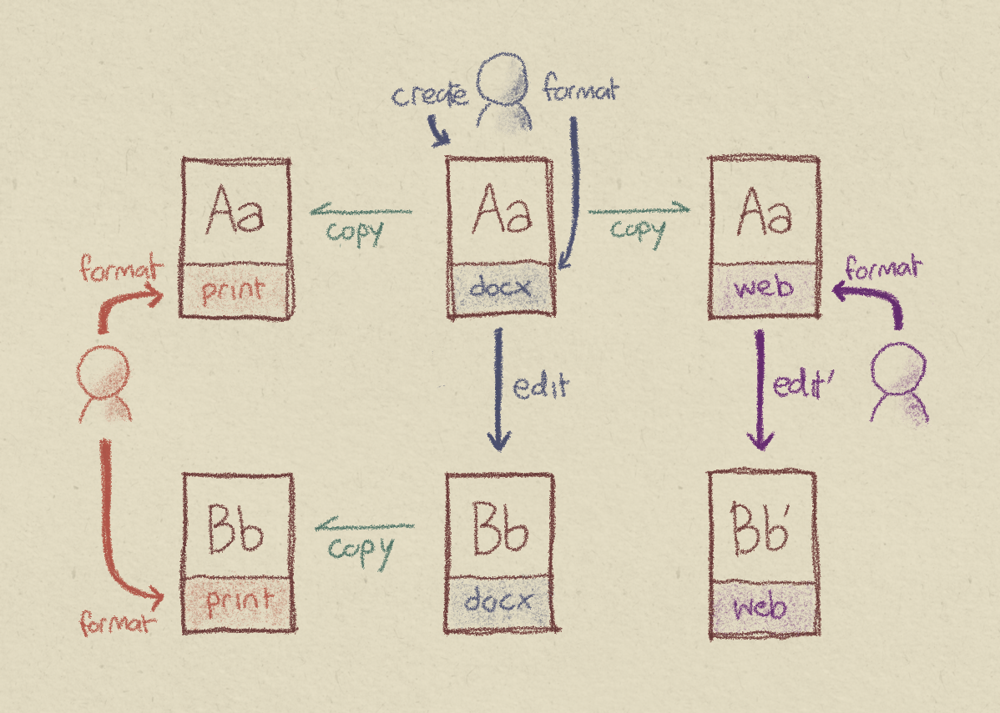
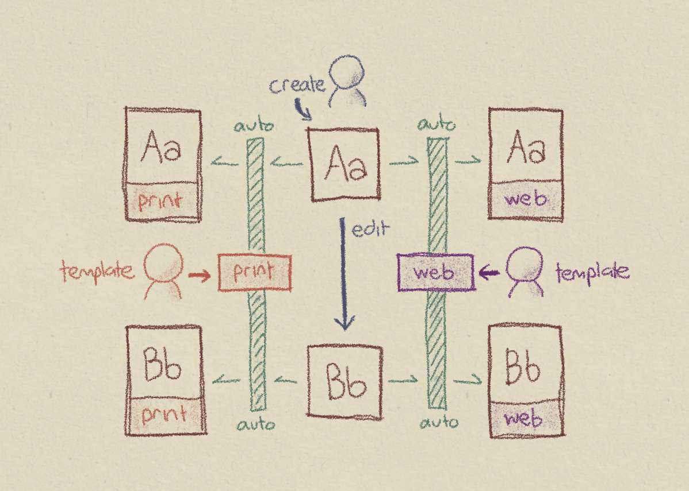

เคยมั้ย ที่อยากเขียนบทความอะไรซักอย่างขึ้นมา
สิ่งแรกที่ทำอาจจะเป็นการ word processor
ปรับ font ให้เป็น TH Sarabun New (หรืออะไรก็ตามที่องค์กรใช้) แต่...

* อ่าว พอเปลี่ยนเป็นภาษาไทยแล้ว font ยังเป็น Cordia New อยู่ มันไม่ปรับตามแฮะ... เลือกใหม่...
* เอ๊ะ คนอื่นเค้าใช้ font ขนาด 14 หรือ 16 กันนะ แล้วหัวเรื่องล่ะใช้ font อะไร ขนาดเท่าไหร่
* แล้ว spacing ระหว่างบรรทัดที่ใช้นี่เป็น single space หรือ 1.15 เท่ากันนะ...

ระหว่างที่ทำทั้งหมดนี้ ก็คิดในใจว่าทำไมจะเขียนอะไรแค่สามย่อหน้ามันต้องยุ่งยากขนาดนี้ด้วย
ทั้ง ๆ ที่ก็อยากจะแค่บันทึกความคิดอะไรไว้เฉย ๆ ไม่คิดว่าจะพิมพ์ออกมาใส่กระดาษ แล้วทำไมต้องเลือกขนาดกระดาษด้วย


นอกจากนี้ ถ้างานเกิดปังขึ้นมา แล้วอยากจะเอาไปลงเว็บ ก็ต้องมีคนมานั่งแปลงไฟล์ Word
ไป format เป็นหน้าเว็บให้ เพิ่มงาน (และโอกาสเกิดความผิดพลาด) ไปอีกรอบนึง



สมมติอีกว่าทำสองขั้นตอนที่ว่านี่แล้ว เจอคำผิด หรือต้องการปรับอะไรบางอย่าง
ก็จะต้องไปดูว่าบทความที่ว่านี่ มันไปปรากฏที่ไหนบ้าง บนเว็บแก้รึยัง ไฟล์ PDF บนเว็บล่ะ ฯลฯ
หลายครั้งก็จะเจอว่าบทความในรูปแบบต่าง ๆ มีเนื้อหาที่แตกต่างกัน
ถ้าโชคดีหน่อยก็อาจจะเป็นแค่จุดเล็กน้อย แต่ถ้าจุดที่แตกต่างกันเป็นเนื้อหาสำคัญของบทความ ก็อาจเกิดผลเสียตามมาได้เยอะ


# เนื้อหา กับการจัดรูปแบบ

ปัญหาข้างต้น เกิดจากการรวมเอา **เนื้อหา (content)** กับ **การจัดรูปแบบ (formatting)** เข้ามาอยู่ด้วยกัน
ทำให้คนเขียนเนื้อหาก็ต้องมาพะวงกับการจัดรูปแบบ ส่วนคนที่มีหน้าที่จัดรูปแบบก็ต้องมาพะวงกับตัวเนื้อหา
ถ้าจะทำเนื้อหาเดียวกันในสองรูปแบบ (เช่น ใน Word กับในเว็บ) ตัวเนื้อหาก็ต้องถูกคัดลอกไป
ทำให้เกิดความซ้ำซ้อน และการต้องมา "ไล่แก้" เหมือนที่พูดไปข้างต้น

จะดีกว่ามั้ย ถ้าคนที่ทำเนื้อหา สามารถให้ความสนใจกับเนื้อหาได้เต็มที่
โดยไม่ต้องมาเสียเวลากับการมาจัดรูปแบบ
ส่วนคนที่นำเนื้อหาไปใช้ ไม่ว่าจะเป็นการพิมพ์เอกสาร เอาบทความขึ้นเว็บ
ก็สามารถสนใจกับความสวยงาม ความเป็นระเบียบได้เต็มที่
โดยที่ไม่ต้องไล่แก้ไฟล์ Word หรือจัดรูปแบบบทความทีละอัน


# แนะนำ markdown

Markdown เป็นทางหนึ่งที่จะแก้ปัญหานี้ โดยเป็นสื่อกลางระหว่างคนสร้างเนื้อหา กับคนนำเนื้อหาไปจัดรูปแบบเพื่อการใช้งานที่หลากหลาย

## คนสร้างเนื้อหา

นอกจากการเขียนเนื้อหา (ซึ่งเป็นหน้าที่หลัก) แล้ว คนสร้างเนื้อหาก็มีหน้าที่เพียงแค่กำหนดว่า
ตรงนี้เป็นหัวข้อหลัก ตรงนี้เป็นหัวข้อรอง ตรงนี้เป็น list ตรงนี้เป็นตัวที่ต้องการเน้น
และให้ใส่รูปภาพตรงนี้ โดยใช้ syntax ที่ง่ายต่อการเข้าใจ

ลองมาดูตัวอย่าง syntax ของ markdown ก่อน

```markdown
# บทความใหม่

การเขียนบทความ อาจแยกได้เป็นสองส่วน คือ
1. การเขียนเนื้อหา
2. การนำเสนอเนื้อหา

โดยทั้งสองส่วนควรจะ**แยกออกจากกัน**
นอกจากนี้ การสะกดคำต้องตรวจให้ดี ๆ
โดยเช็คกับ[ราชบัณฑิตยสภา](https://www.orst.go.th/)
```

จะเห็นได้ว่า markdown ถูกออกแบบมาให้อ่านง่ายและเขียนง่าย
เพราะลักษณะภาษาคล้ายกับการเขียนธรรมดา
ดูจาก code เราก็พอจะอ่านออกว่าคนเขียนต้องการสื่ออะไร เน้นคำตรงไหน อะไรเป็น link
นอกจากนี้ ยังมี format พื้นฐานอยู่ค่อนข้างจำกัด เพื่อให้คนสร้างเนื้อหาไม่ต้องมาพะวงกับการจัดรูปแบบโดยไม่จำเป็น

<Block type="note">
Markdown [ได้แรงบันดาลใจ](https://daringfireball.net/projects/markdown/syntax#philosophy)
มาจากการส่ง email ในสมัยก่อน ที่ยังส่งได้แค่ plain text เท่านั้น
</Block>

<Block type="info">
ถ้าอยากลองเล่นกับ markdown ดู ก็มีเว็บที่ให้ลองค่อนข้างเยอะ ที่แนะนำคือ [HedgeDoc](https://demo.hedgedoc.org/new)
ซึ่งสามารถแก้ markdown ไปพร้อม ๆ กันกับเพื่อนได้ และมีระบบ tracking ที่ค่อนข้างดี ที่สำคัญคือฟรีด้วย
</Block>

## คนจัดรูปแบบ

หลังจากมีเนื้อหาในรูปแบบ markdown พร้อมแล้ว ก็มาถึงขั้นตอนการจัดรูปแบบเพื่อไปนำเสนอ

ในขั้นตอนนี้ คนจัดรูปแบบ ก็มีหน้าที่กำหนดว่า สำหรับการนำเสนอแบบหนึ่ง ๆ นั้น หัวข้อจะใช้ font ไหน ขนาดเท่าไหร่ สียังไง
ตัวที่ให้ความสำคัญ จะหนาแค่ไหน สีจะต่างจากตัวอื่นมั้ย เว้นช่องว่างระหว่างบรรทัดเท่าไหร่
ถ้าเป็นการพิมพ์ก็อาจจะคิดว่า มีหัวกระดาษ header หรือ footer มั้ย เลขหน้าเป็นยังไง เว้นขอบกระดาษเท่าไหร่ดี

ที่สำคัญคือ ทั้งหมดนี้ *ทำเพียงครั้งเดียวเท่านั้น* เพื่อเป็น template
เพราะเมื่อคนจัดรูปแบบได้รับเนื้อหามาเป็นไฟล์ markdown แล้ว ก็เพียงแต่เลือก template ที่มีอยู่แล้ว
ว่าอยากแสดงผลในรูปแบบไหนเท่านั้นเอง



<Block type="note">
มาถึงตรงนี้ หลายคนอาจจะคิดในใจว่า Word ก็ทำ template ได้นี่นา
ซึ่งก็จริง แต่ในทางปฏิบัติเท่าที่เจอมา มีผู้ใช้น้อยคนมากที่ไปใช้ template เหล่านั้น
โดยไม่ไปปรับแก้เลย
</Block>


# ข้อดีข้อเสียของ markdown

### ✅ ได้โฟกัสกับเนื้อหา

ตามที่ได้เขียนไปข้างต้น เมื่อคนเขียน content กำหนดรายละเอียดของ formatting เองไม่ได้
ก็ไม่ต้องมากังวลกับเรื่องที่ไม่จำเป็น ไม่ต้องเสียเวลามาจัดกระดาษ ปรับ font

### ✅ Formatting ที่เป็นเอกภาพ

ในเมื่อ content ถูกแยกออกจาก formatting อย่างชัดเจนแล้ว
การนำเสนอเนื้อหาก็จะเป็นไปอย่างมีมาตรฐานมากขึ้น
เพราะไม่ว่าเนื้อหาจะถูกเขียนมาโดยคนเป็นสิบคน
ก็จะถูกมาจัด format ด้วย template เดียวกันทั้งหมด
มีคนคนเดียวที่กำหนดว่าตัวหนังสือจะเป็น font นี้ ขนาดนี้ สีนี้
ทำให้เอกสารต่าง ๆ ที่ถูกผลิตออกมามีเอกภาพ และเป็นมืออาชีพมากขึ้น

### ✅ ยืดอายุของเอกสาร

ไฟล์ markdown ไม่มีตกยุค ไม่ว่าจะเปิดมาดูตอนนี้หรือ 10 ปีข้างหน้า เนื้อหาก็ยังอยู่สมบูรณ์เหมือนเดิม
ไม่ต้องกังวลว่าจะเปิดเอกสารที่ทำเมื่อ 10 ปีก่อนแล้ว font จะเด้ง (เพราะไม่มีให้เด้ง)

นอกจากนี้ หากถึงวันหนึ่งที่คุณต้องการจะเปลี่ยนรูปแบบ
(เช่น องค์กรเปลี่ยนสี หรือคิดว่าหัวข้อน่าจะตัวโตขึ้น)
ก็สามารถทำได้ในที่เดียว และการเปลี่ยนแปลงนั้นก็จะมีผลต่อเอกสารทั้งหมดย้อนหลังไปด้วย

### ✅ ขนาดไฟล์ที่เล็กกว่า

เปรียบเทียบกับไฟล์ Word ที่ต้องเก็บรูปแบบตัวอักษรแบบต่าง ๆ ไว้
markdown มีขนาดไฟล์ที่เล็กกว่ามาก ถ้าอยากลองเทียบง่าย ๆ
ลองสร้างไฟล์ Word ขึ้นมาอันนึง เขียนว่า `Hello World!` ลงไป แล้ว save ออกมาดูขนาดไฟล์
จะเห็นว่าไฟล์มีขนาดตั้ง 25 KB เทียบกับถ้าเราเก็บเป็น plain text ก็จะมีขนาดเท่ากับจำนวนตัวหนังสือที่เราใช้ (คือ 12 bytes)
หรือต่างกันเกือบสองพันเท่าเลยทีเดียว!

### ✅ เครื่องมือที่หลากหลายขึ้น (และฟรี)

ไม่จำเป็นต้องยึดติดกับ software ที่ต้องจ่ายเงิน และมีตัวเลือกอยู่อย่างเดียวอีกต่อไป
เพราะ text editor อะไรก็สามารถใช้ปรับแก้ markdown ได้
นอกจากนี้ยังไมี [online tools](https://www.markdownguide.org/tools/) ต่าง ๆ อีกมากมาย

### ✅ ใช้งานกับเว็บไซต์อื่น ๆ ได้หลากหลาย

ความง่ายของ markdown ทำให้ markdown ถูกเลือกเป็นวิธีเขียนที่ใช้ในเว็บยอดนิยมหลาย ๆ อัน
ไม่ว่าจะเป็น [GitHub](https://github.com/),
[Reddit](https://www.reddit.com/), [Stack Exchange](https://stackexchange.com/)
หรือในการเขียนเชิงเทคนิคอย่างใน
[Jupyter Notebook](https://jupyter-notebook.readthedocs.io/en/stable/examples/Notebook/Working%20With%20Markdown%20Cells.html) เป็นต้น

### ⭕ จัด format ไม่ได้เป๊ะ

ตรงนี้อาจจะไม่ถูกใจใครหลาย ๆ คน ที่เราไม่สามารถบอกได้ว่าจะเอารูปตั้งไว้ตรงนี้
ให้ wrap words รอบ ๆ มี margin อยู่ 0.2 นิ้ว
(ถ้าอยากได้ control มากขนาดนั้น จะแนะนำ [$\LaTeX$](https://www.latex-project.org/))
แต่ในทางกลับกัน การที่เราไม่สามารถจัด format ได้เป๊ะ ก็แปลว่าเราไม่ต้องสนใจมันมาก ปล่อยให้เป็นหน้าที่ของคนจัด format ไป

### ⭕ ไม่ได้เป็นแบบ WYSIWYG

[WYSIWYG](https://en.wikipedia.org/wiki/WYSIWYG) (what you see is what you get)
เป็นลักษณะของ editor ที่เห็นผลได้ทันทีระหว่างแก้ไข (เช่น Word เป็นต้น)
ข้อดีของ WYSIWYG คือการที่คนเขียนไม่จำเป็นต้องมาจำ syntax ของภาษา อยากให้เป็นตัวหนา ก็ลากครอบ แล้วกดปุ่ม
ก็จะเห็นสิ่งที่ตัวเองต้องการปรากฏขึ้นทันที

แต่ WSYISYG ก็มีข้อเสียเหมือนกัน หลายคนคงเคยใช้ Word แล้วพอจะไปพิมพ์ต่อ ตัวหนังสือเรากลายเป็นคนละ font หรือคนละขนาด
นั่นก็เพราะยังมี tag เก่าหลงเหลืออยู่ หรือบางครั้งลากเพื่อจะปรับ format แต่ได้ไม่หมด ตกไปตัวนึง ก็จะทำให้ format เพี้ยนได้

### ⭕ ยังไม่แพร่หลายในที่ทำงาน

อันนี้ต้องยอมรับว่าเป็นข้อจำกัดที่สำคัญมาก เพราะคงไม่มีใครอยากเอาเอกสารที่คนอื่นเขียนมาเป็นไฟล์ Word มาแปะลงเป็น markdown
แล้วเวลาจะส่งต่อก็ต้องแปลงกลับอีกครั้ง (และนี่ก็คือเหตุผลที่เขียนมาตั้งยาว เพื่อให้มีคนสนใจหันมาใช้ markdown มากขึ้น)

แต่ถ้าพูดถึงการทำงานคนเดียวเพื่อส่งออกไปเลย ตอนนี้ก็มี tools ค่อนข้างเยอะแล้วที่จะแปลง markdown ให้เป็น format ต่าง ๆ
ซึ่งจะแนะนำใน post ต่อไป


# แล้วไงต่อ

เขียนมาทั้งหมดนี่ก็หวังว่าจะมีคน (ถ้าเป็นเพื่อนในที่ทำงานได้ก็จะดี ฮ่า ๆ) ได้เข้าใจถึงข้อดีของ markdown
และอาจจะลองไปเล่น ๆ ดู ถ้าจะเริ่มก็อาจจะเริ่มลองเขียนใน online editor ก่อนก็ได้ เช่น
* [HedgeDoc](https://demo.hedgedoc.org/new)
* [StackEdit](https://stackedit.io/)
* [Dillinger](https://dillinger.io/)
* [Editor.md](https://pandao.github.io/editor.md/en.html)

หรือถ้าอยากอ่านเพิ่มเติมเกี่ยวกับ markdown ก็อาจจะเริ่มจาก [*The Markdown Guide*](https://www.markdownguide.org/)

ถ้าเริ่มรู้สึกว่า เห้ย markdown มันใช่ เดี๋ยวมาดูกันว่าเราจะเริ่มใช้งาน markdown ที่ตัวเราได้ยังไง 😉


