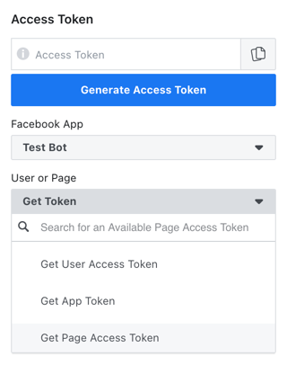
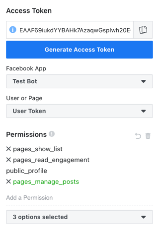
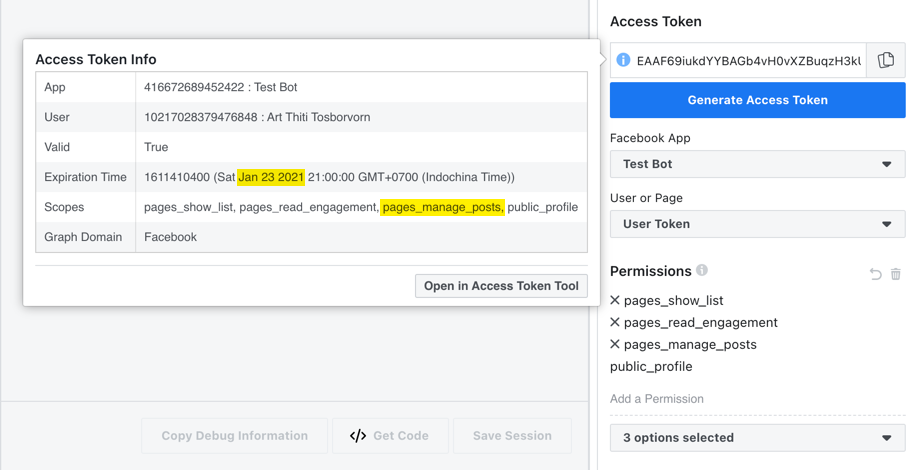
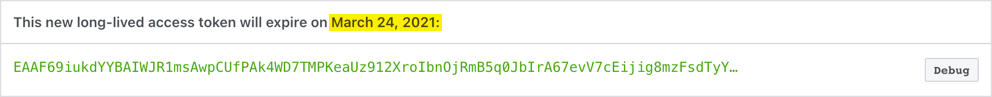
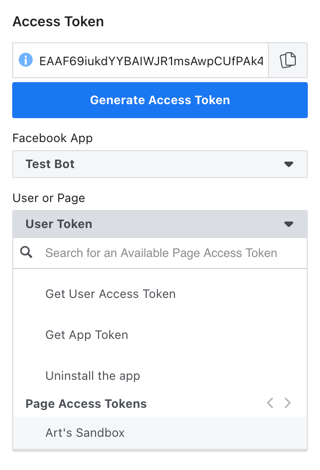
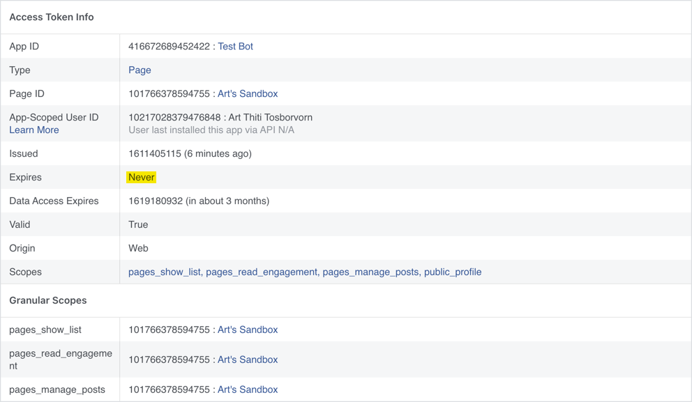
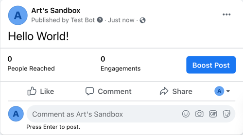

Facebook's [Graph API](https://developers.facebook.com/docs/graph-api/)
  is a powerful tool that you to programmatically interact with Facebook.
To use it, however, you need an access token,
  and [the process](https://developers.facebook.com/docs/pages/access-tokens/) is not quite as simple.
This short tutorial will guide you through the process
  of generating a long-lived Page Access Token that will never expire
  so you can use it in your projects.

Before we begin, make sure you're [registered](https://developers.facebook.com/docs/development/register)
  as a Facebook Developer, and that you have a Facebook page you have admin access to.

:::tip
You might find it useful to have a Facebook page specifically for debugging purpose
  so you can try out stuff without affecting your actual page and confusing your followers.
:::

Here's our game plan:
1. Create a Facebook app
2. Get a short-lived User Access Token
3. Add proper permissions to the token
4. Extend the User Access Token
5. Generate a long-lived Page Access Token


# Steps

## Create a Facebook app

The first thing to do is to create a Facebook app.
Head over to your [Apps page](https://developers.facebook.com/apps/) and click on the "Create App" button.
Choose "Manage Business Integrations", and fill in required information.
Once you have a new app and are presented with "Add Products to Your App" page, you're done.

## Generate User Access Token

Next, we need to get an access token for your page.
Head over to Facebook's [Graph API Explorer](https://developers.facebook.com/tools/explorer/),
  choose your app (creatively named "Test Bot" in my case), and click on "Get Page Access Token".



You'll then choose the page you wish this bot to manage and get a *User Access Token* in return.

## Add permission

Once we have the User Access Token, we will add permissions for this token.
The User Access Token will come with default permissions
  `pages_show_list`, `pages_read_engagement`, and `public_profile`.
Which permissions you add will depend on what you want the app to do,
  and you can find out which permissions are needed by consulting the document.
For example, to have your app [publish a post to a page](https://developers.facebook.com/docs/pages/publishing/),
  you'll need both `pages_manage_posts` and `pages_read_engagement` permissions.

In the "Add a Permission" section, choose appropriate permissions.
Added permission(s) should appear in green.



Then click on the "Generate Access Token" again to generate a new token with the permissions you asked for.
Go through the similar steps as before.
Once you're done, click on the ⓘ icon near your access token on top
  to verify that the Scopes include `page_manage_posts`.



## Extend the token

You'll also notice that the expiration time is about an hour from when you created the token.
We'll want to extend this by clicking on the "Open in Access Token Tool".
This will bring up the [Access Token Debugger](https://developers.facebook.com/tools/debug/accesstoken/).
Towards the bottom of the screen, there's a button to extend the token.
Clicking on the button will generate what's called a long-lived User Access Token.



Click on the `Debug` button and you'll see that
  the new token is now long-lived and will exprire in about 2 months.

Copy the token from the top of the page,
  go back to the [Graph API Explorer](https://developers.facebook.com/tools/explorer),
  and paste the new token into the text box up top.
You should also see when you click the ⓘ icon that the expiration time has been changed.

## Generate Page Access Token

Now that we have a long-lived User Access Token with proper permissions,
  we can generate a long-lived Page Access Token.
Click on the "User or Page" field and select your Facebook page.



Following the same process as before,
  you can debug the access token and verify that the token is a long-lived Page Access Token
  which will never expire.




# Test the token

Phew! That's a lot of work to get a long-lived Page Access Token.
Let's test our hard-earned token.
Facebook has an API that lets app read and write to the Facebook's "social graph"
  called [Graph API](https://developers.facebook.com/docs/graph-api/).
You can certainly use the API through HTTP requests,
  but Facebook also has a [Python wraper](https://facebook-sdk.readthedocs.io/)
  which we can install through `pip install facebook-sdk`.
We can then try our first post!

```python
import facebook

FB_TOKEN = 'xxx' # your Facebook token here

graph = facebook.GraphAPI(access_token=FB_TOKEN)
api_request = graph.put_object(parent_object='me',
                               connection_name='feed',
                               message='Hello World!')
```

This is telling Facebook to [put an object](https://facebook-sdk.readthedocs.io/en/latest/api.html#put-object)
  to `me` on the `feed`
  (since the Graph's access token is a Page Access Token, `me` is the Facebook page.)
Looking at the page, we can see that our test post has appeared on the page!



Posting a photo is quite simple as well
  through the [`put_photo` function](https://facebook-sdk.readthedocs.io/en/latest/api.html#put-photo).

```python
import facebook

FB_TOKEN = 'xxx' # your Facebook token here

graph = facebook.GraphAPI(access_token=FB_TOKEN)
api_request = graph.put_photo(image=open('python-logo.png', 'rb'), # [!code highlight]
                              message='Python!') # [!code highlight]
```


# Conclusion

We're done!
What you'll do with this is entirely up to your imagination.
In the [next tutorial](/blog/2021/automate-facebook-posts/), I'll guide you through how to
  create a bot that will scrape data from the web,
  make a photo (as people like to call, "infographic") out of it,
  and set up GitHub Actions to post this to your page at the end of each day.

Stay tuned!


