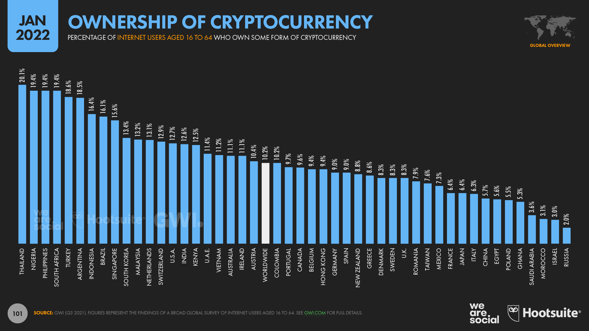
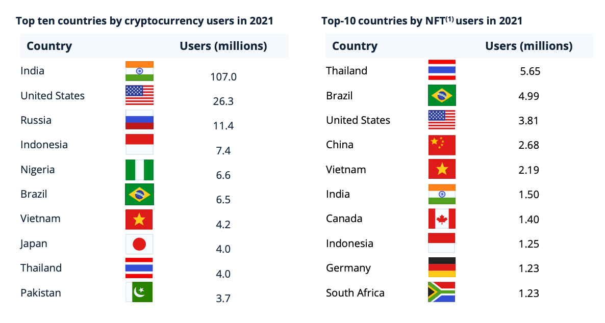
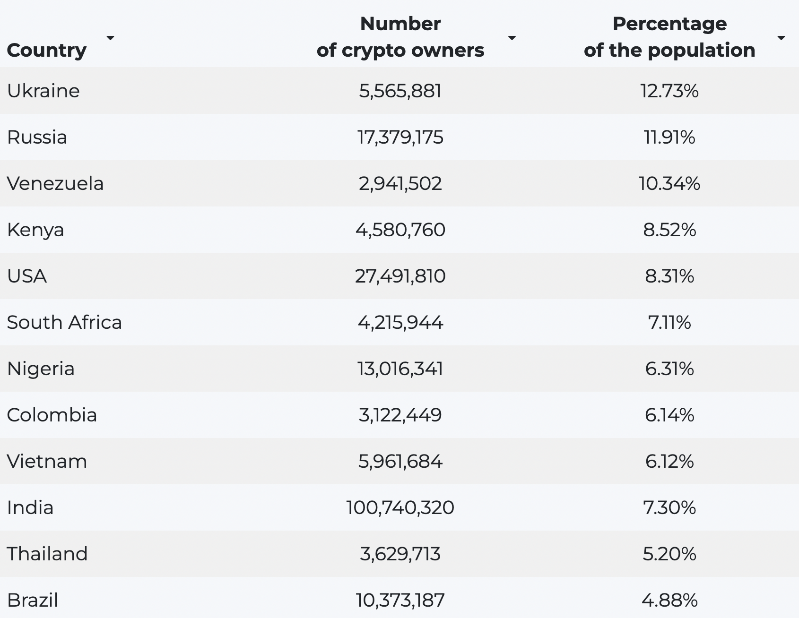

> "คนไทยใช้ NFT มากที่สุดในโลก 5.65 ล้านคน"  
> "คนไทยถือครองคริปโทมากเป็นอันดับ 1 ของโลก"

พาดหัวเหล่านี้คงเคยผ่านตาหลาย ๆ คนมาบ้าง[^1]
หลายคนอาจจะดีใจ ว่าคนไทยก้าวทันเทคโนโลยี
บางคนอาจจะเป็นห่วง ว่าคนไทยเอาเงินไปเก็งกำไรกับสินทรัพย์ที่มีความเสี่ยงมาก

[^1]: ตัวอย่าง
[1](https://www.springnews.co.th/news/825437),
[2](https://www.tnnthailand.com/news/tech/115744/),
[3](https://www.springnews.co.th/spring-life/823581),
[4](https://forbesthailand.com/news/it/คนไทยถือคริปโตสูงสุดใน.html),
[5](https://www.thansettakij.com/money_market/518380),
[6](https://workpointtoday.com/thai-is-the-most-ownership-of-cryptocurrency/)

**แต่คนไทยถือครองคริปโทมากขนาดนั้นจริงมั้ย**

ข้อมูลนี้ถือว่ามีความสำคัญมาก โดยเฉพาะสำหรับหน่วยงานกำกับดูแลอย่าง ก.ล.ต. หรือ ธปท. เพราะเป็นตัววัดว่าคนไทยสนใจ cryptocurrency มากแค่ไหน จะเกิดความเสี่ยงทั้งต่อเงินออม เงินลงทุนของประชาชน หรือความเสี่ยงต่อระบบหรือไม่ หรือหากเกิดเหตุการณ์ราคาคริปโทผันผวนมาก (เช่นกรณี UST ที่ผ่านมา) จะได้ใช้ประเมินได้คร่าว ๆ ว่ามีผู้ได้รับผลกระทบมากน้อยเพียงใด

บทความนี้จะลองมาดูว่าตัวเลขเหล่านี้มีที่มาอย่างไร น่าเชื่อถือแค่ไหน โดยจะพูดถึงสถิติสามตัวที่ได้รับการกล่าวถึงบ่อย ๆ ได้แก่
1. [Digital 2022 Global Overview Report](https://datareportal.com/reports/digital-2022-big-rise-in-cryptocurrency-ownership) ที่ประเมินว่าคนไทยที่ใช้อินเทอร์เน็ต อายุ 16–64 ถึง 20.1% ถือครองคริปโทอยู่ มากเป็นอันดับหนึ่งของโลก
2. [Statista Digital Economy Compass 2022](https://www.statista.com/chart/27571/where-nft-users-live/) ที่ประเมินว่าคนไทยถือครองคริปโท 4 ล้านคน ขณะที่มีคนไทยที่มี NFT มีมากถึง 5.65 ล้านคน
3. [TripleA's "Cryptocurrency across the world"](https://triple-a.io/crypto-ownership/) ที่ประเมินว่าคนไทยถือครองคริปโทอยู่ 3.6 ล้านคน

# เรารู้อะไรบ้างจากข้อมูลของ ก.ล.ต.

ด้วยธรรมชาติของคริปโท ทำให้ไม่มีใครล่วงรู้ได้ว่า wallet ต่าง ๆ นั้นเป็นของใคร ของคนชาติไหน
ในการหาคำตอบว่ามีคนไทยซักกี่คนที่ถือคริปโทอยู่ ข้อมูลที่น่าเชื่อถือที่สุดที่พอจะมีอยู่และเป็นจุดเริ่มต้นได้ ก็น่าจะเป็นข้อมูลที่เรียกว่า administrative data (ภาษาไทยแปลว่า "ข้อมูลเพื่อการบริหาร" ซึ่งคือข้อมูลที่มีจุดประสงค์อื่น ๆ นอกจากการทำสถิติ เช่น ข้อมูลลงทะเบียน หรือข้อมูลบันทึกการทำธุรกรรม)
ในกรณีนี้ ถ้าเราอนุมานว่าคนที่ถือคริปโทส่วนใหญ่จะมีบัญชีอยู่กับ[ศูนย์ซื้อขายสินทรัพย์ดิจิทัล (exchange)](https://www.sec.or.th/digitalasset) ด้วย และ exchange เหล่านี้ก็ต้องรายงานกับ ก.ล.ต. ว่ามีบัญชีเปิดอยู่กี่บัญชี เราก็สามารถดูข้อมูลจาก ก.ล.ต. ได้เลย

จาก [รายงานสรุปภาวะตลาดสินทรัพย์ดิจิทัลรายสัปดาห์ ของ ก.ล.ต.](https://www.sec.or.th/TH/Pages/WeeklyReport.aspx) จะพบว่า **exchange ภายใต้กำกับของ ก.ล.ต. ทั้งหมดมีบัญชีรวมกันประมาณ 2.7 ล้านบัญชี (ณ เมษายน 2565)** ซึ่งอันนี้อาจมีการนับซ้ำได้ (กรณีคนคนหนึ่งมีบัญชีอยู่กับ exchange สองแห่ง)

แน่นอนว่าตัวเลขนี้ยังไม่รวม exchange เจ้าใหญ่ ๆ ของโลกอย่าง Binance, Coinbase, หรือ Kraken ที่ไม่ได้อยู่ใต้กำกับของ ก.ล.ต. ซึ่งเป็นข้อจำกัดของข้อมูล adiministrative data นี้ ทำให้เราไม่สามารถทราบจำนวนคนไทยที่ถือคริปโททั้งหมดได้ แต่อาจจะลองใช้เป็น baseline ในการเปรียบเทียบกับตัวเลขอื่น ๆ ได้

# เปรียบเทียบข้อมูลของทั้งสามแหล่ง

ตัวเลขของทั้ง DataReportal และ Statista นั้น ต่างมาจากผลการตอบแบบสำรวจ โดย DataReportal อ้างอิงผลสำรวจโดย [GWI](https://www.gwi.com/data) (จำนวน 17,500 ตัวอย่าง[^2]) ขณะที่รายงานของ Statista นั้น อ้างอิงข้อมูลจาก [Statista Global Consumer Survey](https://www.statista.com/global-consumer-survey) (อย่างน้อย 2,000 ตัวอย่าง[^3]) โดยทั้งสองแบบสำรวจอ้างว่าเป็นการ[สำรวจแบบใช้โควต้า (quota sampling)](https://en.wikipedia.org/wiki/Quota_sampling) กล่าวคือ จำกัดจำนวนผู้ตอบแบบสอบถาม ตามกลุ่มอายุ เพศ การศึกษา ที่ตอบแบบสอบถามให้ได้ตามสัดส่วนประชากรจริง ทำให้ได้ผลที่น่าเชื่อถือมากกว่าการสำรวจที่ไม่มีโควต้า

[^2]: อ้างอิง [GWI Data Coverage](https://www.gwi.com/data-coverage)
[^3]: จาก [methodology](https://de.statista.com/download/Statista_Global_Consumer_Survey_Methodology_EN.pdf) ของ Statista ไทยอยู่ในกลุ่มประเทศที่ไม่ได้มีการสอบถามเกี่ยวกับแบรนด์ จึงกำหนดจำนวนผู้ตอบแบบสอบถามเป้าหมายไว้ที่อย่างน้อย 2,000 ตัวอย่าง โดยไม่ได้ระบุแน่ชัด

## DataReportal

:::figure

:source[[DataReportal](https://datareportal.com/reports/digital-2022-big-rise-in-cryptocurrency-ownership)]
:::

DataReportal รายงานว่าในไตรมาสที่ 3 ของปี 2021 มีคนไทยที่ใช้อินเทอร์เน็ตและมีอายุระหว่าง 16–64 อยู่ประมาณ 20.1% ที่ถือครองคริปโท
จากข้อมูลนี้ เราสามารถนำมาคำนวณคร่าว ๆ เป็นจำนวนผู้ถือครองคริปโทได้ด้วยการคูณสัดส่วนนี้กับจำนวนประชากรดังกล่าวได้ กล่าวคือ

$$
\begin{aligned}
\text{ผู้ถือคริปโท}
  
  &= \text{จำนวนประชากรอายุ 16–64}\\
  &\quad \times \text{สัดส่วนผู้ใช้อินเทอร์เน็ต}\\
  &\quad \times \text{สัดส่วนผู้ถือคริปโท}\\

  &\approx 45.5 \times 77.8\% \times 20.1\%\\
  &= \text{7.1 ล้านคน}

\end{aligned}
$$

โดยได้ประมาณจำนวนประชากรอายุ 16–64 จากข้อมูลของสำนักงานสถิติแห่งชาติ[^4] และข้อมูลสัดส่วนผู้ใช้อินเทอร์เน็ตในประเทศไทย (internet penetration rate) ที่ 77.8% มาจาก Digital 2022 Global Overview Report ซึ่งสอดคล้องกับประมาณการของ [World Bank](https://data.worldbank.org/indicator/IT.NET.USER.ZS)[^5]

[^4]: จากข้อมูลจำนวนประชากรไทยจำแนกตามกลุ่มอายุในปี 2564 พบว่ามีประชากรอายุ 15–64 ปีประมาณ 46.3 ล้านคน ถ้านำมาหักลบกับจำนวนประชากรอายุ 15 ปีในปี 2564 (ตามข้อมูลประชากรไทยจำแนกตามอายุรายปี ข้อมูลล่าสุด 2553) คือประชากรอายุ 4 ปีในปี 2535 ที่ประมาณ 0.8 ล้านคน ก็จะได้กลุ่มประชากรอายุ 16–64 ปีในปี 2564 ที่ 45.5 ล้านคน
[^5]: นี่เป็นสมมติฐานที่ค่อนข้าง conservative เนื่องจากคนอายุ 16–64 น่าจะมี internet penetration rate สูงกว่าประชากรเฉลี่ยของประเทศ

ดังนั้น จากข้อมูลของ DataReportal เมื่อนำเลขดังกล่าวมาคูณกับสัดส่วนผู้ถือครองคริปโทที่ 20.1% จะ**ประเมินได้ว่าคนไทยถือครองคริปโทอยู่ที่ 7.1 ล้านคน สูงกว่าจำนวนบัญชีของ exchange ในประเทศถึง 2.6 เท่าเลยทีเดียว**

## Statista

:::figure

:source[[Digital Economy Compass 2022](https://www.statista.com/study/112911/digital-economy-compass-2022-chapter-1/)]
:::

รายงาน Digital Economy Compass 2022 ประเมินว่ามีคนไทย 4.0 ล้านคนที่ถือครองคริปโท เนื่องจากรายงานนี้มีตัวเลขเป็นจำนวนผู้ใช้งานอยู่แล้ว (โดยนำผลการสำรวจมาคูณกับจำนวนประชากร) จึงสามารถเปรียบเทียบได้โดยตรงเลย แม้ว่าตัวเลขที่ประเมินจะสูงกว่าตัวเลขจำนวนบัญชี exchange ในไทยอยู่เกือบ 50% ก็ยังเป็นเลขที่ใกล้เคียงมากกว่าของ DataReportal

กระนั้นก็ตาม Digital Economy Compass 2022 ยังรายงานด้วยว่า มีคนไทย 5.65 ล้านคนที่ถือครอง NFTs (non-fungible tokens) อยู่ **ซึ่งเป็นเลขที่มากกว่าที่ประเมินว่าถือครองคริปโท (ในรายงานเดียวกัน) เสียอีก**
แต่ในเมื่อการซื้อ NFTs นั้น จำเป็นจะต้องมีคริปโตเพื่อจ่าย gas fee ดังนั้น ผู้ที่ถือครอง NFTs จึงน่าจะต้องถือครองคริปโทด้วย นี่จึงเป็นผลการศึกษาที่ชวนสงสัยอยู่เช่นกัน

## TripleA

:::figure

:source[[TripleA](https://triple-a.io/crypto-ownership/)]
:::

วิธีคำนวณของ TripleA ค่อนข้างจะน่าสนใจเนื่องจากไม่ได้ใช้วิธี survey โดยตรง TripleA ได้อธิบายว่า
ใช้คะแนนจาก [Chainalysis 2020 Geography of Cryptocurrency Report](https://ag-pssg-sharedservices-ex.objectstore.gov.bc.ca/ag-pssg-cc-exh-prod-bkt-ex/258%20-%20002%20Appendix%20B%20-%202020-Geography-of-Crypto%201.pdf) ซึ่งประเมินความ "เปิดรับ" คริปโทของประเทศต่าง ๆ ผ่านข้อมูลการแลกเปลี่ยนคริปโทบน exchange ต่าง ๆ (จาก web traffic, time zone, หรือสกุลเงิน fiat ที่ใช้แลกเปลี่ยน) จากนั้นนำมาดูความสัมพันธ์กับตัวเลขที่ Bank of Canada ได้ทำการศึกษาไว้ผ่านแบบสอบถาม ซึ่งพบว่า[คนแคนาดา 5% ถือ Bitcoin อยู่](https://www.bankofcanada.ca/wp-content/uploads/2022/04/sdp2022-10.pdf)[^6] เพื่อประเมินว่าคนในประเทศอื่น ๆ ถือคริปโทอยู่เป็นสัดส่วนเท่าไหร่ (เช่น ถ้าคะแนนความเปิดรับของประเทศนั้นสูง ก็น่าจะมีคนถือคริปโทมากกว่าแคนาดา) จากนั้นก็ "นำผลมารวมกับรายงานอื่น ๆ อีก 16 ฉบับ" ก่อนจะออกมาเป็นตัวเลขสุดท้าย ว่า**ประเทศไทยมีผู้ถือครองคริปโทอยู่ประมาณ 3.6 ล้านคน**

[^6]: งานศึกษาของ Bank of Canada ถามเกี่ยวกับการถือครอง Bitcoin ไม่ใช่การถือครองคริปโท

:::note
ทั้งนี้ ตัวเลขของแคนาดา ที่ TripleA น่าจะใช้เป็นจุดตั้งต้น ก็ยังออกมาเป็น 3.2% (แทนที่จะเป็น 5% ตามผลการศึกษาของ Bank of Canada) ผู้เขียนจึงคิดว่า TripleA น่าจะใช้เลขการถือครองจากรายงานฉบับอื่น ๆ มาประกอบกันเพื่อ fit เส้นระหว่างผล survey กับคะแนนความเปิดรับ
:::

# ตกลงคนไทยซักกี่คนถือครองคริปโทอยู่กันแน่

จากที่ได้กล่าวมาแล้วทั้งหมด เมื่อไม่มี administrative data ที่ครบถ้วนแล้ว ก็ไม่สามารถตอบได้ด้วยความมั่นใจว่าสรุปแล้วมีคนไทยซักกี่คนกันแน่ที่ถือครองคริปโทอยู่

ข้อมูลจำนวนบัญชีใน exchange ใต้กำกับของ ก.ล.ต. ที่ประมาณ 2.7 ล้านบัญชี น่าจะใช้เป็น**ตัวเลขขั้นต่ำ**ที่อ้างอิงได้ 
ผู้เขียนคาดว่าตัวเลขจริงไม่น่าจะสูงไปกว่านี้มากนัก
จากข้อกำหนดของหน่วยงานกำกับดูแล เช่น [ไม่ให้ลูกค้่าของสถาบันการเงินใช้บัตรเครดิตซื้อสินทรัพย์ดิจิทัล](https://www.bot.or.th/Thai/FIPCS/Documents/FPG/2561/ThaiPDF/25610186.pdf) หรือ[ไม่ให้แลกเปลี่ยนเงินตราต่างประเทศเพื่อวัตถุประสงค์ในการซื้อสินทรัพย์ดิจิทัล](http://www.ratchakitcha.soc.go.th/DATA/PDF/2562/E/289/T_0079.PDF)
ทำให้คนไทยที่อยากไปซื้อคริปโทใน exchange ต่างประเทศจำเป็นต้องใช้ exchange ไทยเป็นทางส่งเงินไปยัง exchange ต่างประเทศอยู่ดี (อีกทางคือทำผ่าน P2P ซึ่งมีความเสี่ยงมากกว่า)

ข้อมูลจากการสำรวจ มีข้อเสียตรงที่อาจได้ตัวเลขที่ไม่ตรงกับความเป็นจริง (เห็นได้จากความขัดกันของข้อมูลบางชุด) ซึ่งความคลาดเคลื่อนที่สูงนั้น อาจเกิดจากการใช้จำนวน sample ที่น้อยเกินไป การทำแบบสอบถามในลักษณะ non-probabilistic survey (คือคนสามารถเลือกที่จะตอบหรือไม่ตอบก็ได้) ที่อาจทำให้เกิด selection bias ขึ้น หรืออาจเกิดลักษณะทางพฤติกรรมในการตอบแบบสอบถามของคนตอบก็เป็นได้

การใช้ข้อมูลทางอ้อม เช่น [ข้อมูลของ Chainanalysis](https://markets.chainalysis.com/?range=30&asset=BTC#geography-index) ผ่าน web traffic หรือสกุลเงินที่ใช้ในการแลกเปลี่ยน เป็นทางเลือกที่ดูน่าสนใจไม่น้อย เพราะเป็นการนำข้อมูลพฤติกรรมของผู้ใช้งานมาวิเคราะห์จริง ๆ
แต่อาจใช้เทียบได้ในลักษณะของดัชนีเท่านั้น เช่น มีกิจกรรมมากขึ้นเทียบกับอีกช่วงเวลา หรือเทียบว่าประเทศหนึ่งมีกิจกรรมมากกว่าอีกประเทศ
ในแง่นี้ ดัชนีดังกล่าวก็สามารถบอกได้ว่าแม้ไทยไม่ได้เป็นประเทศที่คน "เปิดรับ" คริปโทมากที่สุด (ที่หนึ่งเป็นของเวียดนาม) แต่ก็เป็นประเทศอันดับต้น ๆ ของโลก[^7]

[^7]: จากข้อมูลล่าสุดของ Chainanalysis ไทยอยู่อันดับที่ 12 จาก 154 ประเทศ

ในความเห็นของผู้เขียน วิธีของ TripleA ที่นำข้อมูลทางอ้อมมาใช้ร่วมกับข้อมูล survey หลายชุด หลายประเทศ
ทำให้ได้ใช้ประโยชน์จากข้อมูลที่มีอยู่อย่างเต็มที่ และน่าจะให้ตัวเลขที่ค่อนข้างตรงกับความเป็นจริงมากที่สุด กระนั้นก็ตาม ตัวเลข 3.6 ล้านคน ที่มากกว่าจำนวนบัญชีใน exchange ใต้กำกับของ ก.ล.ต. ถึง 1 ใน 3 ก็อาจจะดูสูงไปบ้าง เป็นโอกาสให้นักวิเคราะห์นักวิจัย ลองหาหนทางใหม่ ๆ ในการประเมินจำนวนคนไทยผู้ถือครองคริปโทต่อไป

สุดท้ายแล้ว แม้การตั้งคำถามเรื่องว่า "ตกลงคนไทยซักกี่คนถือครองคริปโทอยู่" อาจจะไม่ได้คำตอบที่ชัดเจน
แต่ก็น่าจะช่วยแสดงให้เห็นความสำคัญของการจัดเก็บข้อมูลที่ดี เชื่อถือได้ ของผู้กำกับดูแล
และสร้างความตระหนักให้ผู้ที่จะนำสถิติหรือ "ผลการศึกษา" ต่าง ๆ ไปใช้ ได้เห็นความสำคัญของการตรวจสอบแหล่งที่มาและความน่าเชื่อถือของข้อมูลอย่างระมัดระวังอีกด้วย

:::note
บทความนี้ปรากฏเป็นครั้งแรกใน PIER Blog ["คนไทยถือครองคริปโทมากที่สุดในโลก?"](https://www.pier.or.th/blog/2022/0601/)
:::
