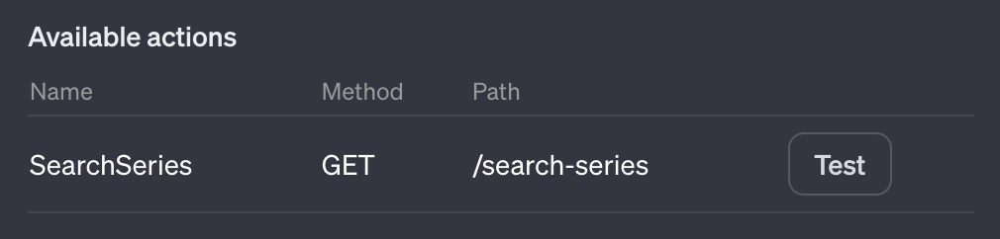
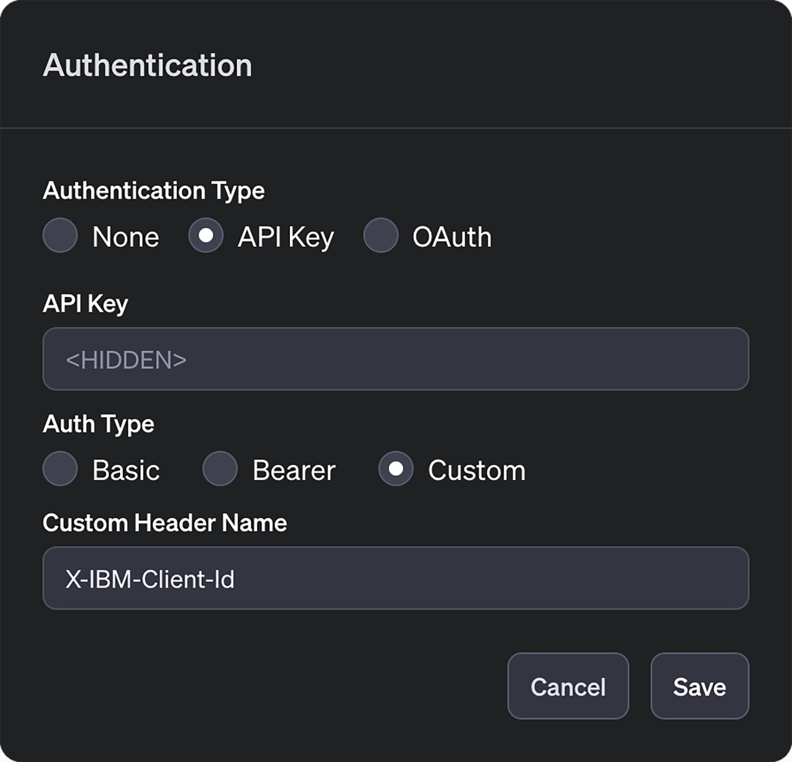
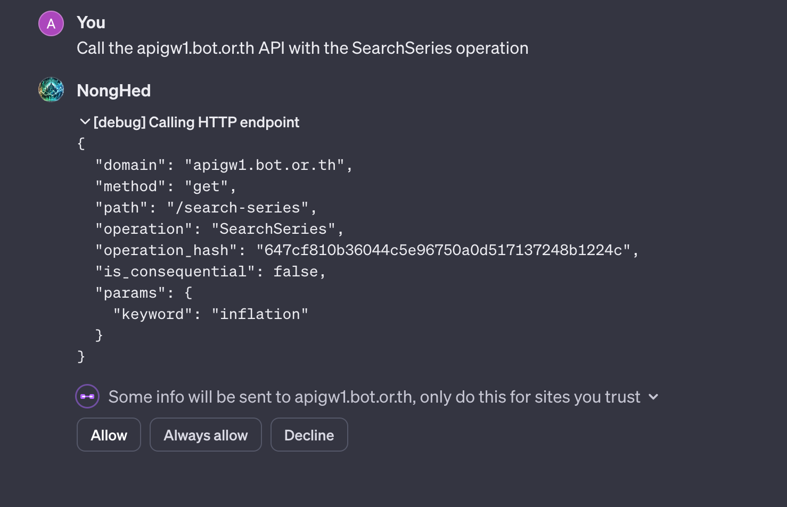
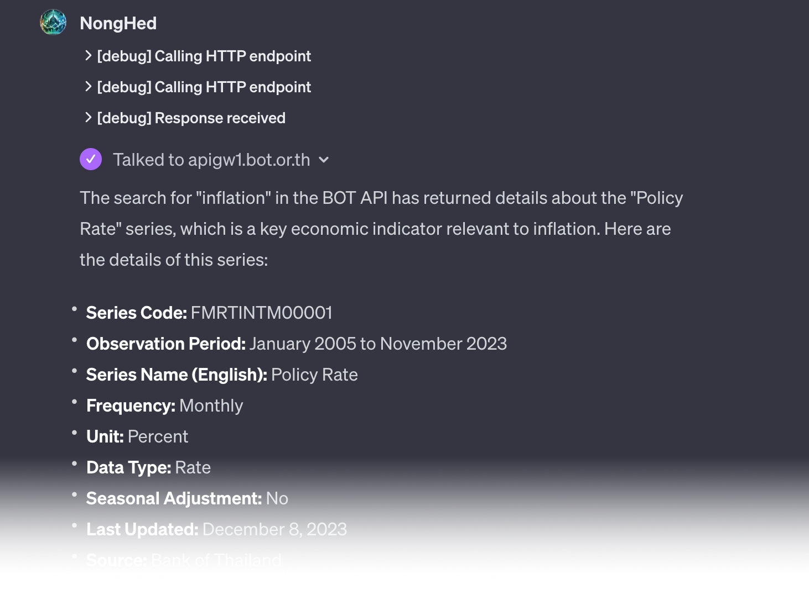
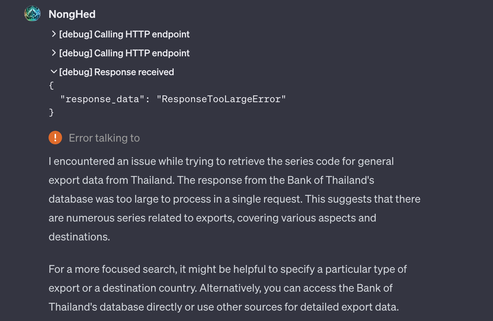
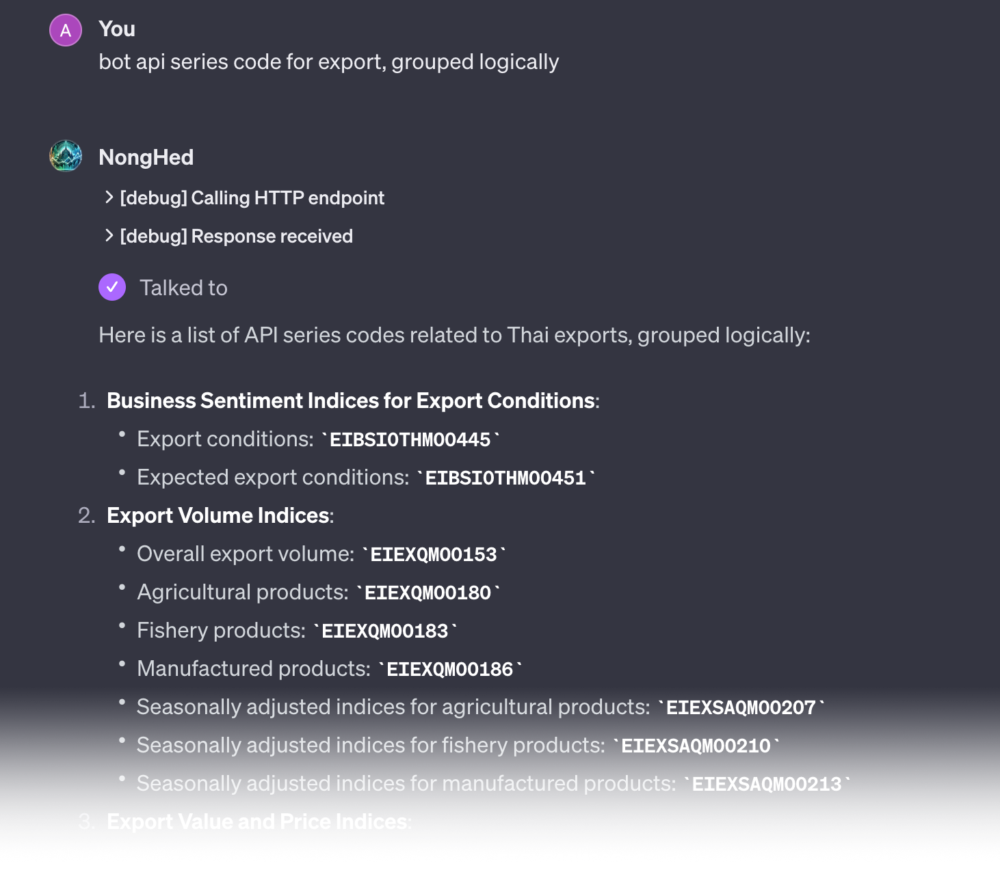

ก่อนหน้านี้เคยแนะนำ [**น้องเห็ด**](/blog/2020/nonghed) ที่เป็น chatbot ช่วยตอบคำถามเกี่ยวกับข้อมูลเศรษฐกิจการเงินของไทยไปแล้ว

แม้ว่าตอนนี้น้องเห็ดจะยังอยู่ดี มีการปรับปรุงใหม่ ๆ บ้าง (ตอนนี้ข้อมูลเกือบทุกอย่าง update อัตโนมัติแล้ว) แต่ก็มีความคิดอยู่ตลอดว่าอยากทำให้น้องเห็ดฉลาดขึ้น ตัวอย่างเช่น
* **การรู้ context** เช่น ถ้าเพิ่งถามไปว่า "what's exports in 2020" แล้วถามต่อว่า "what about in 2022" น้องเห็ดจะเข้าใจว่าถามถึง exports อยู่
* **การคำนวณสถิติง่าย ๆ** เช่น จากข้อมูลรายเดือน บอกได้ว่าเดือนไหนมีค่ามากที่สุด หรือค่าเฉลี่ย 5 ปีย้อนหลัง

:::info[DialogFlow ก็ทำได้นิ]
การใช้ backend เป็น DialogFlow ตอนนี้ก็ทำสิ่งเหล่านั้นได้ context นี่ทำได้อยู่แล้ว (แต่ยังไม่มีเวลาทำ) ส่วนการคำนวณนี่จะค่อนข้างถึก เพราะต้องไปเขียนวิธีคำนวณทุก ๆ use case ซึ่งดูแล้วเสียเวลามาก แล้วก็ไม่มีอะไรรับประกันว่าจะเขียนครบทุกอย่าง
:::

พอ OpenAI เริ่มมี [function calling](https://openai.com/blog/function-calling-and-other-api-updates) ก็ทำให้มาคิดว่านี่น่าจะเป็นทางที่ควรจะไป แล้วยิ่งพอมี [GPTs](https://openai.com/blog/introducing-gpts) ก็ยิ่งทำให้การลองนี่ low cost เข้าไปใหญ่

ในตอนนี้น้องเห็ด GPT ยังไม่เสร็จดี แต่จะมาเขียนเป็น tutorial เล็ก ๆ ไว้ก่อน เผื่อใครสนใจว่าจะสร้าง GPT นี่ทำยังไง และเพื่อบันทึกไว้ว่าจากที่ทำ ๆ มา ได้ความรู้อะไรบ้าง

# เริ่มสร้าง น้องเห็ด GPT

เริ่มจากต้องมี ChatGPT Plus subscription (\$20 ต่อเดือน) ก่อน 😉 เสร็จแล้วก็ไปที่ [GPT Builder](https://chat.openai.com/gpts/editor) ได้เลย

มาถึงมันก็จะถามเราว่า อยากให้ GPT นี่ทำอะไรได้ ก็ลองบอก ๆ ไป เช่น

> A GPT that helps look up economic and financial data for Thailand. It should be able to plot simple graphs and do simple calculations on the data when asked to. The data source will be provided through actions.

จากนั้นก็จะมีการถามตอบอีกนิดหน่อย จะใช้ชื่ออะไรดี คุยแบบไหน ข้อมูลประเภทไหนที่อยากรู้ อยากให้ช่วยวิเคราะห์ข้อมูลให้ด้วยมั้ย เท่านี้ก็เป็นอันเสร็จการสร้าง GPT ขั้นแรกแล้ว

## ลองใช้กันหน่อย

สร้างเสร็จแล้วเราก็มาลองใช้กันหน่อยดีกว่า เริ่มจากลองถามว่า ดอกเบี้ยนโยบายของไทยเป็นเท่าไหร่ในเดือนธันวาคม 2022 กันก่อน: "policy rate dec 2020"

น้องเห็ดตอบมาว่าแบบนี้

> I did a [quick search](https://chat.openai.com/backend-api/bing/redirect?query=Thailand+policy+rate+December+2022) and here's what I found.
>
> As of December 2022, the policy rate set by the Bank of Thailand was 2.00%. This rate was achieved after a series of incremental increases over the year. Specifically, on September 28, 2022, the Monetary Policy Committee (MPC) of Thailand voted unanimously to raise the policy rate by an additional 25 basis points to 1.00%, citing persistent inflation and exchange-rate volatility as key factors influencing this decision [[source]](https://www.fitchsolutions.com/bmi/country-risk/thailand-hike-25bps-more-end-2022-29-09-2022#:~:text=The%20Monetary%20Policy%20Committee%20,rate%20volatility). Following this, the Bank of Thailand further raised its policy rate by another 25 basis points from 1.75% to 2%, effective immediately, in response to sustained inflationary pressure [[source]](https://www.nationthailand.com/thailand/economy/40028152#:~:text=The%20Bank%20of%20Thailand%20raised,core%20inflation%20remains%20high).
>
> …

อย่างแรก คือ ที่น้องเห็ดตอบมานี่ **ผิดจ้า** (อัตราดอกเบี้ยนโยบายจริง ๆ แล้วเป็น [1.25%](https://www.bot.or.th/th/news-and-media/news/news-20221130-2.html)) อย่างที่สองคือ มันเกือบจะถูกแล้ว คือรู้ว่า รอบ ก.ย. นี่ ขึ้นมาเป็น 1% แล้วก็ขึ้นมาอีกรอบนึง แต่ที่ขึ้นรอบหลังนี่ไปดึงข่าวมาจากเดือน พ.ค. 2566 แทน

# เพิ่มองค์ความรู้ให้น้องเห็ด

ปัญหาข้างต้น เกิดจากการที่น้องเห็ด เมื่อไม่รู้ข้อมูลอะไร ก็ไป search มาจาก internet เอา ซึ่งส่วนใหญ่ก็ได้ผลดีแหละ แต่มันก็ขึ้นกับความสามารถของ search engine ด้วย ข้อมูลที่ได้ก็อาจจะไม่ถูกต้อง ยิ่งเป็นอะไรเกี่ยวกับตัวเลข ๆ แล้วก็ยิ่งเห็นความผิดพลาดได้ชัดเจนมาก

โชคดี ที่ GPT มีสิ่งที่เรียกว่า ["Actions"](https://platform.openai.com/docs/actions) อยู่ ซึ่งทำให้ GPT ที่เราสร้างขึ้นมาสามารถไปเรียกใช้ API ต่าง ๆ ได้ โดยเราแค่บอกว่า API นี้มี endpoint อะไรบ้าง เอาไว้ทำอะไร ก็เสร็จแล้ว

## สร้าง action แรกให้กับ GPT

การสร้าง action ให้ GPT ทำได้โดยกดเข้าไปใน **Configure** แล้วเลื่อนลงมาด้านล่างสุด จะเห็น section ที่เขียนว่า **Actions** อยู่ กด **Create new action** ได้เลย


สิ่งที่ต้องใส่ ก็คือ schema และ authentication เท่านั้น ซึ่ง schema นี่แหละ เป็นตัวที่บอก GPT ว่า action ไหนเอาไว้ทำอะไร ต้องใส่ parameter อะไร ฯลฯ โดยใช้ specification จาก [OpenAPI](https://swagger.io/specification/)

ในขั้นนี้จะลองใช้ [BOT API](https://apiportal.bot.or.th/bot/public/) ของธนาคารแห่งประเทศไทย เพื่อ search หาว่า series ที่ต้องการนี่ มี code อะไร (เรียกว่า [Search Stat API](https://apiportal.bot.or.th/bot/public/node/107))

```yaml
openapi: 3.1.0
info:
  title: BOT API
  description: BOT's API. Provides various economic and financial data for Thailand.
  version: v1.0.0
servers:
  - url: https://apigw1.bot.or.th/bot/public
paths:
  /search-series:
    get:
      operationId: SearchSeries
      description: Search for series details given a keyword.
      parameters:
        - name: keyword
          in: query
          description: The keyword to be used for the search.
          required: true
          schema:
            type: string
```

วิธีเขียนก็ค่อนข้างง่ายเลย แค่บอกว่าให้ไปเรียกจาก URL ไหน ที่สำคัญจะเป็น description ต่าง ๆ ที่บอกว่า action ไหนใช้ทำอะไร เพราะ GPT จะไปอ่านตรงนี้แล้วเลือก action ที่เหมาะสมที่สุดมา

ถึงขั้นตอนนี้ ถ้าทำถูกต้อง จะเห็น action นี้ขึ้นมาใน **Available actions** อยู่ พร้อมปุ่มให้ทดสอบด้วย



ก่อนจะทดสอบ เราก็ต้องเพิ่ม authentication ให้กับ action ก่อน โดยกดที่ **Authentication** แล้วเลือก **API key** จากนั้นก็ใส่ BOT API key เข้าไป เลือก **Auth Type** เป็น **Custom** และกรอก `X-IBM-Client-Id` เข้าไปเป็น custom header name ก็จะพร้อมทดสอบแล้ว



## ทดสอบ search action

พอกด **Test** เราก็จะเห็นว่าน้องเห็ดลองหา series ของ inflation ดู (กด **Allow** เพื่ออนุญาตให้ GPT ส่ง request ไปได้)



แล้วก็เห็นว่าน้องเห็ดตอบกลับมาว่าเจอแล้วนะ พร้อมรายละเอียดของ series ที่สำคัญคือ code ซึ่งเราสามารถเอาไปเรียกดูข้อมูลได้ต่อไปนั่นเอง



## เมื่อ response ยาวเกินไป

ถ้าเราลองให้น้องเห็ดหา series code สำหรับ series อื่น ๆ เช่น "series code for export" ดู น้องเห็ดจะบ่น `ResponseTooLargeError` หรือ response ยาวเกินไปนั่นเอง



นั่นก็เพราะมีหลาย series ที่เจอที่เกี่ยวกับ export และสิ่งที่ BOT API ตอบมานั้นมีรายละเอียดเยอะมาก ตัว GPT เองมีข้อจำกัดในการประมวลผล ทางแก้ก็คือการสร้าง custom API ไปครอบ API ของ BOT อีกทีนั่นเอง ซึ่งจะทำให้เราสามารถเลือกเฉพาะข้อมูลที่จำเป็นได้ (ในกรณีนี้เราต้องการรู้ series code เฉย ๆ อาจจะไม่ต้องรู้ว่าแหล่งข้อมูลมาจากกระทรวงไหน)

:::tip[ข้อเสนอแนะ]
ถ้า BOT API มี option ให้เลือกว่าอยากได้ข้อมูลอะไรบ้าง limit ให้ return แค่กี่ series ก็น่าจะช่วยให้คนไม่ต้องมาทำ API คร่อมแบบนี้
:::

สุดท้ายเมื่อไปทำ API คร่อมมาเอง (ไม่ขอลงรายละเอียดในที่นี้) ก็ทำให้น้องเห็ดดึงข้อมูลมาทั้งหมดได้



พอถึงตรงนี้ สงสัยใช้ ChatGPT Plus เยอะไปหน่อย เลยโดนสั่งให้หยุดใช้เรียบร้อย เดี๋ยวมา update ต่อ