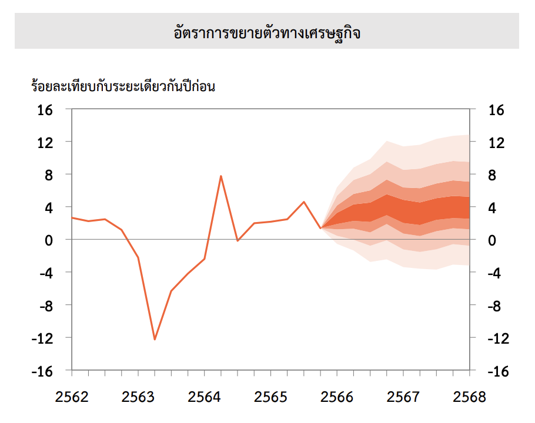

import { forecasts } from "./forecasts.js"

เมื่อวันก่อนมีข่าวพาดหัวว่า [**"ซัด ธปท. ประเมินจีดีพีสูงเกินจริง มือลั่นส่งเอกสารลับกลุ่มไลน์นักข่าวทำเนียบ**"](https://www.thairath.co.th/money/personal_finance/banking_bond/2757534) เนื้อข่าวคือโฆษกสำนักนายกออกมา leak ประมาณการของ[สำนักงานเศรษฐกิจการคลัง (สศค.)](https://www.fpo.go.th/main/Home.aspx) ก่อนเผยแพร่จริงหนึ่งวัน พร้อมเทียบว่าประมาณการการขยายตัว GDP ของ สศค. ในปี 2566 ที่ 1.8% นั้น ต่ำกว่าที่ ธปท. ประเมินไว้เมื่อต้นปีที่ 3.6% มาก จากนั้นก็มีชาวเน็ตทั้งหลายมาวิจารณ์การทำงานของ ธปท. มากมาย ว่าประมาณการผิดอยู่เรื่อย ชอบประมาณการสูงเกินจริง ฯลฯ เลยคิดว่าอยากจะมาเขียนเรื่องกระบวนการประมาณการ GDP ในประเทศไทย (เท่าที่ทราบ) ให้เห็นภาพกันหน่อย

# สามหน่วยงานเศรษฐกิจที่เผยแพร่ประมาณการ GDP

ในประเทศไทย มีหน่วยงานภาครัฐเผยแพร่ประมาณการ GDP อยู่ทั้งหมด 3 หน่วยงาน คือ
1. [สำนักงานเศรษฐกิจการคลัง (สศค.)](https://www.fpo.go.th/main/Economic-report/Thailand-Economic-Projections.aspx) เผยแพร่ทุกเดือนแรกของไตรมาส (เดือน 1, 4, 7, 10)
2. [สำนักงานสภาพัฒนาการเศรษฐกิจและสังคมแห่งชาติ (สศช.)](https://www.nesdc.go.th/more_news.php?cid=254&filename=QGDP_report) เผยแพร่ทุกเดือนที่ 2 ของไตรมาส (เดือน 2, 5, 8, 11)
3. [ธนาคารแห่งประเทศไทย (ธปท.)](https://www.bot.or.th/th/our-roles/monetary-policy/mpc-meeting.html#accordion-48bcd59f93-item-4446ffe2ee) เผยแพร่ทุกเดือนที่ 3 ของไตรมาส (เดือน 3, 6, 9, 12)

:::note[เมื่อ กนง. ลดการประชุมเหลือ 6 ครั้งต่อปี]
ก่อนหน้านี้ กนง. ประชุม 8 ครั้งต่อปี โดยจะมี 4 ครั้งที่ไม่เผยแพร่ประมาณการ (เรียกว่า "รอบเล็ก") สลับกับ 4 ครั้งที่เผยแพร่ประมาณการ (เรียกว่า "รอบใหญ่") แต่ตั้งแต่ปี 2565 เป็นต้นมา กนง. ลดการประชุมเหลือ 6 ครั้ง ทำให้ pattern ของการเผยแพร่ประมาณการอาจจะต่างไปเล็กน้อย
:::

จากทั้งสามหน่วยงานนี้ มีของ สศช. ที่ต่างไปจากคนอื่น เพราะ สศช. เป็นหน่วยงานที่มีหน้าที่คำนวณ GDP ที่ถือว่าเป็น "ของจริง" ของประเทศ

# ประมาณการ GDP

## กระบวนการประมาณการ (แบบคร่าว ๆ สุด ๆ)

ในการทำประมาณการเศรษฐกิจ หน่วยงานที่ทำประมาณการจะต้องรวบรวมข้อมูลต่าง ๆ ที่เกี่ยวข้องกับเศรษฐกิจ (ซึ่งเยอะมาก) รวมถึงทำการคาดการณ์ไปข้างหน้าด้วย ไม่ว่าจะเป็นปริมาณนักท่องเที่ยว (ดูตั้งแต่ capacity สนามบิน การจองห้องพักโรงแรมล่วงหน้า) GDP ประเทศคู่ค้าที่สำคัญ ราคาน้ำมัน สถานการณ์ความไม่สงบในภูมิภาคต่าง ๆ ราคาข้าว โครงการภาครัฐต่าง ๆ ดำเนินการถึงไหนแล้ว จะเบิกจ่ายในไตรมาสไหนอีกเท่าไหร่

ข้อมูลต่าง ๆ เหล่านี้ จะถูกนำไปใส่ในแบบจำลองทางเศรษฐศาสตร์ เพื่อประมาณการ (จากความสัมพันธ์ต่าง ๆ ในอดีต) GDP (หรือเงินเฟ้อ) ไปข้างหน้า ประมาณ 8–9 ไตรมาส

## ประมาณการ มาพร้อมความเสี่ยง

ตัวเลขประมาณการที่เราเห็นกันตามหน้าข่าว ส่วนใหญ่จะเป็น "ค่ากลาง" ถ้าเป็นของ ธปท. ก็จะเป็นฐานนิยม (คือเลขที่ ธปท. คิดว่ามีโอกาสเกิดสูงที่สุด) หรือถ้าเป็นหน่วยงานอื่นก็อาจจะมาเป็นช่วง ข่าวก็จะรายงานค่ากลางของช่วงนั้น

สิ่งที่ต้องเน้นมาก ๆ คือ ประมาณการ มาพร้อมกับความเสี่ยงของประมาณการอยู่เสมอ คือ แม้ว่าเลข 3.6 จะเป็นเลขที่คิดว่าเป็นไปได้มากที่สุด แต่ก็มีการสื่อว่ามีปัจจัยอะไรที่อาจทำให้ GDP ออกมาต่ำกว่า หรือสูงกว่านี้ได้ โดยจะสื่อออกมาในรูปแบบ fan chart

:::figure

:source[[รายงานนโยบายการเงิน ไตรมาสที่ 1 ปี 2566](https://www.bot.or.th/content/dam/bot/documents/th/our-roles/monetary-policy/mpc-publication/monetary-policy-report/MPR_2566_Q1.pdf)]
:::

แน่นอนว่า การตัดสินใจทางนโยบาย ไม่ได้มองแค่ "ค่ากลาง" เพียงอย่างเดียว แต่ผู้กำหนดนโยบายก็คำนึงถึงความเสี่ยงต่าง ๆ ที่อาจเกิดขึ้นด้วยแล้ว (ยังไม่นับถึงการทำ "ฉากทัศน์" (scenario) ต่าง ๆ ที่อาจไม่ได้เผยแพร่ออกสู่สาธารณะ เมื่อมีความจำเป็นด้วย)

## ประมาณการ ต้องปรับตามข้อมูลใหม่

จากข้อมูลที่เยอะมาก เมื่อมีเหตุการณ์อะไรเกิดขึ้นที่ส่งผลกระทบข้อมูลเหล่านั้น (เช่น เกิดสงคราม ราคาน้ำมันพุ่งสูง) ก็จะมากระทบกับตัวเลขประมาณการ ทำให้ต้องมีการปรับประมาณการใหม่อยู่อย่างสม่ำเสมอ เพื่อให้ผู้ดำเนินนโยบายได้ข้อมูลที่ถูกต้องที่สุด

นั่นหมายความว่า การประมาณการของอัตราการขยายตัวของทั้งปี 2566 ที่ทำเมื่อต้นปี 2566 จะมีข้อมูลน้อยกว่าประมาณการที่ทำในช่วงปลายปี และแน่นอนว่ามีความคลาดเคลื่อนสูงกว่า จนกระทั่งเมื่อ สศช. ประกาศเลข GDP ของปี 2566 จริง ๆ ในเดือน ก.พ. จึงจะเป็นตัวเลขที่ยึดถือได้มากที่สุด

:::note[การแก้ไข GDP]
สศช. จะมีการปรับปรุง GDP ย้อนหลังหนึ่งไตรมาส เช่น เมื่อประกาศ GDP ไตรมาส 3 ก็อาจมีการปรับปรุง GDP ของไตรมาส 2 ได้ และเมื่อครบปี ก็จะปรับปรุงย้อนกลับไปทั้งปีอีกครั้ง
:::

## ประมาณการ ไม่ใช่เป้า

หลายครั้งที่เราเห็นข่าวชอบลงว่า คนนั้นคนนี้ "ตั้งเป้า GDP ไว้ที่" เท่าไหร่ ๆ ซึ่งพอไปดูเนื้อข่าวแล้วจริง ๆ ก็คือการบอก "ประมาณการ" นั่นเอง ว่าหน่วยงานนั้น ๆ "คาดการณ์" ว่าถ้าภาวะเศรษฐกิจเป็นไปตามที่คิด GDP ในปีนี้น่าจะอยู่ที่เท่าไหร่

ประมาณการนี้ไม่ใช่เป้า ไม่ใช่ KPI ของรัฐบาลหรือของใคร (ยกเว้นเสียแต่ว่ารัฐบาลจะตั้ง KPI ของตัวเองขึ้นมาว่าจะต้องดัน GDP ให้โตเท่านั้นเท่านี้) ดังนั้นถ้ามีเหตุการณ์ใหม่ ๆ เข้ามา ก็ต้องมีการปรับประมาณการใหม่ (ซึ่งข่าวก็มักจะเอาไปลง เช่น "ธปท. หั่นเป้า GDP ปี...") ซึ่งอาจจะทำให้คนอ่านเข้าใจผิดไป

# ย้อนดู GDP ปี 2566

เอาล่ะ พอมี background บ้างแล้ว ก็ย้อนกลับมาที่[ข่าวต้นเรื่อง](#content) หน่อย

ภาพด้านล่าง แสดงการประมาณการการขยายตัวของ GDP ในปี 2566 โดยทั้งสามหน่วยงาน จะเห็นว่าในช่วงครึ่งปีแรก ทุกหน่วยงานคาดการณ์ว่า GDP จะเติบโตในระดับ 3–4% ทั้งสิ้น ประมาณการนี้เริ่มลงมาอยู่ในช่วงต่ำกว่า 3% ตั้งแต่เดือน ส.ค. หลังจากที่ สศช. ประกาศตัวเลข GDP ในไตรมาส 2 ออกมาต่ำกว่าที่คาดไว้ค่อนข้างเยอะ ซึ่งเดี๋ยวอาจจะได้มาดูกันว่าเกิดจากอะไร

<Plotter options={forecasts} />

ถ้าถามว่า หรือมันเป็นที่หน่วยงานรัฐมั้ย ที่ประเมินไม่เก่งเอง นักลงทุนต่าง ๆ เค้าน่าจะเก่งกว่านะ ก็ลองไปดูที่เป็นแถบ ๆ สีเทา ซึ่งคือผลจากการ survey สถาบันการเงินต่าง ๆ ในภูมิภาค (ของประเทศไทยมีประมาณ 20 กว่าแห่งที่ตอบ) จะเห็นว่าทุกคนก็คาดการณ์ไว้ในช่วงใกล้ ๆ กัน จะมีในเดือน พ.ย. ที่ ธปท. และ สศช. ออกมาคาดการณ์ต่ำกว่า percentile ที่ 10 ซะด้วยซ้ำ ก่อนที่สถาบันต่าง ๆ จะปรับการคาดการณ์ลงมาอยู่ในช่วง 2–3%
